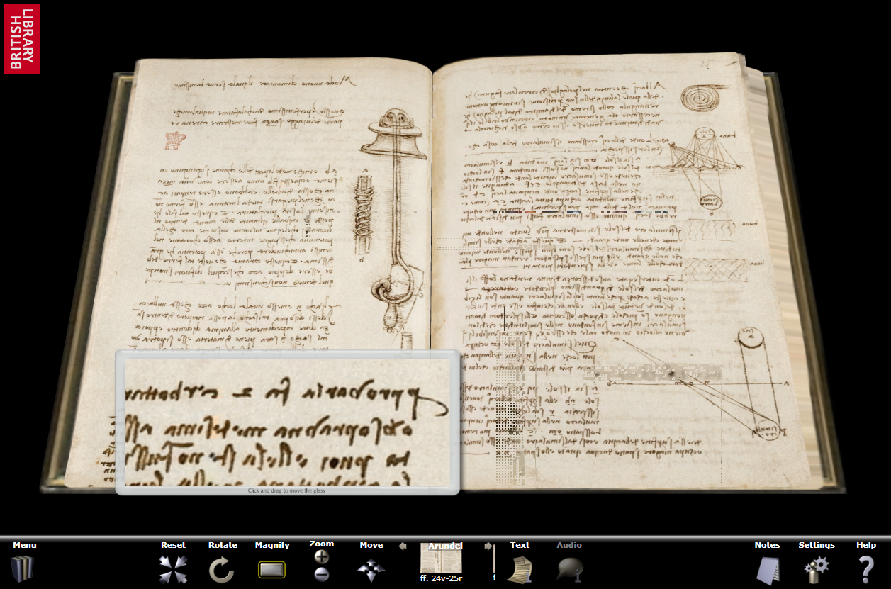

La British Library vient de mettre à disposition une quinzaine d'[ouvrages extrêmement rares sur le web](http://www.bl.uk/onlinegallery/ttp/ttpbooks.html).

Grâce à des technologies Web récentes de Microsoft, donc après que vous ayez acheté Vista ou téléchargé quelques mises à jour de quelques dizaines de mégas chacune comme .Net 3.0, WPF et Silverlight, vous pourrez tourner les pages du Codex de Léonard de Vinci, [directement dans votre explorateur favori](http://www.devx.com/VisualStudio/Door/39899) (surprise, ça marche même sous Firefox...). La fenêtre ressemble à ça :

En cliquant sur les pages, elles tournent une à une en 3D, comme du vrai papier, c'est très beau. On peut zoomer sur les pages scannées en haute résolution, ou utiliser une loupe, comme sur mon exemple d'une vaine tentative de déchiffrer la célèbre écriture miroir de Léonard.

Informations sur la technologie utilisée [ici](http://www.devx.com/VisualStudio/Door/39899).
