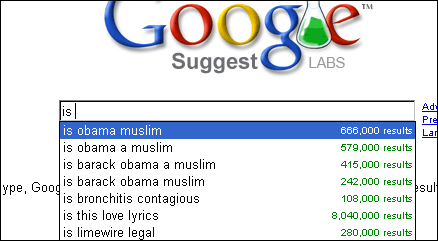

[Google est une boite très intéressante](http://goulu.wordpress.com/2008/01/29/visite-chez-google/). Fondamentalement créative et, j'en suis convaincu, bien intentionnée, elle collecte une quantité phénoménale de données utilisées pour améliorer l'accès à l'information de ses centaines de millions d'utilisateurs.

Parfois, ces données agglomérées fournissent des indications imprévues. Par exemple l'outil [Google Suggest](http://www.google.com/webhp?complete=1&hl=en) essaie de deviner ce que vous allez chercher sur le Net en complétant les premières lettres que vous tapez avec les recherches les plus fréquentes sur Google. Par exmple, si vous tapez "is " (avec espace), Google Suggest vous liste les demandes les plus fréquentes commençant par "est-ce que ... ". Ces jours-ci ça donne ça :

En gros, les 4 recherches les plus fréquentes+récentes concernent la religion du candidat Obama aux élections états-uniennes... Intéressant, non ?

Les 8 millions de gens qui ont cherché les paroles (=lyrics) de la chanson "Is this love?" de Bob Marley sont classés après parce que certainement moins fréquentes, en nombre / jour.

Autre effet intéressant du système "PageRank" de classement des résultats de Google : si beaucoup, énormément de sites font [un lien sur une secte dangereuse](http://www.scientology.org) (ne pas cliquer dessus, c'est inutile...), Google va augmenter le "Page Rank" de la scientologie associée aux mots "secte dangereuse". Comme énormément de sites en anglais l'ont fait sur les mots "[dangerous cult](http://www.google.ch/search?q=dangerous+cult)", la scientologie sort en premier lorsqu'on recherche ces mots ! Pas mal, non ?

Ca s'appelle une "Google Bomb", et ça sera possible tant que Google (et les autres) ne seront pas capables de comprendre la signification des pages. Mais ils y travaillent. Ca s'appellera le "web sémantique" et ça méritera le titre de "web 3.0".

### Sources:

- [Google Suggest and Obama](http://blogoscoped.com/archive/2008-01-30-n85.html)
- [Scientology Googlebomb](http://blogoscoped.com/archive/2008-01-29-n23.html)
