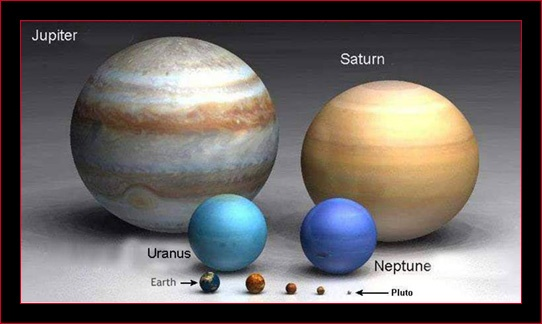
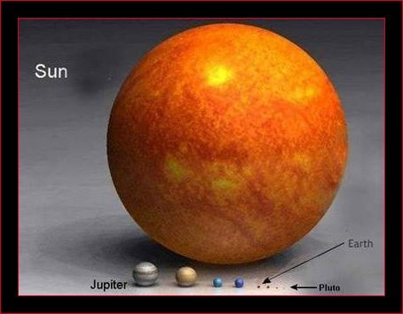
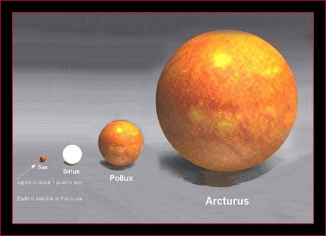
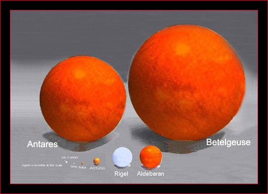

Entre deux dossiers sur la ratatination des spermatozoïdes par les téléphones portables, ce cher ServumPecus tourne la tête vers les étoiles de temps en temps et trouve des choses magnifiques comme [ça](http://servumpecus.canalblog.com/archives/2008/01/24) :

Jupiter, c'est grand par rapport à la Terre

Le Soleil, c'est grand par rapport à Jupiter, et énorme par rapport à la Terre

Arcturus est une grande étoile, par rapport au Soleil. Elle est énorme par rapport à Jupier et colossale par rapport à la Terre.

Les géantes rouges comme Bételgeuse ou Antarès sont très grandes par rapport à Arcturus. Enormes par rapport au Soleil. Colossales par rapport à Jupiter. Et incroyablement monstrueuses par rapport à la Terre. Elles ne sont pas tellement loin (500 années lumières) mais c'est assez pour les ramener à la taille de petits points dans le ciel noir.
