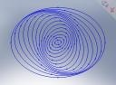
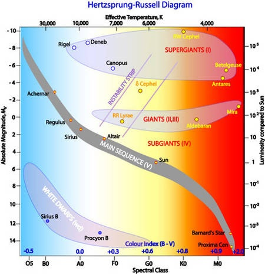

Suite à [Galaxies, Fenêtres sur l’Univers](/2007/07/23/galaxies/ "Galaxies, Fenêtres sur l’Univers"), je m'étais lancé dans la réalisation d'une [Simulation de Galaxie Spirale](http://3dmon.wordpress.com/2007/08/26/simulation-de-galaxie-spirale/) en temps réel basée sur [Demoniak3D](http://www.ozone3d.net/demoniak3d/).

L'idée était principalement d'illustrer le fait que les bras spiraux des galaxies ne tournent pas : se sont des "ondes de pression" dans lesquels la densité d'étoiles est plus élevée qu'ailleurs en raison du fait que les étoiles suivent "en moyenne" des orbites elliptiques décalées, comme illustré sur le graphique ci-contre, où les spirales apparaissent clairement.

Je viens de réaliser une nouvelle version de cette simulation que vous pouvez [télécharger ici](http://www.ozone3d.net/demos_projects/spiral_galaxy.php) et exécuter sur votre propre PC (doté d'une carte 3D décente) pour voir 15'000 étoiles tourner devant vos yeux ébahis:



A noter qu'à ma connaissance c'est la seule simulation de Galaxie en temps réel qui révèle les bras spiraux. Ceci est possible car on ne simule pas la physique de la gravitation, mais seulement la géométrie en résultant.

### Vie et mort des étoiles

Dans cette nouvelle version , j'ai commencé à implanter un autre phénomène fascinant : le cycle de vie des étoiles. Comme expliqué dans [Galaxies, Fenêtres sur l’Univers](/2007/07/23/galaxies/ "Galaxies, Fenêtres sur l’Univers"), les étoiles naissent au rythme d'une par jour (!) dans la Voie Lactée, principalement dans les bras spiraux. Puis elles vieillissent et meurent (une par jour aussi !) après n'avoir effectué que quelques tours de la Galaxie. Pour visualiser ceci "à l'échelle" dans ma simulation, j'ai fait le calcul suivant :

- ma galaxie contient environ 10^6 x moins d'étoiles qu'une galaxie spirale réelle (je veux un processeur 10'000'000 de fois plus puissant !)
- mais elle tourne environ 10^13 x plus vite
- donc les étoiles de ma simulation doivent naitre et mourir 10^(13-6) soit 10'000'000 x plus souvent qu'une fois par jour, ce qui fait 116 x par seconde !

### La séquence principale

La vie des étoiles se déroule de gauche à droite dans le diagramme ci-dessous:

Les étoiles supergéantes ([vraiment très grosses](/2008/02/01/on-est-peu-de-chose/)) naissent bleues. Après une vie brève passée à briller 10'000x plus que le Soleil, elles deviennent rouges et meurent brutalement en [supernovae](/2007/03/08/perles-cosmiques/), brillant comme des millions de soleils pendant quelques heures et laissant une étoile à neutrons, un [magnetar](/2007/09/28/magnetar/) voire un [trou noir](/2007/06/26/le-trou-noir-central-de-la-voie-lactee-revele/) au centre d'une [nébuleuse de matériaux expulsés dans l'espace](/2007/09/28/magnetar/)

Les étoiles naines restent toute leur longue vie bleues/blanches et jaunissent en s'éteignant lentement. 10'000x moins lumineuses que le Soleil, elles deviennent des naines brunes pratiquement invisibles.

La plupart des étoiles, dont le Soleil, suivent la "séquence principale" : elles naissent bleues et lumineuses, et meurent rouges, tout en devenant 1 milliard de fois moins lumineuses qu'au début.

Dans mon programme, je considère pour l'instant que toutes les étoiles suivent la séquence principale. Je simule le vieillissement en regroupant les étoiles en 6 étapes de la séquence. Il y a aussi une étape 0 "nébuleuse" qui correspond au gaz qui forme une étoile jeune et qui résulte de la mort de l'étoile vieille, ce qui permet de définir un cycle. Pour des raisons techniques et pour correspondre à la réalité, le nombre d'étoiles à chaque étape doit rester le même. La simulation permute donc 7 "étoiles" choisies au hasard dans chacune des étapes : une nébuleuse prise au hasard devient une bleue de type O5, une bleue O5 prise au hasard devient BO et ainsi de suite jusqu'à une étoile de type M0 prise au hasard, qui meurt pour donner une nébuleuse.

Ainsi les étoiles vieillissent, mais pas toutes à la même vitesse, ce qui est conforme à la réalité.

### Prochaines étapes:

- rendre les transitions de couleur plus douces
- faire naître les étoiles dans les bras spiraux : c'est là que ça se passe en réalité car les nébuleuses y sont "comprimées"
- simuler la trajectoire des étoiles du noyau galactique en 3D. permettre de varier la taille du noyau pour faire des galaxies elliptiques
- trouver comment faire des galaxies spirales "barrées"

### Références

- [Les Galaxies](http://www.dil.univ-mrs.fr/~gispert/enseignement/astronomie/5eme_partie/galaxies.php)
- [Article on Demoniak3D Blog](http://www.ozone3d.net/blogs/demoniak3d/?p=71)
