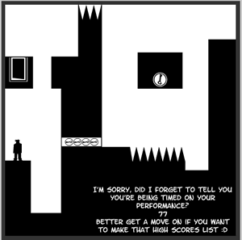

[Grâce à Steph](http://www.stephguerin.com/archives/cest_vendredi_jouons_avec_shift/) j'ai passé un excellent moment à jouer sur le web à un petit jeu très chouette : [Shift.](http://www.bubblebox.com/play/puzzle/921.htm) 

 C'est un jeu de plate-forme d'apparence très classique : on se déplace avec les flèches, on peut sauter avec space, et il faut atteindre les clés pour pouvoir accéder à la porte de sortie sans tomber sur les piques.

Le truc qui fait toute la différence, c'est la touche shift. Je n'en dis pas plus : jouez-y et vous verrez qu'on peut encore avoir des idées géniales en matière de jeux video.
