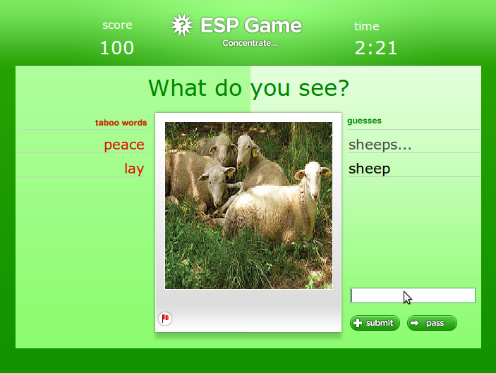
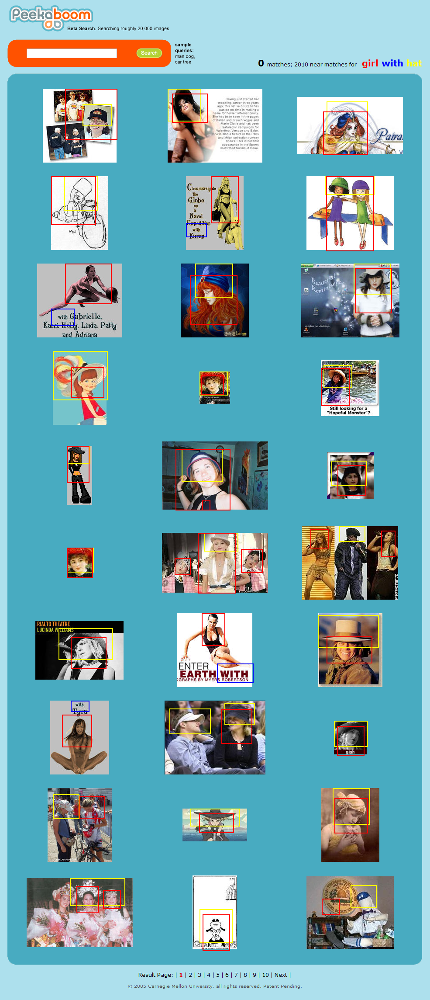

Tombé sur un interview de [Luis Von Ahn](http://www.cs.cmu.edu/~biglou/), un chercheur qui travaille sur un sujet qui me plait beaucoup : comment utiliser (gratuitement) la puissance des cerveaux humains, interconnectés par internet, pour faire des choses dont les ordinateurs ne sont pas capables ?

Von Ahn est l'inventeur des [ReCaptcha, dont j'ai déjà parlé ici](/2007/10/16/recaptcha-quand-linternet-utilise-les-cerveaux-humains/). Dans la vidéo, il donne une information sidérante : il y a environ 200 millions de "captchas" résolus chaque jour sur internet (rappel : les captchas sont des images dans lesquelles il faut distinguer un texte déformé à taper au clavier, servant à prouver à un site internet que l'on est humain et pas un programme de spam). En comptant 10 secondes pour reconnaitre le mot et le taper, ceci correspond à 63.4 années d'activité humaine (à plein temps 7j/7, 24h/24, pas de vacances...) effectués chaque jour! Comme par définition ce travail ne peut pas être automatisé, ce serait un véritable gâchis de cervelle si Von Ahn n'avait pas eu la lumineuse idée des [ReCaptcha](/2007/10/16/recaptcha-quand-linternet-utilise-les-cerveaux-humains/), qui permettent d'utiliser ce travail pour digitaliser de vieux livres à peine lisibles.



Pour illustrer encore le gâchis de cervelle, Von Ahn explique qu'Erika et quelques autres personnes ont passé 9 milliards d'heures à jouer au Solitaire livré avec Windows (!) en 2003. Si ces gens avaient pris une truelle ou une pioche à la place, ils auraient pu construire un gratte-ciel comme l'Empire State Building  ou un Canal de Panama par jour !

Von Ahn essaie maintenant de créer des "jeux bêtes mais utiles" sur lesquels les gens pourraient perdre leur temps, mais en produisant un résultat constructif. Le problème principal et de faire quelque chose dont les ordinateurs sont incapables mais qui est à la portée de n'importe quel humain sans se casser la tête.

Luis Von Ahn a ainsi créé [PeekaSearch](http://www.peekaboom.org), un moteur de recherche d'images capable de trouver sur internet des images. Pour l'alimenter, Von Ahn a imaginé trois jeux auxquels jouent des humains pour s'amuser, effectuant ainsi un travail impossible à automatiser et ceci gratuitement !

- Dans "[Phetch](http://www.peekaboom.org/phetch/)", un joueur "descripteur" décrit une image à quelques autres, qui doivent la chercher sur internet, avec Google par exemple. Le premier qui trouve la même image que celle du "descripteur" a gagné. Mais en fait ce sont les autres images qui sont intéressantes, puisqu'elles correspondent à la même description : elles peuvent donc être ajoutées au moteur de recherche...
- Dans "[ESP Game](http://www.gwap.com/gwap/gamesPreview/espgame/)", deux personnes connectées en même temps doivent taper des mots (en anglais hélas) décrivant le contenu d'une image. Si elles tapent les deux le même mot, l'image change pour les joueurs, et le mot est ajouté à une liste des mots "tabous" de l'image pour une prochaine partie entre d'autres joueurs. peu à peu, la liste des mots "tabous" correspondra au contenu de l'image, ce qui permettra de faire des recherches sur des images, entre autres.

- "[Peekaboo](http://www.peekaboom.org/)" est aussi un système de reconnaissance d'image à deux joueurs, mais là un des joueurs rèvèle peu à peu l'image à l'autre, qui doit reconnaître le mot décrivant l'image. Je pense que ça sert à situer le contenu des images à partir des mots définis dans le "ESP game".
    

Le résultat net de tout ceci est que [PeekaSearch](http://www.peekaboom.org) est très efficace. En cherchant ["girl with hat" dans les images Google](http://images.google.ch/images?hl=fr&q=girl+with+hat) on trouve déjà pas mal de choses, mais avec PeekaSearch c'est beaucoup plus précis : les "girls" sont encadrées en rouge, les "hat" en jaune, et même le mot "with" est signalé en bleu s'il apparait dans un texte figurant sur l'image !

C'est très fort, non ?
