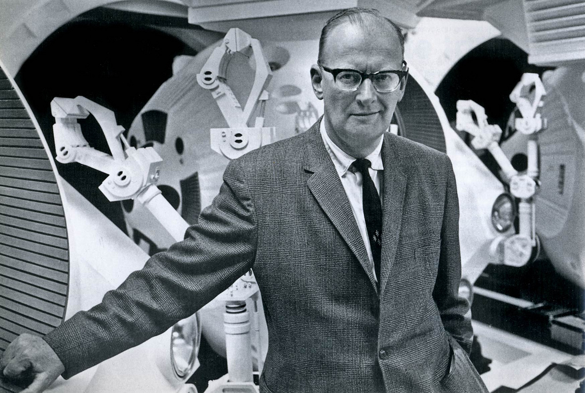

J'apprends par [Cocktail Party Physics](http://twistedphysics.typepad.com/cocktail_party_physics/2008/03/sir-arthur-c-cl.html) que [Sir Arthur C. Clarke](http://fr.wikipedia.org/wiki/Arthur_C._Clarke) est décédé. Il est l'auteur de nombreux et remarquables romans de science-fiction, des vrais, avec de la science dedans. Le plus connu est "2001 l'Odyssée de l'Espace" coécrit en 1968 avec Stanley Kubrick qui en a fait un des (le ?) [meilleurs films de science fiction](/2008/03/17/la-physique-des-films-spatiaux/).

Clarke était aussi l'auteur des "3 lois de la science et de la technologie" (dont je ne connaissais que la première) :

1. "_Toute technologie suffisamment avancée est indiscernable de la magie_". Pensée à se remémorer à chaque reportage sur les Papous, les Bochimans ou toute autre peuple pratiquant la magie...
2. "_Quand un scientifique distingué mais âgé dit que quelque chose est possible, il a certainement raison. Quand il dit que quelque chose est impossible, il a probablement tort._" Moralité : ne jamais dire que quelque chose est impossible...
3. "_La seule manière de découvrir les limites du possible est de s'aventurer un peu au delà, dans l'impossible_". N'est ce pas une merveilleuse idée de considérer que le possible et l'impossible ont une frontière floue, variable ?
