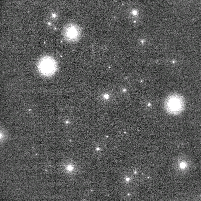

A l'oeil nu, on peut voir [Andromède](http://fr.wikipedia.org/wiki/NGC_224) à 3 Millions d'années lumière, et dans des conditions exceptionnelles. [M81](http://fr.wikipedia.org/wiki/M81) à 12 Millions d'années lumière. Ces sont les [Galaxies](/2007/07/23/galaxies/) les plus proches de notre Voie Lactée, comportant chacune des milliards d'étoiles.

Or il y a deux jours, un astre situé à 7.5 Milliards d'années, donc 1000 fois plus loin, a été visible à l'oeil nu pendant 4 minutes ! GRB 080319B a alors brillé 2.5 millions de fois plus fort qu'une étoile explosant en [supernova](http://fr.wikipedia.org/wiki/Supernova), elle-même aussi brillante qu'une galaxie entière. (source: [Futura-Sciences "Un sursaut gamma record, visible à l'œil nu !"](http://www.futura-sciences.com/fr/news/t/astronomie/d/un-sursaut-gamma-record-visible-a-lil-nu_15014/)) L'événement a même été [filmé](http://grb.fuw.edu.pl/pi/ot/grb080319b/normal.html) : c'est le petit point apparaissant au centre de l'image ci-contre.

Le 080319 dans le nom peu poétique de ce phénomène, c'est la date à laquelle il est apparu : 19 mars 2008. GRB c'est pour "Gamma Ray Burst", car il a en fait été détecté par le satellite "Swift", spécialement conçu pour détecter les "[sursauts gamma](http://fr.wikipedia.org/wiki/Sursaut_gamma)", ces phénomènes extrêmement violents et mystérieux. Et B, c'est parce que c'était le second détecté ce jour là.

Car le plus étonnant, c'est que les sursauts gamma ne sont pas rares. Les premiers ont été détectés en 1969 par des satellites militaires chargés de repérer des explosions nucléaires, produisant assez de rayons gamma pour produire des tumeurs à quelques kilomètres à la ronde. Or les satellites détectent en moyenne une fois par jour (!) des explosions produisant le même rayonnement depuis l'espace.

Les chercheurs se sont vite aperçus qu'ils provenaient de toute la sphère céleste, donc pas de notre Galaxie mais d'autres galaxies très lointaines. Actuellement, on estime qu'une étoile sur 10'000 meurt en causant un sursaut gamma (une hypothèse de mécanisme est décrite [ici](http://www.obspm.fr/actual/nouvelle/apr06/GRB.fr.shtml)). Lorsqu'on sait qu'une étoile par jour meurt dans une galaxie comme la Voie Lactée, il n'y a qu'un suraut gamma tous les 30 ans dans notre galaxie en moyenne, mais ils rayonnent si fort que nous détectons chaque jour ceux arrivant dans les 10'000 galaxies voisines.

Un sursaut gamma trop proche de nous stériliserait la planète en quelques secondes. Certains pensent que c'est ce qui s'est presque produit il y a 450 millions d'années : l'extinction massive de l'ordovicien serait due à une "[hypernova](http://fr.wikipedia.org/wiki/Hypernova)" un peu trop proche. Ca ne devrait pas se reproduire "prochainement", la prochaine supernova proche prévue, [Eta Carina](/2007/05/09/compte-a-rebours-stellaire/), est heureusement suffisamment loin.
