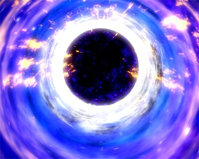

"Chuis le poinçonneur galactique ... j'fais des trous,  des trous noirs, [encore des trous noirs](http://drgoulu.local/2007/03/13/cest-plein-de-trous-noirs/) ... [des trous d'première classe](http://drgoulu.local/2007/06/26/le-trou-noir-central-de-la-voie-lactee-revele/), des trous d'seconde classe ... "

Le petit dernier s'appelle XTE J1650-500 et a la bonne idée de tourner autour d'une autre étoile pas trop loin dans notre Voie Lactée, ce qui a permis de déterminer sa masse : 3.6x celle du Soleil seulement, ce qui en fait le plus petit trou noir connu. C'est intéressant pour vérifier expérimentalement la [limite d'Oppenheimer-Volkoff](http://fr.wikipedia.org/wiki/Limite_d%27Oppenheimer-Volkoff) qui fixe théoriquement à 3.3 masses solaires la limite entre étoile à neutron et trou noir.

Les petits trous noirs ont aussi un "effet de marée" plus intense que les grands : la force d'attraction varie énormément avec la distance, ce qui fait par exemple que vos pieds seraient attirés beaucoup plus fortement que votre tête en passant à proximité, donc que tout en tombant vers le trou noir, vous seriez étiré en forme de spaghetti ...

source : [Scientific American : "](http://www.scientificamerican.com/gallery_directory.cfm?photo_id=0C159570-0816-D40C-935EECCAA921250A&sc=rss)[The Smallest Known Black Hole:"](http://www.scientificamerican.com/gallery_directory.cfm?photo_id=0C159570-0816-D40C-935EECCAA921250A&sc=rss) article agrémenté de cette belle vue d'artiste, hélas peu relativiste.
