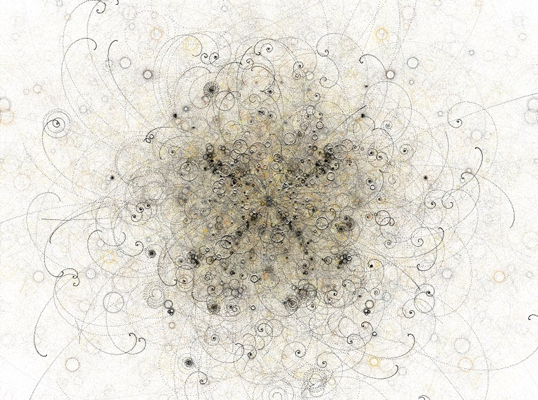
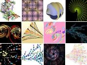

[Proce55ing (ou Processing),](http://processing.org/) est un langage de programmation, et même un environnement de développement d'applications graphiques temps réel interactives. Créé initialement par [Ben Fry](http://benfry.com) et [Casey Reas](http://groupc.net/) pour des applications de visualisation de données, Processing est également apprécié de créateurs comme qui en tirent des oeuvres graphiques magnifiques.

_["Bubble Chamber"](http://www.complexification.net/gallery/machines/bubblechamber/) de [Jared Tarbell](http://www.complexification.net/gallery/) Cliquez sur l'image pour la version interactive_

\[vimeo 658158\]

_["Solar with Lyrics"](http://www.flight404.com/blog/?p=111) de [Robert Hodgin (flight404)](http://www.flight404.com/blog/?cat=1) musique "Lovely Head" de Goldfrapp_

La [variété des applications](http://processing.org/exhibition/index.html) réalisées avec Proce55ing est réellement impressionnante. On trouve beaucoup d'autres [exemples sur YouTube](http://www.youtube.com/results?search_query=processing.org&search=tag) ou sur flickr [ici](http://www.flickr.com/photos/eskimoblood/collections/72157600002925667/) ou [là](http://www.flickr.com/photos/flight404/sets/72057594065151925/).

[Xavier Gouchet](http://www.xgouchet.fr/processing.php) s'y est mis aussi et a achevé de me convaincre de regarder Processing de plus près.

Le langage Processing est fortement inspiré de Java, le système de développement est basé sur Java, et on peut exporter les applications sous forme d'applet Java. Pour commencer, on peut se débrouiller sans maitriser cette danse, juste avec des bases de programmation, mais pour faire des choses aussi sophistiquées que les exemples ci-dessus, il faut bien connaitre le graphisme 2D et 3D, voire OpenGL et les maths, mais surtout avoir un talent de graphiste pour que le résultat soit joli.

Ma première application Processing est une version simplifiée et 2D de ma fameuse [Simulation 3D de Galaxie Spirale](/2008/02/08/galaxie-spirale-et-sequence-principale/).

_(Mise à jour du 15.1.2011)_ : Elle était depuis longtemps sur [OpenProcessing](http://www.openprocessing.org/visuals/?visualID=699), mais je peux enfin l'intégrer directement à ce blog :

\[processing width="600" height="400" file="/wp-content/uploads/2008/04/Galaxy.jar"\]Chargement\[/processing\]

En pressant sur les touches curseur vous pourrez modifier l'ellipsité et la torsion de la galaxie en temps réel. Cette première oeuvre est assez moche, heureusement quelqu'un en a beaucoup amélioré l'esthétique [sur OpenProcessing](http://www.openprocessing.org/visuals/?visualID=700).

Pour vous mettre à Processing vous aussi :

1. [téléchargez le](http://processing.org/download/index.html)
2. [lisez un peut tout ça](http://processing.org/learning/index.html)
3. lancez-vous à partir des nombreux exemples fournis
4. consultez la liste des [processing hacks](http://wiki.processing.org/doku.php?id=hacks:contents) pour éviter de réinventer la roue et devenir un vrai gourou
