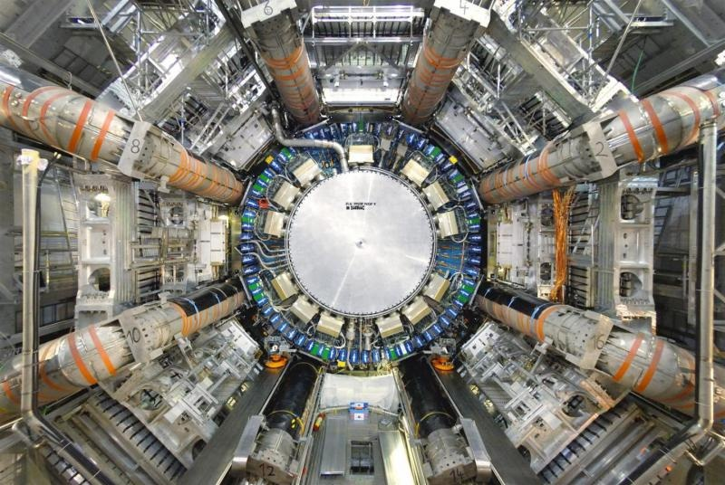

Le [CERN ouvrait aujourd'hui ses portes](https://lhc2008.web.cern.ch/LHC2008/) au public pour lui montrer le Large Hadron Collider (LHC), le plus puissant accélérateur de particules du monde, qui sera mis en service cet été.

Je souhaitais voir [ATLAS](http://public.web.cern.ch/public/fr/LHC/ATLAS-fr.html), le plus imposant détecteur de particules, destiné entre autres à découvrir le [Boson de Higgs](http://fr.wikipedia.org/wiki/Boson_de_Higgs), la particule qui permettrait de valider la théorie qui explique pourquoi certaines particules ont une masse et d'autre pas.

Mais à l'ouverture à 9h, il y avait déjà une queue de plus 3h pour le visiter... Nous nous sommes donc rendus sur le [site de Ferney-Voltaire](https://lhc2008.web.cern.ch/LHC2008/OpenDaysF/point8.html) où la queue n'était "que" d'une heure et demie et permettait d'obtenir... un ticket pour une visite 2h plus tard ! Après beaucoup de déception et de reproches pour la mauvaise organisation de l'événement, nous sommes donc rentrés chez nous (à 10 minutes seulement, mais j'ai pensé à [ceux ont fait le voyage depuis les USA](http://blogs.discovermagazine.com/badastronomy/) spécialement pour assister à cette journée...) et retournés à 14h plonger 100m sous terre.

Et ça valait la peine : imaginer un tunnel de 27km rempli des équipements de physique les plus sophistiqués que l'on puisse concevoir actuellement est difficile, mais le voir c'est vraiment impressionnant. Nous avons visité une section illustrant proche de l'expérience "[beauty](http://public.web.cern.ch/public/fr/LHC/LHCb-fr.html)" destinée à comprendre la "rupture de symétrie" qui a fait que le Big Bang a produit plus de matière que d'antimatière, ce qui fait qu'il reste de la matière ...

Cette section permet de voir de nombreux aspects du [fonctionnement du LHC](http://public.web.cern.ch/public/fr/LHC/HowLHC-fr.html) :

- le point d'injection des particles depuis un autre accélérateur dans le LHC
- les aimants dipolaires qui courbent les 2 faisceaux de protons circulant en sens inverse dans le tunnel et les aimants quadrupôles qui focalisent ces faisceaux
- un point où les deux faisceaux sont déviés l'un vers l'autre dans un seul tube afin de provoquer des collisions frontales au milieu du détecteur

ainsi que les dispositifs permettant à tout ceci de fonctionner aux limites de la physique actuelle :

- la circulation d'hélium liquide à -270°C permettant de maintenir les aimants à supraconducteurs à une température suffisamment basse,
- des câbles de cuivre d'environ 10 cm2 de section pour conduire des courants de 16000 ampères dans ces aimants,
- des pompes permettant de créer un vide de 0.000000000036 bar...

Tout ça devrait donner de la matière à quelques articles dans les prochaines années.
