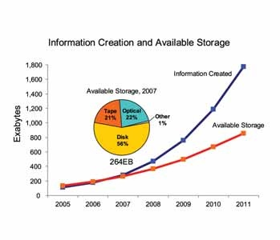
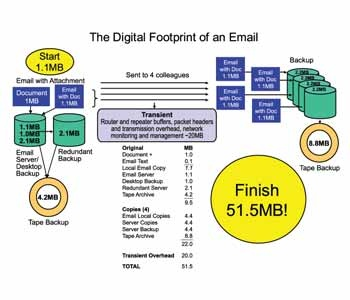

Le récent rapport "[The Diverse and Exploding Digital Universe](http://www.emc.com/collateral/analyst-reports/diverse-exploding-digital-universe.pdf) - An Updated Forecast of Worldwide Information Growth Through 2011" d'IDC\* [sponsorisé par EMC\*](http://www.emc.com/leadership/digital-universe/expanding-digital-universe.htm) est absolument passionnant. Comme le dit le sous-titre, il s'agit d'une prévision de la croissance mondiale en informations jusqu'en 2011, et c'est une mise-à-jour dans puisqu'une première version avait été publiée en 2007, suite à une étude de marché sur les [systèmes de stockage de données](http://www.idc.com/err/404error.jsp;jsessionid=5B499EE2DE7F5345EA3AACB9B0428252?requestedUrl=/groups/storagewatch/apr08/&redirectUrl=www.idc.com).

Les principales conclusion du rapport sont :

1. la quantité totale d'informations stockées sous forme digitale en 2007 était de 2.25 x 10²¹ bits (soit 281 milliards de gigabytes, ou 281 [exabytes](w:en:Exabyte)), soit 45 gigabytes par être humain ! 
2. cette quantité va décupler d'ici 2011, suivant une croissance de 60% / an environ. Cette croissance est principalement due à la TV haute définition et aux caméras de surveillance, mais aussi à l'accès à internet dans les pays émergents, et aux réseaux sociaux.
3. depuis 2007, la production des systèmes de stockage n'arrive plus à suivre la croissance de "l'univers digital".
4. en 2011, l'information sera répartie sur environ 20 millions de milliards de supports (!) allants du gros disque dur à la puce RFID en passant par la mémoire des téléphones portables.

Quelques réflexions:

- Si la quantité d'information totale (2.25 x 10²¹ bits) parait colossale, il est intéressant de la mettre en perspective avec un nombre qui peut être relié à la miniaturisation : le nombre d'Avogadro. Si on était capables de stocker un bit par atome (c'est possible, ça a été fait avec quelques atomes), toute la mémoire de toute la planète pourrait être stockée dans un centième de mole de matière, par exemple un diamant de 0.13 gramme (moins d'un carat ), ou sur une surface monoatomique de 20 m2 environ.
- Le rapport parle souvent de "création d'information", alors qu'il s'agit principalement d'information captée pour être préservée de la [destruction](/2007/02/25/linformatique-detruit-linformation/). L'information réellement produite (par l'intelligence humaine uniquement selon moi) est beaucoup plus faible. Peut-être quelques gigas par an ...
- De plus, les quantités d'informations mentionnées incluent les copies. Par exemple, un DVD de 4Gb tiré à 10'000 exemplaires compte comme 40 Terabytes d'information.
    
    
    
    Plus spectaculaire encore, l'analyse ci-dessus montrant qu'un seul e-mail de 1 Mb envoyé à 4 destinataires occupe plus de 50Mb au total !
- Je me demande donc si cette explosion d'informations ne serait pas la **conséquence** de la disponibilité des systèmes de stockage bon marché plutôt que la réponse à cette explosion . Avec plus de bande passante et des mémoires caches optimisées, n'arriverait-on pas à limiter le nombre de copies ?

Notes:

- [IDC](http://www.idc.com) est une importante boite d'études de marché qui "analyse le futur" (j'aime bien ce slogan...).
- [EMC](http://www.emc.com) est un gros éditeur de solutions de "gestion de l'information". Documentum est leur produit phare.
