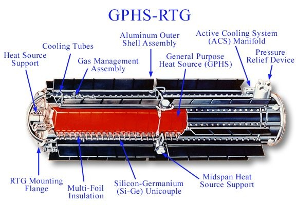

Bonne nouvelle : la sonde Cassini qui nous a déjà apporté une myriade d'informations et de magnifiques photos de Saturne et de sa banlieue (voir [ici](http://drgoulu.local/2008/01/10/les-plus-belles-images-de-cassini/), [ici](http://drgoulu.local/2007/12/03/saturne-le-poster/), [là](http://drgoulu.local/2007/10/15/cassini-forever/) et encore [là)](http://drgoulu.local/2007/10/14/cassini-huygens-10-ans-de-reve/) va fonctionner encore 2 ans.

Sa mission initiale s'achève cet été, mais elle est en tellement bon état que la NASA a décidé de la faire repasser près de Saturne et 4 de ses satellites Titan, Encelade, Dioné, Rhéa et Hélène, représentés sur le photo montage ci-dessous.

Après les océans, les volcans et les geysers, les chaines montagneuses et les cratères bizarres déjà trouvés sur ces astres si lointains, quelle merveilles nous surprendront encore ? Une chose est sure, j'en parlerai ici.

Une info intéressante sur Cassini : si elle fonctionne encore, c'est entre autres grâce au [générateur thermoélectrique à radioisotope](http://fr.wikipedia.org/wiki/G%C3%A9n%C3%A9rateur_thermo%C3%A9lectrique_%C3%A0_radioisotope) qui produit de l'électricité à partir de la radioactivité "naturelle" du plutonium. Le principe est simple, et l'appareil aussi : c'est un gros thermocouple chauffé par le plutonium à un bout et refroidi (activement ?) à l'autre.

Ca produit 200W pendant 50 ans, puis 100W pendant des siècles, et on est très contents que ça ne nous soit pas retombé sur la tête au lancement...

[source : Techno Sciences](http://www.techno-science.net/?onglet=news&news=5279)
