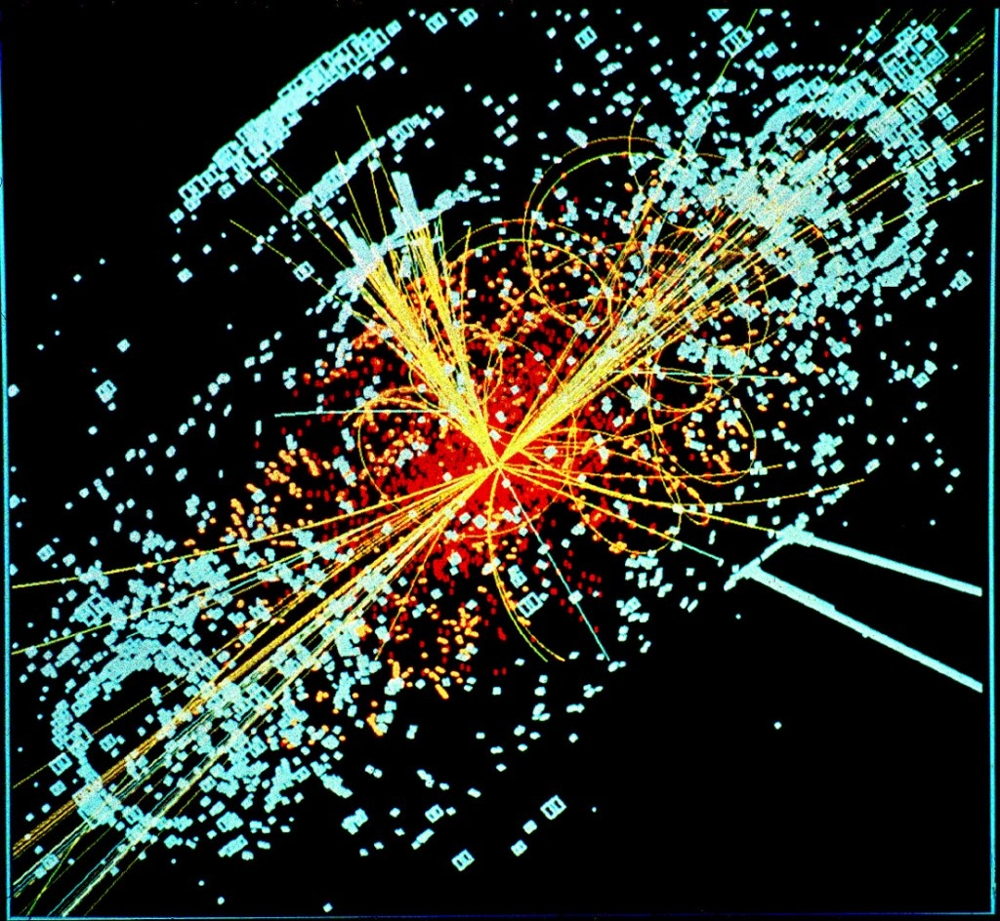

Intéressant de voir comme le catastrophisme attire. Des films holywoodiens aux sectes apocalyptiques, la recette de la fin du monde a toujours du succès.

Après la guerre nucléaire totale, l'énorme météore qui frappe la Terre, le Déluge suite à la fonte des glaces de l'Antarctique, les virus ebola croisés avec la grippe aviaire voire le Soleil qui s'éteint et bien d'autres, voici le petit dernier à la mode : l'annihilation de la planète suite à la mise en service du LHC au CERN !



Au début j'ai cru à un gag, puis à un moyen tordu de faire parler de soi, mais la plainte de Luis Sancho et Walter L. Wagner visant à empêcher la mise en service du nouvel accélérateur de particules se révèle être la pointe de l'iceberg. Il y a apparemment des gens qui ont vraiment peur que la collision de deux protons à haute énergie cause la Fin du Monde !

Si vous voulez vous préparer au pire, le [site des plaignants](http://www.lhcdefense.org/) vous dirigera vers d'autres, comme:

- une véritable [caricature de pensée de cow-boy](http://www.misunderstooduniverse.com) intitulée "La France construit la machine de la Fin du Monde" dans laquelle, en plus, le CERN est soupçonné de produire assez d'antimatière pour détruire les environs (pas grave), mais surtout qu'elle pourrait être utilisée par des terroristes ! Et les commentaires sont du même niveau : lamentables.
- [Unfication Theory](http://www.unificationtheory.com/god/CONCERN.html) propose un pavé indigeste démontrant que les gens du CERN ne connaissent rien à la physique et vont détruire le joli monde créé par Dieu Tout Puissant.
- le site [notepad.ch](http://www.notepad.ch) (suisse!), dont l'auteur reprend par cut & paste des infos glanées sur le web et se fend même d'un commentaire sur [mon article consacré au LHC](http://drgoulu.local/2008/04/06/plongee-dans-le-lhc-du-cern/)

J'aurais du respect pour Luis Sancho, Walter L. Wagner et les courageux anonymes éditant les sites mentionnés plus haut s'ils imitaient [Paco Rabanne, qui avait promis qu'il ne ferait plus de prédiction si la Station Mir ne s'écrasait pas sur Paris le 11 août 1999](http://picoti.free.fr/findumonde/interview.htm). Depuis, on est tranquilles.

De mon côté, je m'engage à ne plus jamais parler de physique si le LHC absorbe la Terre dans un trou noir...

A noter un site beaucoup plus sérieux, celui de la [lifeboat fundation](http://lifeboat.com/ex/main), qui étudie scientifiquement les risques menaçant l'humanité et de proposer des "shields", des protections. [Leur page sur le LHC](http://lifeboat.com/ex/particle.accelerator.shield) contient des informations et des liens très intéressants comme :

- les vidéos officielles expliquant le fonctionnement d'[ATLAS sur YouTube](http://www.youtube.com/theATLASExperiment)
- des [panorama du détecteur ATLAS](http://www.petermccready.com/portfolio/05091901.html) en construction
- la belle image ci-dessous, représentant la simulation de ce qu'ATLAS devrait détecter : la création d'un boson de Higgs à partir de l'énergie pure créée par le choc de deux protons.

