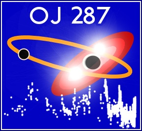

Au centre de notre Galaxie, la Voie Lactée, se trouve un [trou noir](https://fr.wikipedia.org/wiki/trou_noir) qui pèse comme 2.7 millions de Soleils, et parmi les [millions d'autres](http://drgoulu.local/2007/03/13/cest-plein-de-trous-noirs/) on vient d'en trouver un [tout petit](http://drgoulu.local/2008/04/02/des-ptits-trous-noirs/), lourd comme 3.6 Soleils seulement. Avant que [celui de 10\-57 masses Solaires](http://drgoulu.local/2008/04/17/on-va-tous-mourir/) nous dévore tous (arf!) voici des nouvelles d'un vrai monstre : OJ287.

OJ287 est un [quasar](http://fr.wikipedia.org/wiki/Quasar), une galaxie très lointaine (3.5 milliards d'années lumière) dont le cœur est extrêmement lumineux, ce qui fait qu'on l'observe depuis plus d'un siècle. Or, approximativement tous les 12 ans, sa luminosité augmente en produisant deux flashes successifs.

En 1980, l'équipe finlandaise de Mauri Valtonen a proposé une explication au phénomène : OJ287 serait composé de deux trous noirs, l'un de 100 millions de masses solaires, soit 40 fois plus que [celui du centre de la Voie Lactée](http://drgoulu.local/2007/06/26/le-trou-noir-central-de-la-voie-lactee-revele/). Et celui là, ce serait le petit : il tournerait autour d'un autre, de 18 milliards de Soleils ! Les flashes se produiraient lorsque le petit traverserait par deux fois le disque d'accrétion du grand, comme illustré sur la figure ci-contre.

Le disque d'accrétion, c'est de la purée de matière en orbite à la vitesse de la lumière autour du trou noir, une sorte de LHC naturel avec des étoiles à la place des protons, si vous voulez vous faire une idée ...

Tout ceci n'aurait été que pure spéculation si les finlandais n'avaient pas prédit la date des prochains flashes : le 13 septembre 2007. Et à cette date, des dizaines de téléscopes autour de la Terre ont enregistré le phénomène, validant du même coup beaucoup de choses:

1. Les masses du duo de trous noirs : OJ 287 est le plus gros jamais mesuré, 6x plus lourd que le numéro 2.
2. La théorie de la relativité. Albert avait expliqué la mystérieuse précession de l'[orbite de Mercure](http://fr.wikipedia.org/wiki/Mercure_\(plan%C3%A8te\)#L.27orbite_de_Mercure) de 0.1 degré par siècle, et ici les mêmes équations se sont révélées absolument parfaites et valables pour un objet monstrueux dont l'orbite se décale de 39 degrés par période de 12 ans !
3. L'émission d'ondes gravitationnelles. Avec les instruments les plus sensibles actuellement, on a toujours pas réussi à mesurer ces ondes prévues par la Théorie, faute de phénomènes impliquant des masses importantes à portée de main. Or Valtonen a pu calculer que si OJ 287 ne dissipait pas d'énergie sous forme d'ondes gravitationnelles, les flashes se produiraient 20 jours plus tard.

Observation, Hypothèse, Validation expérimentale : ça c'est de la Science ! Avec du rêve en prime. J'attends avec impatience des images de synthèse qui montreraient à quoi ressemble le feu d'artifice vu de moins loin.

## Sources:

1. \[altmetric arxiv="1112.1162" float="right"\]Mauri Valtonen, Stefano Ciprini "OJ 287 binary black hole system", 2011, [arXiv:1112.1162](https://arxiv.org/abs/1112.1162) \[astro-ph.HE\]
    

- [Wikipedia OJ 287](http://fr.wikipedia.org/wiki/OJ_287)
    
- [Les quasars, bancs de tests ultimes pour la relativité générale ?](http://www.techno-science.net/?onglet=news&news=5289) sur Techno-Science
- [Une preuve de la théorie d'Einstein au cœur du quasar OJ 287](http://www.futura-sciences.com/fr/news/t/astronomie/d/une-preuve-de-la-theorie-deinstein-au-cur-du-quasar-oj-287_15295/), Laurent Sacco, [Futura-Sciences](http://www.futura-sciences.com/)
