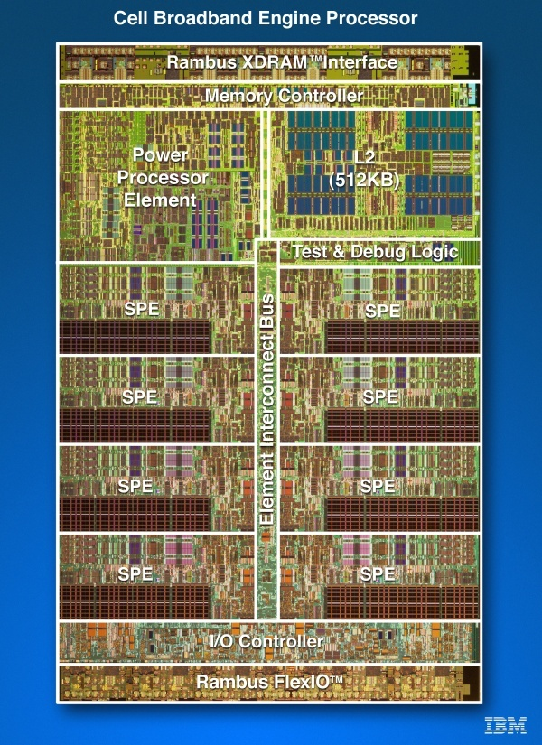

A peine s'est-on habitués à l'idée d'avoir des processeurs à double coeur dans nos PC que les quadruple coeurs ([Intel Core 2 Quad](http://www.intel.com/cd/products/services/emea/fra/processors/core2quad/333916.htm) ou  [AMD Opteron Quad Core](http://multicore.amd.com/us-en/quadcore/)) débarquent dans les PC haut de gamme, et bientôt sur nos bureaux.

Si le double coeur apporte sans conteste un gain de confort (un coeur pour Windows, un autre pour l'application ...), il faut reconnaitre que très peu d'applications sont capables de tirer parti du gain de performance qu'apportent théoriquement deux unités de calcul. Que dire pour quatre ?

L'article "[Choosing Dual or Quad Core](http://www.codinghorror.com/blog/2007/09/choosing-dual-or-quad-core.html)" de Jeff Atwood donne une réponse simple après de nombreux tests : "ça dépend".

Certaines applications vont presque 2x plus vite avec 4 coeurs qu'avec 2 : elles sont parfaitement parallélisées, avec des processus très indépendants ne nécessitant que très peu de communication entre eux. [Pov-Ray](http://www.povray.org/), certains benchmarks et des modules de jeux comme le [système de particules du moteur Valve Source](http://www.anandtech.com/show/2114/9) sont du nombre.

D'autres logiciels sont moins "scalables", essentiellement parce que les processus doivent s'échanger des données entre eux, et chaque synchronisation bloque l'utilisation simultanée des coeurs. Avec 4 coeurs, l'accélération n'est "que" d'environ 150%. Dans cette catégorie on trouve par exemple  [Windows Media Encoder](http://www.microsoft.com/expression/products/EncoderPro_Overview.aspx), [Cinebench](http://www.maxon.net/pages/download/cinebench_e.html) et d'autres programmes de traitement d'images notamment.

Enfin, il y a tous les programmes qui ne sont pas parallélisés, ou qui n'ont été codés que pour 2 coeurs. Et il faut bien le reconnaitre, c'est le cas de la plupart des logiciels actuels.

Reste que la tendance est lancée : les processeurs auront bientôt 4, 8, 16 coeurs ([le processeur Cell](http://fr.wikipedia.org/wiki/Cell_%28processeur%29) qui équipe déjà la Playstation III a déjà 1+8 coeurs, on les voit bien sur la photo), et les programmeurs sont en train d'apprendre à en tirer parti.

Pour l'instant, un Quad vous apportera donc peu de gain de performance sur des applications interactives. Mais si vous encodez des videos, faites du rendu réaliste ou autres applications fonctionnant pendant des heures en tâche de fond, les 4 coeurs vous apporteront un gain de vitesse tout en laissant la machine disponible pour du travail interactif, ça peut valoir le coup.

_(article publié aussi [sur le blog du Microclub](http://microclub.ch/2008/04/19/4-coeurs-cest-mieux-que-2-parfois/))_
