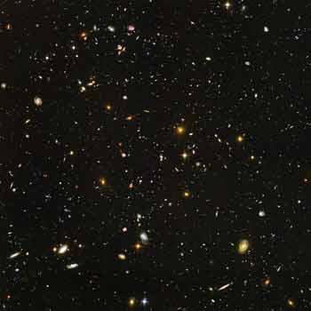
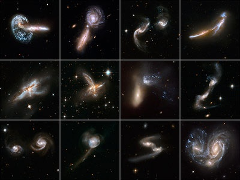
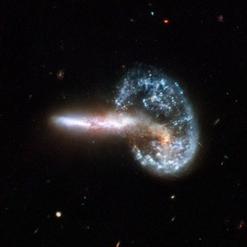

Le téléscope spatial Hubble fête ses 18 ans, l'occasion de revenir sur l'extraordinaire [moisson d'images](http://hubblesite.org/gallery/album/) prises par ce satellite.

Affranchi des perturbations de l' atmosphère, Hubble a en particulier obtenu des images de myriades de galaxies, nous permettant de comprendre la formation et l'évolution de ces nuages formés de milliards d'étoiles, petites gouttes de matière dans un Univers essentiellement vide.

_image Hubble d'un minuscule bout de ciel noir vu de la terre, le "fond du ciel". Chaque point est une Galaxie contenant des milliards d'étoiles._

On sait maintenant que les belles spirales qui décorent beaucoup de galaxies ne se forment, lentement, que si la galaxie n'est pas perturbée par une voisine. Car les galaxies se rencontrent parfois "brutalement" dans des "collisions" où les d'étoiles des deux se croisent, avec un risque infome de collision mais en créant des nuages de gaz qui donnent naissance à de nouvelles étoiles au sein de galaxies déformées.

Les images de [Collisions de Galaxies en cours prises par Hubble](http://hubblesite.org/gallery/album/galaxy_collection/interacting_/) sont peut être les plus spectaculaires :

la première, Arp 148 est magnifique et particulière : le jet blanc est une galaxie vue sur la tranche qui vient de traverser (en quelques millions d'années...) le centre de la galaxie bleue, presque perpendiculairement. Une "onde de choc" d'étoiles renforce la luminosité de l'extérieur la galaxie bleue:

_[Arp 148, deux galaxies en interaction à 500 millions d'années lumière](http://www.eurekalert.org/multimedia/pub/7890.php?from=113306)_

Les collisions de galaxies sont assez fréquentes, et d'ailleurs notre Voie Lactée va connaitre une rencontre mouvementée avec Andromède dans les prochains milliards d'années. Tout est déjà simulé, ce qui évite d'attendre :



N'oubliez pas : le "nuage de gaz" est en fait formé de milliards d'étoiles ...
