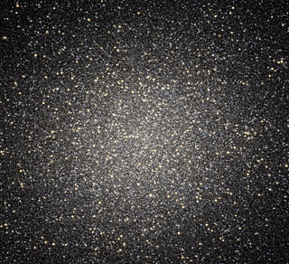
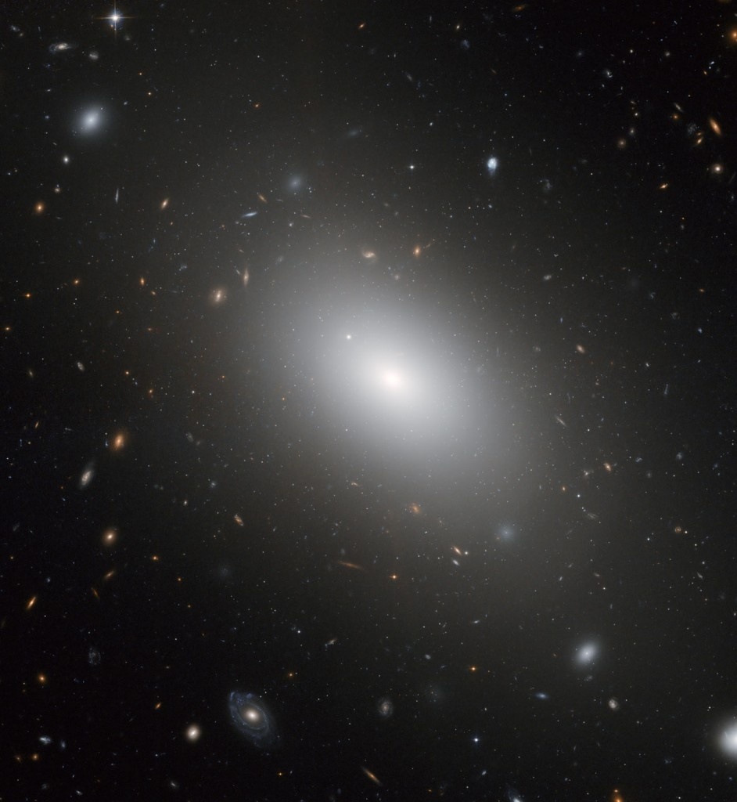
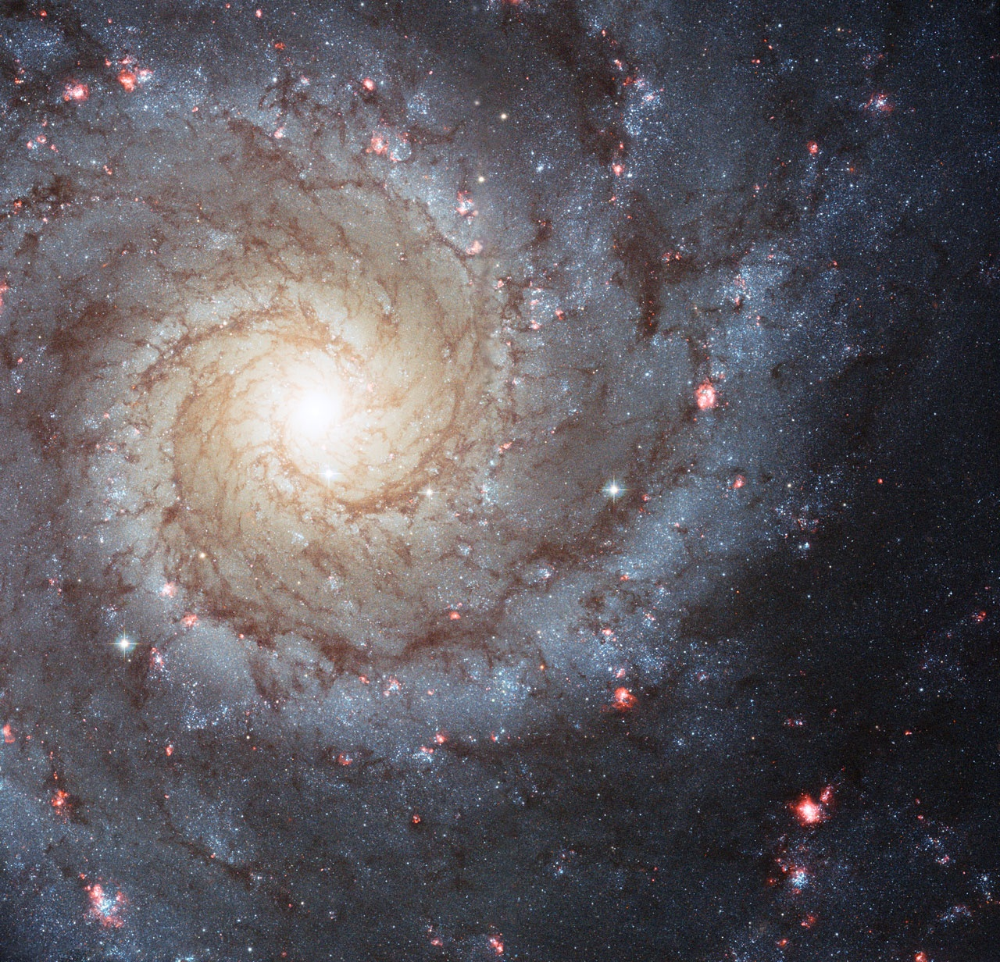
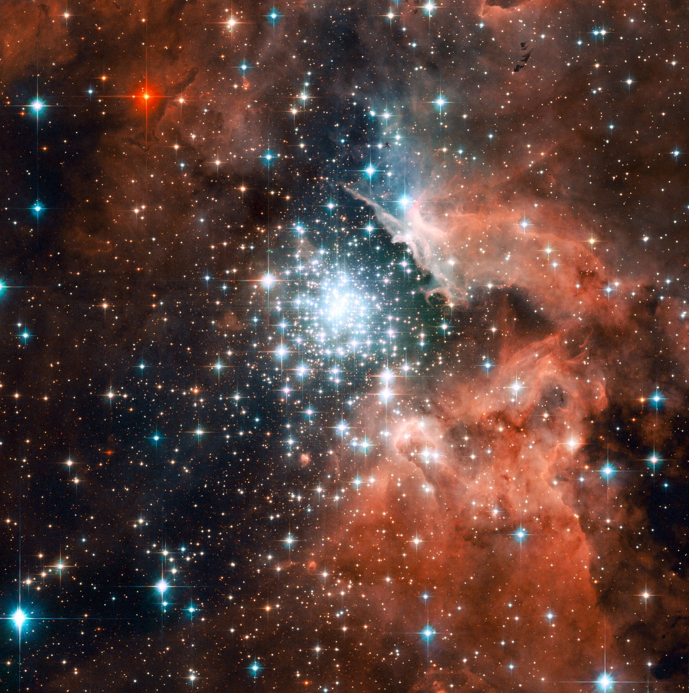
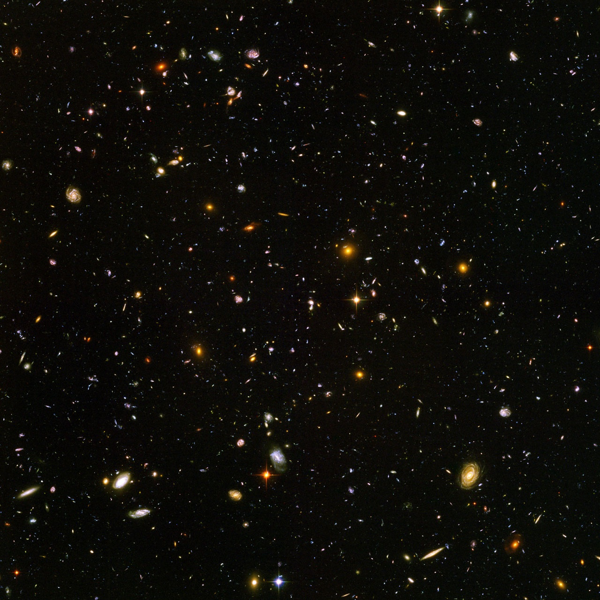
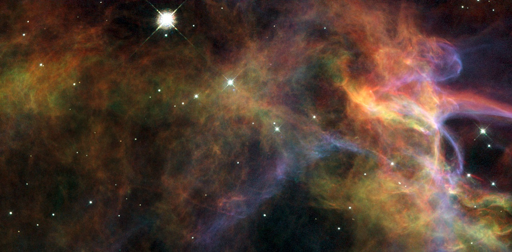
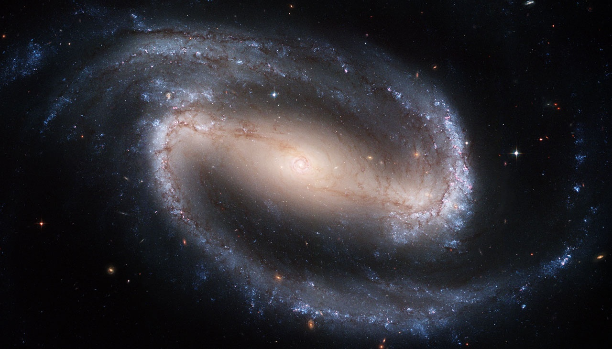

Grâce à [Miro](/2008/03/09/le-futur-de-la-television-zattoo-miro-etc/), j'ai découvert les magnifiques "vodcasts" diffusées par l'équipe du [téléscope spatial Hubble : les Hubblecast](http://www.spacetelescope.org/videos/archive/category/hubblecast/). Présentés de manière très professionnelle et réalisée en haute définition, ce sont d'excellentes émissions de vulgarisation scientifique présentant les découvertes faites à l'aide du télescope spatial Hubble.

Le seul problème c'est qu'elles sont en anglais... Voici quelques éléments en français pour vous aider à choisir vos épisodes et à les comprendre :

### [Episode 16: Galaxies devenues folles!](http://www.spacetelescope.org/videos/heic0810a/)

Un des grands mystères de l'astronomie est comment les galaxies croissent et évoluent. On pense que les collisions de galaxies [(dont j'ai un peu parlé](/2008/04/25/un-festival-de-galaxies/)) sont des événements clés dans leur développement. Une étonnante collection de 59 nouvelles images de galaxies en collision a été publiée à l'occasion du 18ème anniversaire du Téléscope Spatial Hubble de la NASA/ESA. Elles nous donnent une vision unique de la façon dont les galaxies interagissent pour former de plus grandes galaxies.



_(les Hubblecasts sont aussi disponible sous YouTube, mais la qualité laisse vraiment à désirer par rapport à l'[original](http://www.spacetelescope.org/videos/heic0810a/))_

### [Episode 15: Un trou noir trouvé dans l'énigmatique Omega du Centaure](http://www.spacetelescope.org/videos/heic0809a/)

Pour les astronomes, Omega de Centaure a longtemps été une exception parmi les amas globulaires. 10x plus grand que les autres amas globulaires, il contient aussi des étoiles d'âges très différents. Un nouveau résultat obtenu par le Télescope Spatial Hubble fournit une explication surprenante des particularités d'Omega du Centaure : ce n'est pas un amas globulaire, mais les restes d'une galaxie dont les étoiles externes ont été capturées par une autre lors d'une ancienne collision.

### [Episode 14: Hubble trouve les premières molécules organiques sur une planète extra solaire](http://www.spacetelescope.org/videos/heic0807a/)

Le téléscope spatial Hubble a effectué la première détection d'une molécule organique dans l'atmosphère de HD189733B, une "Jupiter Chaude" située à 63 années lumières. Cette percée est un important pas dans la possibilité d'identifier des signes de vie sur une planète extérieure à notre Système Solaire.

### [Episode 13: La galaxie gargantuesque NGC 1132 : un "fossile cosmique"](http://www.spacetelescope.org/videos/heic0804a/)

Le télescope spatial Hubble a pris une nouvelle image de la galaxie NGC 1132, qui est probablement un "fossile cosmique" : la conséquence d'une énorme fusion de multiples galaxies dans un carnage de collisions qui a produit une galaxie elliptique géante beaucoup plus brillante que les galaxies typiques.

### [Episode 12: Obscurité sur une planète monstrueuse](http://www.spacetelescope.org/videos/heic0720a/)

Grâce au télescope spatial Hubble, les astronomes ont trouvé la première preuve de nuages ou brume dans l'atmosphère d'une exoplanète. Cette découverte donne une meilleure compréhension de la classe de planètes géantes que les astronomes appellent "Jupiters chaudes".

### [Episode 11:](http://www.spacetelescope.org/videos/heic0719a/) [Un grand festival galactique](http://www.spacetelescope.org/videos/heic0719a/)

La galaxie Messier 74 se trouve à plus de 30 million d'années lumière. Dans cette image prise par le télescope spatial hubble, les énormes bras de cette magnifique galaxie spirale se courbent dans l'espace, décorées par des nuages d'hydrogène roses et brillants dans la lumière pale et bleue de millions d'étoiles fraichement formées.

### [Episode 10](http://www.spacetelescope.org/videos/hubblecast10a/)[: Faire vivre l'Univers](http://www.spacetelescope.org/videos/hubblecast10a/)

Nous vivons dans un Univers d'une taille inimaginable et d'une beauté presque incompréhensible. Comment la lumière de l'Univers est elle transformée en images, qui inspire des générations en rendant l'Univers vivant?

Cet épisode décrit le traitement "en fausses couleurs" d'images astronomiques et mentionne le [logiciel FITS LIberator](http://www.spacetelescope.org/projects/fits_liberator/), un complément de PhotoShop permettant de faire des images astronomiques à la maison.

### [Episode 9](http://www.spacetelescope.org/videos/heic0715a/)[: Les amas d'étoiles explosent de vie!](http://www.spacetelescope.org/videos/heic0715a/)

Le téléscope spatial Hubble a pris une image spectaculaire de NGC 3603, une nébuleuse géante parmi les plus brillantes de la Voie Lactée. Située à 20'000 années lumière, NGC 3603 est un nid dans lequel des centaines de nouvelles étoiles sont nées "récemment". C'est un endroit splendide pour l'étude de la naissance des étoiles.

### [Episode 8](http://www.spacetelescope.org/videos/heic0714a/)[:](http://www.spacetelescope.org/videos/heic0714a/) [Un pas en direction de nos origines...](http://www.spacetelescope.org/videos/heic0714a/)

En photographiant le "ciel ultra profond", l'image des objets les plus lointains prise sur une portion de ciel vierge de toute étoile proche, les téléscope spatiaux Hubble et Spitzer ont combiné leurs forces pour découvrir neuf des galaxies les plus petites, ténues et compactes jamais découvertes dans l' Univers.

Ces objets semblent indiquer que les galaxies les plus anciennes ont peu à peu fusionné pour former les galaxies actuelles, beaucoup plus grandes.

### [Episode 7](http://www.spacetelescope.org/videos/heic0712a/) [: Dévoilons la Nébuleuse du Voile](http://www.spacetelescope.org/videos/heic0712a/)

Le télescope spatial Hubble a découvert de magnifiques sections de la Nébuleuse du Voile (déjà mentionnée [ici](/2007/12/13/meilleures-photos-astronomiques-2007/)), les restes dispersés d'une supernova qui a explosé il y a 5 à 10'000 ans. Ces nouvelles images montrent la magnifique et délicate structure résultant de cette explosion cosmique.

L'émission explique la vie mouvementée des étoiles et la création des éléments chimiques lourds dont nous sommes faits lors des supernova.

### [Episode 6](http://www.spacetelescope.org/videos/hubblecast06a/) [: Batailles de géants](http://www.spacetelescope.org/videos/hubblecast06a/)

### [Episode 5](http://www.spacetelescope.org/videos/heic0709a/) [: Anneaux de matière sombre](http://www.spacetelescope.org/videos/heic0709a/)

### [Episode 4](http://www.spacetelescope.org/videos/heic0708a/) [: 'Baby Booms' dans les amas globulaires](http://www.spacetelescope.org/videos/heic0708a/)

### [Episode 3](http://www.spacetelescope.org/videos/heic0707a/) [: le 17ème anniversaire de Hubble](http://www.spacetelescope.org/videos/heic0707a/)

### [Episode 2](http://www.spacetelescope.org/videos/heic0706a/) [: Galaxies barrées et Trous noirs](http://www.spacetelescope.org/videos/heic0706a/)

Hubble a founri une incomparable photo de la galaxie barrée la plus proche, NGC 1672. Cette image remarquable fournit une vue à haute résolution de la grande barre de cette galaxie, de son champ de nuages de formation d'étoiles et de ses bandes sombres de poussière interstellaire.

### [Episode 1](http://www.spacetelescope.org/videos/heic0705a/) [: La Galaxie Comète](http://www.spacetelescope.org/videos/heic0705a/)
