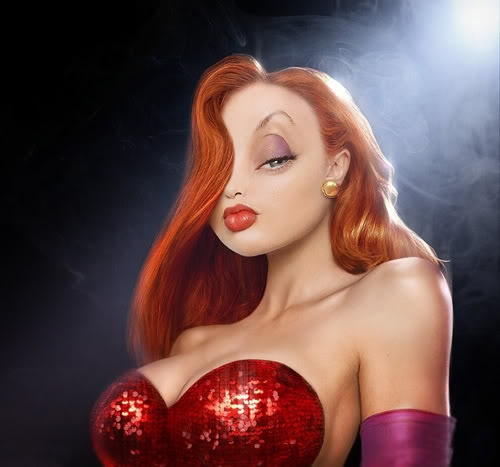
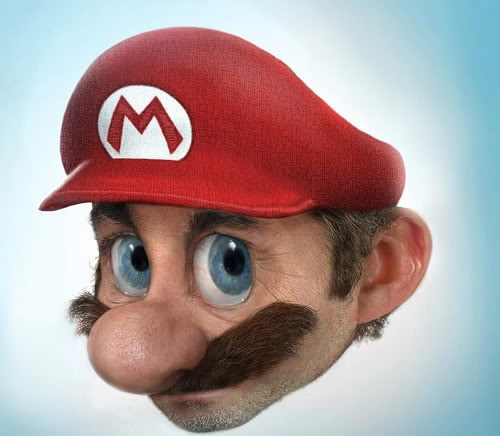
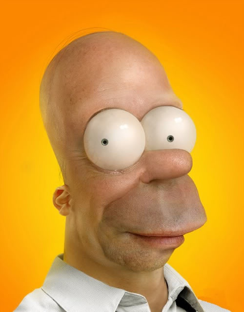

Si vous avez vu "Qui veut la peau de Roger Rabbit", vous n'avez pas pu oublier Jessica:



 

Et voilà que [Pixeloo](http://pixeloo.blogspot.com/) nous fait ceci :

N'est-elle pas mâââgnifique ? Ne vous ferait-elle pas un tout petit peu penser à une célébrité actuelle? Si oui, c'est normal : la video suivante vous montre en accéléré le travail de Pixeloo sur PhotoShop pour Jessica-Rabittitifier un portrait d'Angelina Jolie :



Impressionnant, n'est-ce pas ? Du même auteur, il y a aussi Super Mario:

et mon préféré, Homer Simpson fait à partir de la tête de "John Locke" dans Lost:

