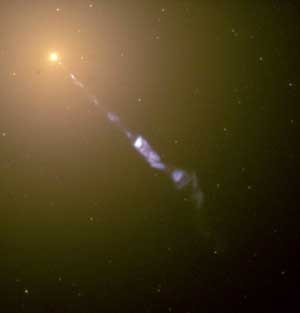
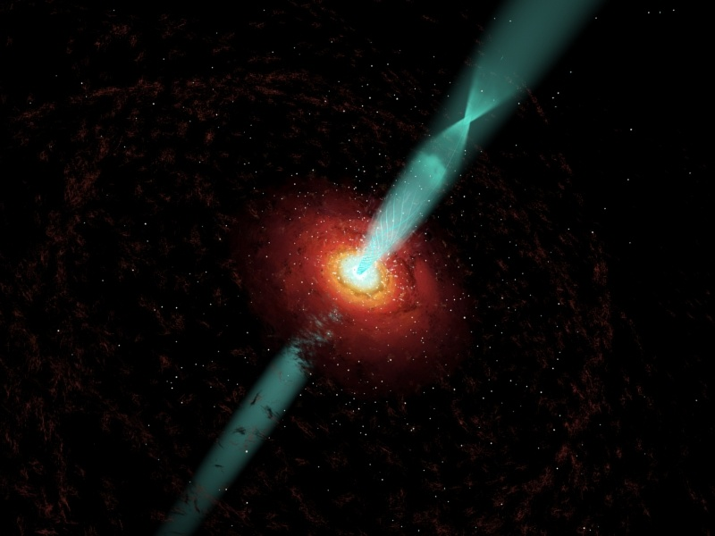

Les trous noirs sont très noirs : aucune lumière ne peut en sortir. En plus ils sont très petits, ce qui empêche définitivement de les "voir" avec un télescope. Par contre les phénomènes cataclysmiques qu'ils produisent dans leur voisinage dégagent une énergie colossale qui trahit leur présence sans doute possible. Il y a d'une part le disque d'accrétion dont j'ai déjà parlé [ici](http://drgoulu.local/2007/03/13/cest-plein-de-trous-noirs/) et [là](http://drgoulu.local/2008/04/18/ca-cest-du-trou-noir-du-vrai/), et d'autre par les "jets", que l'on est en train de comprendre un peu mieux.

A l'origine, ce sont des photos comme celle du centre de la galaxie M87 ci-contre qui ont révélé des jets de plasma très chaud émis à 99% de la vitesse de la lumière par le centre de plusieurs galaxies, perpendiculairement à leur plan de rotation.

La violence du phénomène ne laisse aucun doute sur l'origine, mais le fait demeure, paradoxal : les trous noirs sont capables d'émettre de la matière dans l'espace, probablement en quantités beaucoup plus importantes que celle qu'ils absorbent.

En 1977 déjà, Blandford et Znajek ont proposé un mécanisme expliquant l'émission de ces jets : la matière du disque d'accrétion tombant en spirale vers le trou noir serait déviée par le champ magnétique de celui-ci, qui serait enroulé sur lui-même au point de former une gigantesque dynamo qui accélèrerait la matière sur des lignes de champ hélicoïdales qui s'échappent par les pôles du trou noir. Leur théorie prédit qu'il devrait y avoir un "noeud" à une certaine distance de l'émission ou le jet serait focalisé avant de poursuivre son chemin dans l'Univers. Cette magnifique théorie est illustrée par l'image ci-dessous (cliquer pour agrandir):

Si vous me conaissez, vous m'avez vu venir : oui, la théorie vient d'être vérifiée grâce à sa prédiction : en observant une bouffée de particules progressant le long du jet de BL Lacertae (BL Lac à 950 millios d'années lumière) pendant plusieurs années, Alan Marscher de l'université de Boston a observé qu'elle a émis plus de lumière, de rayons X et de rayons gamma exactement à la position du noeud prévu : CQFD.

L'image ci-dessus et la vidéo correspondante ci-dessous sont réalisées par [Wolfgrang Steffen](http://bufadora.astrosen.unam.mx/~wsteffen/index_engl.htm) , un astronome mexicain qui a fondé l'entreprise [Cosmovision](http://www.cosmovision.com.mx/) réalisant des [animations](http://www.astrosen.unam.mx/~wsteffen/COSMOVISION_ANIMS/indice_1.html) de phénomènes astronomiques comme celle-ci:



Steffen a aussi développé le logiciel "[Shape it](http://bufadora.astrosen.unam.mx/shape/index.html)" qui traite à la façon des astronomes des nuages de particules 3D. Ca fait plusieurs sujets pour de prochains articles...

### sources :

- "[En vidéo : le secret des blazars](http://www.futura-sciences.com/fr/news/t/astronomie/d/en-video-le-secret-des-blazars_15419/)" Laurent Sacco, [Futura-Sciences](http://www.futura-sciences.com/), 2 mai 2008
- [Black Hole's Secrets Revealed - TFOT](http://www.tfot.info/pod/1166/black-holes-secrets-revealed.html)
- "[Black Hole Plasma Jet Spotted Tracing Corkscrew Path](http://www.scientificamerican.com/article.cfm?id=black-hole-plasma-jets-trace-corkscrew-path)", JR Minke, Scientific America, Avril 2008
