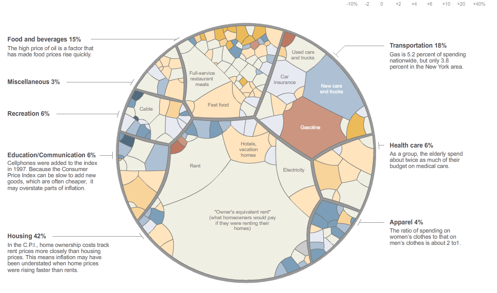

Le New York Times publie ce très intéressant [graphique, esthétique et interactif qui plus est :](http://www.nytimes.com/interactive/2008/05/03/business/20080403_SPENDING_GRAPHIC.html)

Il représente la part de près de 84'000 prix dans les dépenses des ménages américains, regroupés par domaines (logement, transport, alimentation etc.). De plus, la variation des prix sur un an est codée avec des couleurs : rouge = inflation, bleu = baisse des prix.

source : [average American consumer spending - data visualization & visual design - information aesthetics](http://infosthetics.com/archives/2008/05/average_american_consumer_spending.html)
