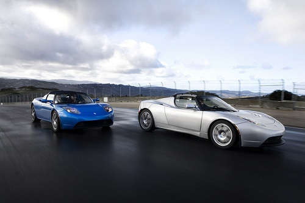

La voiture de sport électrique américaine "Tesla" dont j'ai déjà causé [ici](/2006/08/24/voitures-de-sport-electriques/) va prochainement être [disponible en Europe](http://www.teslamotors.com/eu/). Ce n'était apparemment pas prévu, mais Tesla Motors a soudain décidé de réserver 250 exemplaires à ce côté ci de l'Atlantique. Le prix de €99'000, à comparer aux $109'000 que coute la machine aux USA, explique peut-être le soudain intérêt de Tesla pour l'exportation...



La voiture accélère de 0 à 100 km/h en 4 secondes grâce à un moteur de 185 kW (~248 chevaux!) qui fournit 270 Nm de 0 à 6000 tours. Elle atteint 200 km/h en pointe (à 13'000 tours) et roule 365 km avant de nécessiter une recharge pendant 3h½.

Conçue sur une base de Lotus Elise, la Tesla n'est pas très grande mais pèse tout de même 1.2 tonnes, soit 300kg de plus que sa maman à essence. La faute à 400 kg de batteries lithium-ion, qui rendront l'âme vers 160'000 km.

L'idée de lancer des véhicules électriques dans le haut de gamme me parait excellente : les clients prêts à payer (trois fois plus cher) pour un véhicule propre et silencieux que pour son équivalent pétaradant ne sont pas très nombreux, donc autant viser ceux qui sont attirés par l'exclusivité ou qui souhaite apparaitre comme écolopolitiquement corrects. Pour les autres, [il y a le scooter](http://goulu.wordpress.com/2008/05/05/scooter-electrique/) ...

### sources:

- les différents [blogs](http://www.teslamotors.com/blog) de l'entreprise.
- [Tesla Roadster sur Wikipedia](w:en:Tesla_Roadster)
- [Riding the PCH and more in a Tesla Roadster!](http://green.autoblog.com/2007/11/17/video-riding-the-pch-and-more-in-a-tesla-roadster/) sur AutoblogGreen
