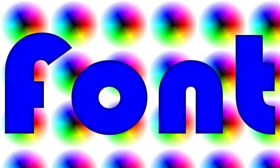
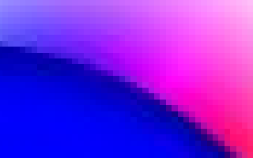

Voici comment générer rapidement et automatiquement des polices de caractères bitmap avec canal alpha, donnant un anti-aliasing parfait quel que soit la texture de fond utilisée. Toutes les polices vectorielles peuvent être utilisées et combinées avec une infinité d'effets graphiques.

Le logiciel réalisant 99% du travail est [ImageMagick](http://www.imagemagick.org/), un programme de traitement d’images open-source gratuit que je considère comme un "Photoshop sans GUI" : aussi puissant que l'outil d'Adobe, ImageMagick s'utilise uniquement depuis un autre programme, voire simplement la ligne de commande du shell. A installer d'urgence.

Voici par exemple le petit fichier batch qui crée quelques fichiers contenant des mots, dont le fichier font.png contenant le mot "font" de l'image ci-dessus :

`@echo off rem Function: Create transparent background, aliased texts from a list of words rem Author: Philippe Guglielmetti rem Requires: ImageMagick v.6 or later (www.imagemagick.org) set texts=OK Abort Cancel font "This is Great !" set params=-background none -font Bauhaus-93 -pointsize 72 -density 300 -fill blue -blur 0x5 for %%a in (%texts%) do convert.exe %params% label:%%a %%a.png set texts= set params=`

Les "params" définissent la police à réaliser:

- \-background none est essentiel pour dessiner la police sur un fond transparent (canal alpha)
- \-font Bauhaus-93 définit la police vectorielle à utiliser (dont le nom n'est parfois pas identique à celui apparaissant dans le dossier "Fonts" de Windows...)
- \-pointsize 72 -density 300 spécifient que la police doit faire 72pt de haut à 300dpi. La taille du bitmap sera donc supérieure à l'écran, mais il pourra être imprimé ou utilisé comme texture dans un jeu 3D ou une démo Demoniak3D avec un résultat d'excellente qualité
- \-fill blue -blur 0x5 sont deux petits effets de base : on remplit le caractère en bleu, et on adoucit le tracé de la lettre, qui est d'un pixel de noir par défaut. Ceci crée des pixels semi-transparents au bord des caractères, ce qui permet une découpe parfaite des caractères quel que soit le fond, comme on le voit sur le zoom ci-contre:
    
     

Pour placer la police sur la texture de fond afin de vérifier sa qualité, on utilise un autre module d'ImageMagick;

`composite.exe -tile back.png -compose Dst_Over font.png test.jpg`

Une fois ce test réalisé, on peut s'attaquer à la génération de tous les caractères de la police. Si seuls quelques caractères sont nécessaires, on peut utiliser le batch ci-dessus en définissant par exemple

`set texts=0 1 2 3 4 5 6 7 8 9`

Mais ceci est fastidieux pour une police complète, et pour des raisons de programmation de l'application finale, il peut être utile de nommer les fichiers d'après le code ASCII de chaque caractère. Comme cette fonctionnalité n'est pas disponible dans le langage de commande Windows, il faut programmer ceci dans un langage évolué. Par exemple en LUA:

`params="-background none -font Bauhaus-93 -pointsize 72 -density 300 -fill white -blur 0x5 " for i=32,167 do os.execute("convert.exe "..params.."label:"..string.char(i).." "..i..".png") end`

Ces 2 lignes génèrent automatiquement 130 fichiers de belles lettres prêtes à être utilisées comme textures dans votre jeu. A noter que ces fichiers pèsent déjà 10 Mb au total, soit plus que l'exécutable d'ImageMagick : il peut donc être intéressant d'inclure ImageMagick à votre produit et de l'utiliser pour créer les polices nécessaires lors de l'installation plutôt que d'alourdir votre distribution...

Enfin, si vous trouvez les polices ci-dessus un peu trop carrées, visitez [cette page](http://www.imagemagick.org/Usage/fonts/) qui vous donnera une petite idée des effets possibles, et explorez [celle-ci](http://www.imagemagick.org/Usage/) pour une vision plus complète.

[_(this article is available in English here)_](http://3dmon.wordpress.com/2008/05/10/generation-of-high-quality-bitmap-fonts/)
