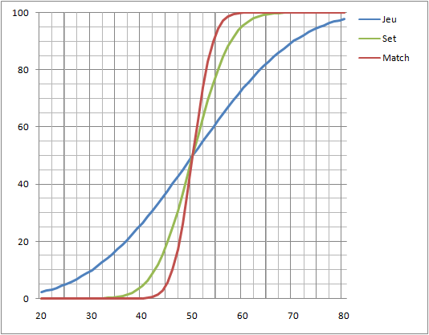

Pour gagner un match de tennis, il faut gagner des "sets". Et pour gagner un "set", il faut gagner deux "jeux" de plus que son adversaire, et pour gagner un "jeu", il faut réussir deux balles de plus que son adversaire. Quel est l'effet de cette étrange manière de compter les points? Que se passerait-il si on comptait simplement les balles gagnantes de chaque joueur, en terminant un match par un score de 88 à 82 par exemple ?

Il y a quelques années, un article par dans "Pour la Science" \[1\] montrait que le comptage des points au tennis introduit un effet non-linéaire dans la relation entre :

- la probabilité de gagner une balle
- et la probabilité de gagner un match.

Ceci apparait de façon limpide dans le graphique ci-dessous:

_probabilités de gain  d'un jeu, d'un set ou d'un match en fonction de la probabilité de gain d'une balle._

J'ai réalisé ce graphique en programmant la simulation de 100'000 matches de tennis entre un joueur gagnant 20% des balles contre son adversaire (qui en gagne donc 80%), puis 100'000 matches lorsqu'il gagne 21% des balles et ainsi de suite. Le programme compte par la même occasion le pourcentage de sets et de jeux gagnés.

Comme on le voit, si en échangeant quelques balles avec Federer vous remarquez qu'il vous laisse en gagner 1/3 (ou que vous êtes vraiment bon), vous n'avez que 10% de chances de gagner un jeu contre lui, mais strictement aucune de gagner un set. Pour avoir 10% de chances de gagner un set contre 'Rodjeur', il vous faut être capable de gagner 43% des balles contre lui. Et pour avoir 10% de chances de remporter un match contre lui, il vous faut 47% de balles gagnantes...

Le système de comptage des points au tennis amplifie donc les écarts entre les joueurs : un joueur qui gagne 51% des points contre un adversaire gagnera 62% des matches contre lui. A 52% contre 48%, il gagnera 3 matches sur 4.

Lors du dernier [match de](http://www.eurosport.fr/tennis/ms-rome/2008/story_sto1567138.shtml) [Federer contre Stepanek à Rome](http://www.eurosport.fr/tennis/ms-rome/2008/story_sto1567138.shtml), le Suisse a marqué 88 pts contre 82 pts à Stépanek, ce qui lui donnait 70% de chances de victoire, mais il a perdu. Stepanek a gagné, malgré moins de balles victorieuses! C'est le prix à payer de la non-linéarité : le comptage des points fait que certaines balles sont plus importantes que d'autres, et donc que celui qui les marque peut gagner avec moins de balles.

Si on gagnait au tennis en étant le premier à marquer, disons 90 points, Federer aurait gagné ce match, mais il en aurait statistiquement perdu beaucoup ces dernières années contre des joueurs qui ne perdent que 1 ou 2% de balles contre lui.

Le système de comptage des points au tennis favorise donc l'apparition de "Numéros 1" et leur maintien en haut du classement. Tout [le contraire du football](http://drgoulu.local/2008/05/09/la-science-du-football/) donc.

### Référence :

1. L’algèbre du tennis – Pour la science n°127, mai 1988
