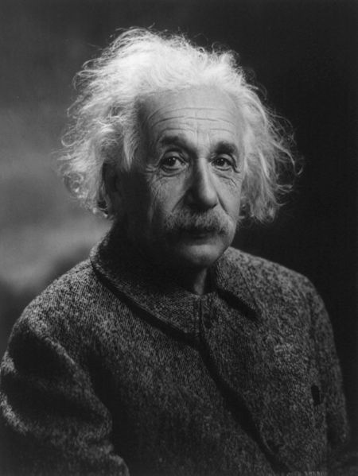

L'étude de texte est un art qui se perd. Un grand nombre de média papier et électronique ont récemment titré "[Croire en Dieu est un superstition enfantine, selon une lettre d'Einstein](http://www.google.ch/search?q=Croire+en+Dieu+est+une+%C2%ABsuperstition+enfantine%C2%BB%2C+selon+une+lettre+d'Einstein)".

Or il n'a jamais dit ça. Dans cette fameuse lettre, il est écrit :

1. "_Le mot Dieu n'est pour moi rien de plus que l'expression et le produit des faiblesses humaines, la Bible un recueil de légendes, certes honorables mais primitives qui sont néanmoins assez puériles_." Notez qu'en disant "le mot Dieu" et pas "Dieu" tout court, Einstein est très clair : c'est la conception que les humains ont de Dieu qui lui semble fragile, pas Dieu lui-même.
2. "_La religion juive, comme toutes les autres religions est l'incarnation des superstitions les plus enfantines_". La encore, Einstein ne dit pas que croire en Dieu est une superstition, il dit que les religions le sont, c'est fort différent.



Einstein n'était pas athée, il l'a clairement écrit dans un télégramme au rabbin Goldstein de New York, qui lui avait demandé s'il croyait en Dieu :

> _**Je crois au Dieu de Spinoza, qui se révèle dans l'ordre harmonieux de ce qui existe, et non en un dieu qui se préoccupe du sort et des actions des êtres humains.**_

Baruch [Spinoza](https://fr.wikipedia.org/wiki/Spinoza) est un philosophe juif du XVIIème qui fut excommunié pour s'être opposé à la conception transcendante du divin. Selon lui, Dieu n'est pas extérieur au monde, mais [immanent](https://fr.wikipedia.org/wiki/immanence) à la Nature, il est la Nature. Spinoza était donc un [pantheiste](https://fr.wikipedia.org/wiki/panthéisme) [matérialiste](https://fr.wikipedia.org/wiki/matérialisme), reconnu comme tel par Albert :

> Je suis fasciné par le panthéisme de Spinoza, mais j'admire plus encore sa contribution à la pensée moderne, parce qu'il est le premier philosophe qui traite l'esprit et le corps comme unité, et non comme deux choses séparées.

D'autres sources laissent penser qu'Einstein était [agnostique](https://fr.wikipedia.org/wiki/agnostique), mais il n'était certainement pas athée au vu des nombreuses [citations](http://atheisme.free.fr/Citations/Einstein.htm) où il mentionne Dieu :

- "_Je ne peux pas imaginer un Dieu qui récompense et punit l'objet de sa création. Je ne peux pas me figurer un Dieu qui réglerait sa volonté sur l'expérience de la mienne. Je ne veux pas et je ne peux pas concevoir un être qui survivrait à la mort de son corps. Si de pareilles idées se développent en un esprit, je le juge faible, craintif et stupidement égoïste._" (Albert Einstein, Comment je vois le monde / 1934)
- "_Cette conviction, liée à un sentiment profond d'une raison supérieure, se dévoilant dans le monde de l'expérience, traduit pour moi l'idée de Dieu._" (Albert Einstein, Comment je vois le monde / 1934)
- "**_Définissez-moi d’abord ce que vous entendez par Dieu et je vous dirai si j'y crois._**"
- "_Le hasard, c'est Dieu qui se promène incognito._" (23.6.2017 : [probablement apocryphe](http://drgoulu.local/2008/11/26/ce-queinstein-na-jamais-dit/#comment-3381871056))
- "_La science sans religion est boiteuse, la religion sans science est aveugle._"
- "_Ce qui m'intéresse vraiment c'est de savoir si Dieu avait un quelconque choix en créant le monde._"
- "_L'escalier de la science est l'échelle de Jacob, il ne s'achève qu'aux pieds de Dieu._"

Enfin, les religieux et les athées sont renvoyés dos à dos dans une lettre datant d'un an avant sa mort :

> "Ce que vous avez lu sur mes convictions religieuses était un mensonge, bien sûr, un mensonge qui est répété systématiquement. **Je ne crois pas en un Dieu personnel et je n’ai jamais dit le contraire de cela, je l’ai plutôt exprimé clairement**. S’il y a quelque chose en moi que l’on puisse appeler "religieux" ce serait alors mon admiration sans bornes pour les structures de l’univers pour autant que notre science puisse le révéler."  _(Albert Einstein, lettre du 24 mars 1954)_
