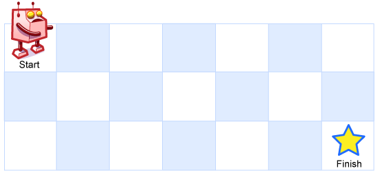

Si vous souhaitez travailler chez Google ou facebook, voici un petit tuyau : cultivez l'art de résoudre des casse-tête, et montrez vos talents sur internet.

[Chez Google](http://goulu.wordpress.com/2007/12/04/interview-chez-google/), on testera votre raisonnement logique dès les premières minutes du premier interview téléphonique, puis on vous cuisinera sur de nombreux autres problèmes plus mathématico-informatiques lors des interviews suivants. En parallèle, vous recevrez un e-mail qui vous incitera à participer aux [compétions de programmation sur TopCoder](http://www.topcoder.com/), un site extraordinaire sponsorisé par de nombreuses entreprises qui recherchent à la fois des solutions originales à des problèmes très pointus et des développeurs de haut niveau. Un très bon endroit pour se faire remarquer (pas seulement par Google) si vous êtes un mordu d'algorithmes. Dommage qu'on doive s'engager à ne pas parler des problèmes à l'extérieur du site TopCoder, parce qu'ils sont très jolis.

Google lance aussi des "chasses au trésor" sur internet. Là je viens de commencer à participer à [celle-ci](http://treasurehunt.appspot.com/), qui commence très fort: si le robot ci-dessous ne peut aller que vers la droite ou vers le bas, combien y'a-t-il de chemins distincts qui le mènent au but ?

Vous avez trouvé ? En comptant à la main ? Bien. Mais en fait, pour la chasse au trésor, il faut répondre pour un damier de 56x32 cases (le nombre change pour chaque participant) ... Dans ce cas, la réponse est 232059241971866600926656, ce qui suppose de [connaitre les maths](http://www.joaoff.com/2008/01/20/a-square-grid-path-problem/) et de disposer d'une bonne calculatrice ...

Si c'est facebook qui vous tente, il faut visiter [cette page](http://www.facebook.com/jobs_puzzles/), chosir un des jolis problèmes qui s'y trouvent, le résoudre avec un programme en C++, Java, JavaScript, OCaml/SML, Perl, PHP ou Python, ce qui montre bien que les langages de programmation n'ont que peu d'importance pour ceux qui savent ce qu'est un algorithme, et que toutes ces jolis sites web ne sont que du vernis.  Ensuite, il faut envoyer la réponse à { (0xFACEB00C >> 2) en décimal } @ facebook.com. [Facile](http://www.hervekabla.com/wordpress/?/archives/11389-Facebook-recrute-des-developpeurs.html).
