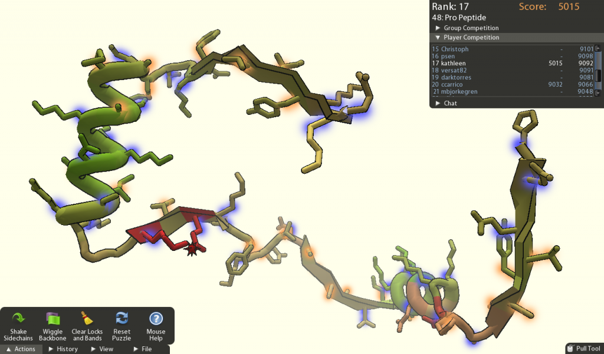
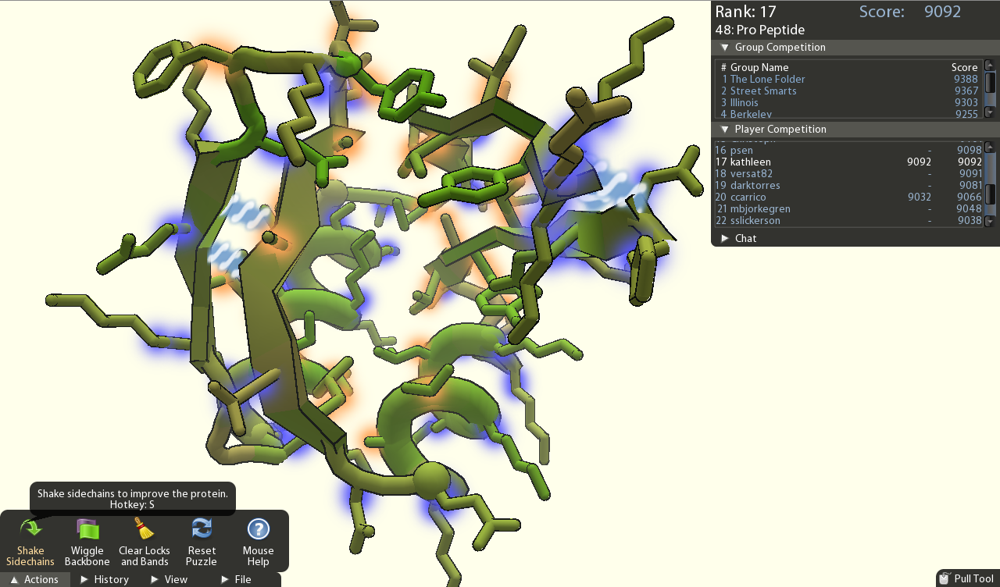

Si vous aimez les casse-tête et les jeux bien fichus, dépêchez-vous d'essayer [Fold It](http://fold.it/portal/). C'est génial, 100% gratuit et ça peut rapporter gros. Il s'agit de déformer une molécule affichée en 3D à l'écran pour qu'elle prenne une forme bien compacte :



Après quelques molécules simples où on vous explique le principe et les diverses manipulations possibles, vous pourrez commencer à affronter les autres joueurs pour tenter d'obtenir le meilleur score sur des molécules de plus en plus complexes. Le jeu est très prenant et devient progressivement très difficile.

Exemple : situation de départ et d'arrivée du Pro Peptide no 48

De plus, jouer à ce jeu est utile à la science. En effet l'étude de la géométrie des protéines et de leur "pliage" en différentes formes est la clé de la compréhension des plusieurs maladies et de la conception de nouveaux médicaments. Mais cette étude demande des puissances de calcul colossales pour simuler les mouvements et déformations possibles. Outre des [superordinateurs](/2007/11/27/le-top-500-des-supercalculateurs/) fonctionnant sur ce sujet, il existe plusieurs projets de [calcul distribué](/2007/01/20/calcul-distribue-avec-boinc/) comme [folding@home](w:) auquel vous pouvez contribuer en installant sur votre ordinateur un programme qui va faire quelque chose d'utile pendant que vous ne l'utilisez pas.

FoldIt va plus loin en [associant la puissance de votre cerveau à celle de l'ordinateur](/2008/03/07/les-ordinateurs-humains-des-captchas-a-peekasearch/) : l'être humain est capable de "voir" en 3D et d' "imaginer" des solutions beaucoup plus facilement qu'un ordinateur, qui lui est bon pour calculer et simuler. L'idée derrière FoldIt est donc que des humains assistés et interconnectés pourraient arriver à plier "pour le plaisir" des protéines qui ont un intérêt scientifique à être étudiées en détail. [Vous trouverez toute l'explication scientifique ici](http://www.boinc-af.org/content/view/942/219/).

Alors, Erika et les millions d'autres, par pitié arrêtez de jouer au Solitaire de Windows et ne perdez plus votre temps quand vous voulez passer le temps : jouez à FoldIt !

Si vous devenez accro, rejoignez le groupe de l' [Alliance francophone](http://www.alliancefrancophone.org/), j'y suis.

source : Rémi Sussan "[Les joueurs au secours de la science](http://www.internetactu.net/2008/05/20/les-joueurs-au-secours-de-la-science/ "Les joueurs au secours de la science")" sur internet actu
