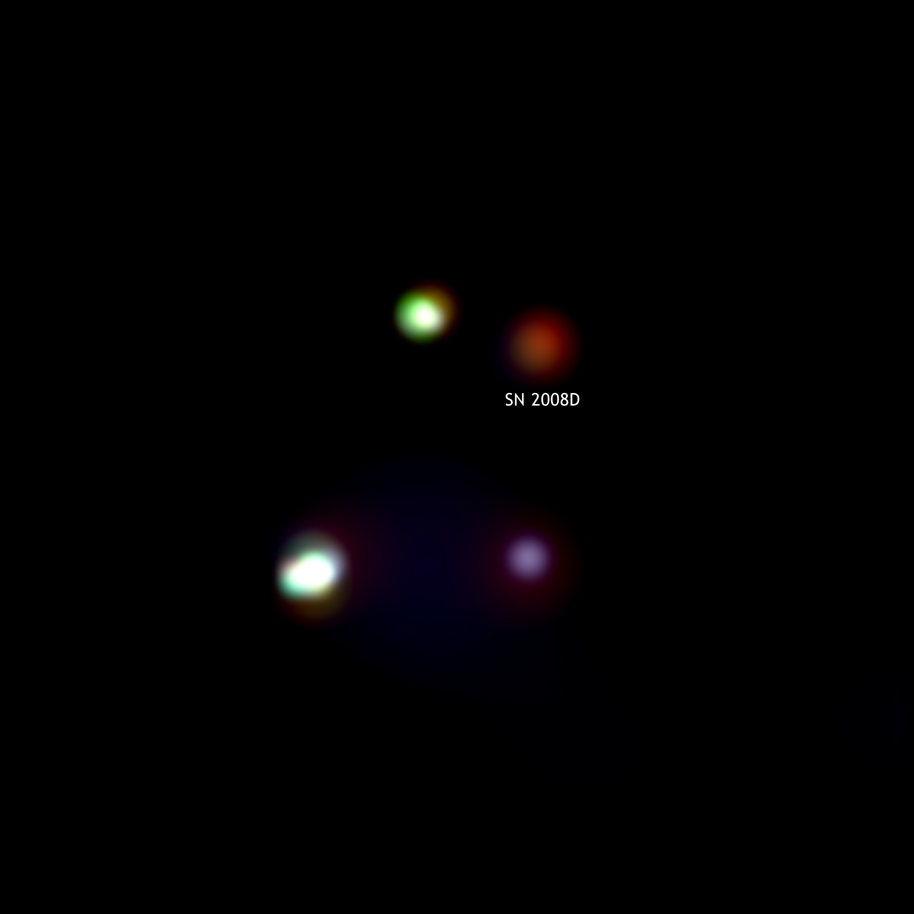
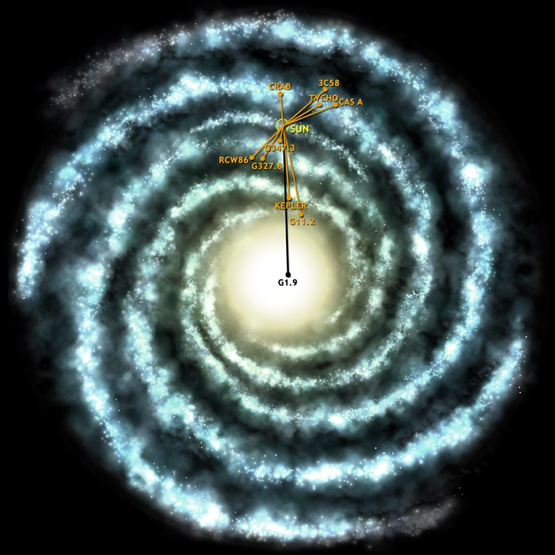

De temps en temps, une étoile explose. Dans une Galaxie contenant des milliards d'étoiles, ça arrive même assez souvent, mais jusqu'à maintenant on n'avait jamais observé une explosion en direct\*, ce qui fait que toute la théorie de ce qui se passe à la mort d'une étoile était basé sur l'observation des "rémanents", les restes de [supernovas](w:Supernova) passées.

Cette théorie prévoit que la [fusion thermonucléaire](/2005/12/11/la-fusion-thermonucleaire/) s'arrête dans une étoile, elle s'effondre sur elle même en quelques secondes, comprimant son centre jusqu'à ce que les protons des tous les atomes se touchent et se combinent avec les électrons pour former [une boule ultra compacte de neutrons](w:Étoile_à_neutrons) sur laquelle les couches externes de l'étoile vont s'écraser en produisant quasi instantanément d'énormes quantités de fer et d'autres éléments lourds, et rebondir dans l'espace dans d'[incroyables feux d'artifice](/2007/03/08/perles-cosmiques/). Ce processus très rapide est tellement "chaud" qu'il ne produit pas de lumière, mais des rayons X pendant quelques minutes, la lumière venant ensuite.

Et devinez quoi ? le 9 janvier 2008 Alicia Soderbers avait pointé le [satellite Swift](w:SWIFT_(satellite)) sur la galaxie NGC 2770 (à 90 millions d'années lumière) pour observer les rayons X émis par les restes d'une supernova apparue en décembre 2007 quand soudain elle a observé en direct un flash de rayons X pendant plus de 3 minutes, juste à côté ! En quelques minutes de plus, elle a réussi à convaincre tous les astronomes de la planète à braquer leurs téléscopes sur le point en question et ... la lumière fut !

 (en bas à droite, l'apparition de la supernova 2008d dans les rayons X, qui aveugle la vieille 2007uy et le centre actif de la galaxie NGC 2770 visibles à gauche. En haut, les images de la galaxie dans le visible, avant et après)

Il faudra encore du temps pour analyser toutes les mesures faites lors de cette observation, mais une fois encore la Science a montré sa supériorité écrasante sur Elisabeth Teissier : quand on prédit qu'une étoile va s'allumer dans 5 minutes grâce à des rayons invisibles depuis la Terre, et bien l'étoile s'allume. Et encore une fois, la force d'une théorie scientifique se mesure à sa capacité de prédiction, pas dans la correspondance avec ce qui a déjà été observé.

Il y a quand même un problème : normalement, on devrait observer en moyenne 3 supernovas par siècle dans notre propre Galaxie, la Voie Lactée. Mais on est loin du compte : la dernière a été vue en [1604](w:en:SN_1604). Pourquoi est-on loin du compte ?

La réponse est dans la figure suivant, qui montre l'emplacement dans la galaxie des 8 supernovas répertoriées par nos ancêtres : elles ne sont pas très loin du Soleil, disons dans une zone couvrant 10% du disque galactique : le compte est bon. Mais pourquoi ne voit-on pas les supernovas plus lointaines, alors qu'elles brillent comme des millions d'étoiles ? Parce que la Galaxie contient des nuages de poussières, très ténus, mais très étendus aussi, et qui empêchent la lumière de parcourir de telles distance. Les myriades d'étoiles qui constèlent notre ciel nocturne ne représentent qu'une toute petite fraction de la petite bulle de matière qu'est notre Galaxie.

\*Note : bien sur, en [185](w:en:SN_185), [1006](w:SN_1006), [1054](w:en:SN_1054), [1181](w:en:SN_1181), [1572](w:en:SN_1572), [1604](w:en:SN_1604) des humains ont vu des points brillants apparaitre dans le ciel pendant quelques jours, mais ils ne savaient pas ce que c'était...

Références:

- ["Birth cry of a supernova](http://feeds.feedburner.com/%7Er/BadAstronomyBlog/%7E3/295179445/)" sur [Bad Astronomy Blog](http://www.google.com/reader/view/feed/http%3A%2F%2Ffeeds.feedburner.com%2FBadAstronomyBlog)
- Jean Etienne, "[SN2008D, l'étoile qui a explosé sous les yeux des astronomes !](http://www.futura-sciences.com/fr/news/t/astronomie/d/sn2008d-letoile-qui-a-explose-sous-les-yeux-des-astronomes_15607/)" 22 mai 2008, [Futura-Sciences](http://www.futura-sciences.com/)
    
- A. M. Soderberg et al, "[An extremely luminous X-ray outburst at the birth of a supernova](http://www.nature.com/nature/journal/v453/n7194/edsumm/e080522-05.html)", Nature
- Laurent Sacco, "[Chandra débusque la plus jeune supernova de la Voie Lactée](http://www.futura-sciences.com/fr/news/t/astronomie/d/chandra-debusque-la-plus-jeune-supernova-de-la-voie-lactee_15540/)", 15 mai 2008, [Futura-Sciences](http://www.futura-sciences.com/)
