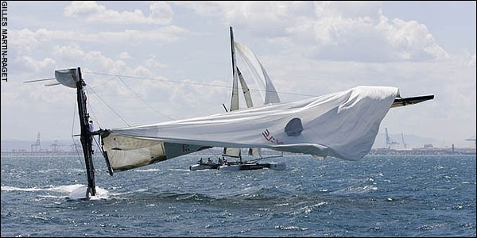

La voile est un sport magnifique, qui peut être [très technique](http://foils.wordpress.com/),mais qui peut devenir un beau panier de crabes aussi. Alinghi a gagné [la Coupe de l'America](/2007/03/18/l-americas-cup-pour-les-nuls/) à la régulière sur l'eau et l'a [conservée de haute lutte à Valence](http://goulu.wordpress.com/2007/07/06/geneve-americas-cup-geneve/), mais a commis quelques erreurs sur le plan juridique qui ont conduit à un imbroglio juridique assez lamentable. L'excellent blog ["Tribord Amure"](http://www.tribormat.fr/) de Matthieu Robert, un pro de la Coupe donne tous les détails.

En résumé, le challenger américain Oracle, qui n'était pas parvenu à atteindre la finale de ces 2 éditions, a profité des erreurs d'Alinghi pour aligner ses meilleurs forces sur son meilleur terrain : leurs sont parvenus devant les tribunaux américains à forcer Alinghi à un duel direct. Oracle a le choix des armes : ils ont imposé à Alinghi de construire d'énormes catamarans de 90 pieds, très chers et qui ne serviront que pour ces régates qui n'auront rien à voir avec le "match racing", espérant probablement obtenir un forfait d'Alinghi par manque de temps. (comment on dit "A vaincre sans péril, on triomphe sans gloire" _(Le Cid, Corneille)_, en yankee ? )

Mais Alinghi a , sauf revirement au n-ième recours, le choix dans la date (pas pu résister...) et le lieu, et va sans doute parvenir à aligner un bateau de folie début 2009. En attendant, les équipes habituées à s'affronter au contact sur de raides monocoques doivent maitriser des engins totalement différents, et ce n'est pas simple :

_photo : [Gilles Martin-Raget](http://www.martin-raget.com/)_

Après Alinghi il y a quelques semaines, ça a été [au tour d'Oracle de chavirer](http://www.tribormat.fr/post/2008/05/25/Un-dessalage-en-regle-rien-a-dire/) sur un petit cata d'entrainement de 40 pieds, où Franck Cammas, un pro de la bête enseignait son métier à Russel Coutts, [LE Russel Coutts](w:Russell_Coutts).

C'est pas parce que je suis un petit Suisse que je pense que cette photo préfigure le résultat du duel, mais parce que je crois qu'Oracle n'a pas compris ce qui fait la force d'Alinghi : l'équipe. Les états-uniens sont emmenés par une forte tête notoire, le patron d'Oracle Larry Ellison, qui a engagé une autre forte tête pour diriger son team à la manière habituelle sur les bateaux : je donne les ordres, vous obéissez.

Alinghi n'a pas de fortes têtes : Bertarelli a amené ses compétences de manager et a monté une équipe moderne basée sur la complémentarité et la collaboration. Sur l'eau, ils gagneront.
