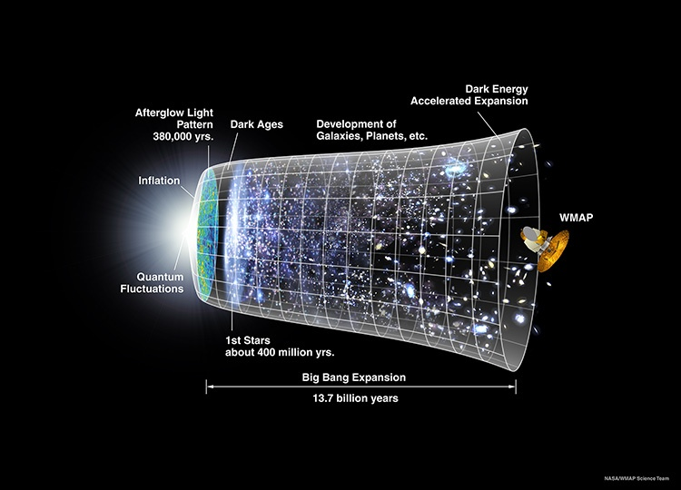
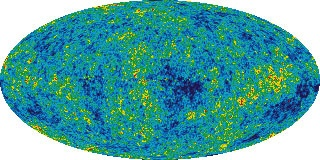

Si vous comprenez le très bon anglais, regardez [l'excellente présentation de Brian Cox au TED](http://www.ted.com/talks/brian_cox_on_cern_s_supercollider.html). Ce jeune et enthousiaste physicien du CERN présente le LHC du CERN dans le contexte des interrogations actuelles en physique. A un moment, il montre cette image de nos connaissances actuelles de l'histoire de l'Univers:

 [ _(cliquez dessus pour accéder au site d'origine, où l'image est disponible en diverses tailles)_](http://map.gsfc.nasa.gov/media/060915/index.html)

Cette figure montre le BigBang à gauche, il y a 13.7 milliards d'années, la phase "inflatoire" où il a gonflé exponentiellement en 380'000 ans, avant que la purée de matière ne s'agglomère par gravitation pour former les étoiles (les premières 400 millions d'années après le Big Bang seulement), les galaxies, amas et superamas qui constituent l'univers actuel.

Le satellite représenté à gauche, c'est [WMAP ("Wilkinson Microwave Anisotropy Probe")](http://map.gsfc.nasa.gov/) qui a mesuré la densité de la purée de matière telle qu'elle était 380'000 ans après le Big Bang, à la fin de l'inflation. C'est l'image la plus ancienne de l'Univers que l'on puisse obtenir par l'astronomie, on en voit un bout sur la tranche d'Univers la plus à gauche ci-dessus, mais la voici au complet, correspondant à la voute céleste complète :

Cette image montre qu'il y avait déjà des grumeaux dans la purée, mais sans structure claire : le Big Bang a "pété droit", mais des phénomènes survenus immédiatement ensuite ont créé une légère anisotropie.

"Comment ?", c'est l'une des questions que le LHC va contribuer à résoudre, une autre étant la raison de l'accélération de l'expension de l'univers, aussi représentée sur la première figure. WMAP et d'autres mesures montrent que de "l'énergie sombre" fait que les Galaxies se repoussent. C'est comme si [la constante de la gravitation universelle variait](http://drgoulu.local/2008/01/21/perlisismes-les-dictons-informatiques-dalan-perlis/) : l'attraction faiblit au fur et à mesure que l'Univers vieillit. Tout ça devrait être éclairci très bientôt par mes voisins, au CERN.
