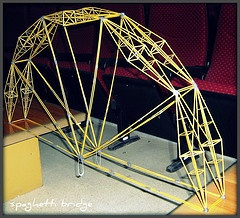
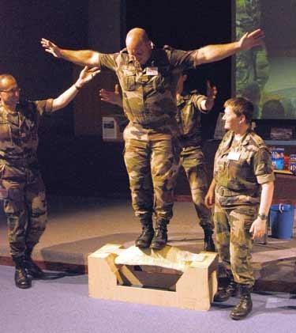
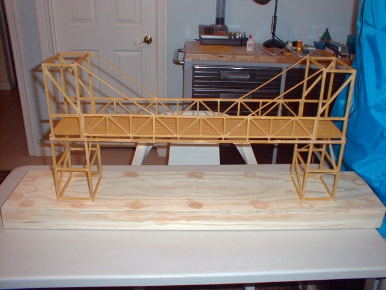

"_L'ingénieur des Mines construit un pont, celui-ci s'écroule, il ne sait pas pourquoi. Le Polytechnicien construit un pont, celui-ci s'écroule mais il sait pourquoi. Le gars des Arts et Métiers construit un pont, et il ne sait pas pourquoi, mais ça tient._"

Les concours de ponts en spaghetti s'attaquent à ce décalage bien connu entre les formations théoriques poussées et celles qui insistent plus sur la pratique.

A L'[Université de Delft aux Pays-Bas](http://www.spaghetti.citg.tudelft.nl/), les étudiants affrontent même des [bureaux d'ingénieurs](http://www.abt.eu/nl/actueel.asp?page=1&cid=1&nid=96&qv=) professionnels. Les meilleurs étudiants construisent des ponts de 600 grammes supportant 500 fois leur poids suspendu au centre de la portée, alors que les pros arrivent à des structures supportant plus de 1000x leur poids propre en pâtes.

En France, Car Tec-Inno bien connu pour ses "festivals de la robotique" y inclut maintenant un [concours de ponts](http://www.cartec-inno.com/index.php?ID=8) de spaghetti. Comme à Delft, ils doivent avoir une portée de 1m mais ne doivent pas utiliser plus de 500g de pâtes, par contre ils peuvent s'appuyer sur les flancs inclinés de la vallée. Le record n'est cependant que de 33 kg de charge. [Les ponts conçus par les militaires de l'ESAG](http://dicod.refonte.prosodie.net/terre/breves/le_pont_en_spaghetti_des_sapeurs_resiste_a_125kg) ont supporté 125 kg, mais avec 2Kg de pâtes.

Selon eux, on ne peut pas faire un pont aussi résistant avec seulement 2kg de béton ! En fait, on peut probablement car [selon cette discussion sur Futura-Sciences](http://forums.futura-sciences.com/tpe-tipe-autres-travaux/183185-calcul-de-resistance-un-pont-spaghettis.html) la résistance à la rupture en traction des spaghettis est à peu près la même que du bon béton en compression. Mais le béton a une résistance bien inférieure en traction, alors que le spahetti, beaucoup plus élastique, "[flambe](http://fr.wikipedia.org/wiki/Flambage)" facilement en compression. Il faut donc concevoir un pont en spaghetti très différemment d'un pont en béton.

C'est [Richard](http://designsmarter.typepad.com/richardsblog/) qui m'a fait découvrir le merveilleux monde de la construction en spaghetti. Après une vie passée dans la construction, il coule une heureuse retraite à Las Vegas, en essayant de motiver des jeunes en difficulté à s'intéresser au monde, à étudier, et à faire quelque chose de leur vie. Dans ce contexte, il a construit ce magnifique "[Barilla Fettucini Bridge](http://designsmarter.typepad.com/richardsblog/2008/05/pasta-testing-s.html)" :

Le but recherché n'est pas un record de résistance, mais une démarche scientifique appliquée à une jolie réalisation de travaux manuels. Comme Richard a conçu son pont avec SolidWorks, je n'ai pas pu résister à la tentation de [calculer sa résistance avec CosmosWorks](http://projets.ch/wp/blog/28)...

### Référence:

1. Luis Alberto Segovia González, Inácio Benvegnu Morsch, João Ricardo Masuero, "[Didactic Games in Engineering Teaching - Case : Spaghetti Bridges and Building Contest](http://www.cpgec.ufrgs.br/segovia/espaguete/arquivos/COBEM2005-1756.pdf)", 2005, Proceedings of COBEM 2005 18th International Congress of Mechanical Engineering
