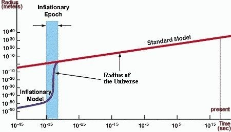

Dès que l'on parle du [Big Bang à l'origine de l'Univers](/2008/05/30/le-big-bang-en-une-image/), la première question qui se pose est "qu'y avait-il avant ?". C'est la Grande Question du Temps. La réponse de la physique actuelle est "la question n'a pas de sens". Dans cet article, je vais tenter de montrer que ce n'est de loin pas une façon de contourner la difficulté de la question.

### Introduction

Commençons par un sujet qui peut paraître éloigné. Notre intuition en regardant un thermomètre est qu'il peut toujours faire plus froid : 20°C, 0°, -20°, -100°, -300°C ... Et bien non. Il ne peut pas faire -300°C, parce que [la température est en fait une mesure de l'agitation des molécules](http://fr.wikipedia.org/wiki/Temp%C3%A9rature), et qu'à une certaine température appelée "zéro absolu" (-273.15°C), les molécules ou atomes ne bougent absolument plus du tout. Une fois qu'on a compris que la température mesure en fait une sorte de vitesse, il devient évident qu'il ne peut pas faire plus froid que le zéro absolu. En serait-il de même avec le temps ? Si le temps que l'on mesure en secondes était en fait relié à une autre notion qui aurait un "zéro absolu" au moment du Big Bang, la question de savoir ce qu'il y avait "avant" n'aurait effectivement pas de sens.

### La 4ème dimension

Selon Einstein, [le temps est une quatrième dimension](/2007/02/07/le-temps-une-4eme-dimension-imaginaire/) liée aux dimensions spatiales par la vitesse de la lumière. Si on admet qu'à l'instant du Big Bang, l'Univers était un point de dimensions spatiales nulles, le temps était aussi au "Temps zéro"  absolu. Autrement dit, si on mesure le temps non pas en secondes, mais en se basant sur le [rayon de l'Univers observable](/2008/05/30/le-big-bang-en-une-image/) qui augmente depuis le BigBang, il devient clair qu'à un moment l'univers avait un rayon de 1 mètre (à 10\-32 secondes), mais que se demander quand il avait un rayon de -1m n'a pas de sens.

### La mesure du temps

Nous allons nous intéresser à la mesure du temps, en commençant par son unité : la seconde. A quoi correspond-elle physiquement ? Jusqu'en 1956, c'était un 60ème de 60ème de 24ème de jour terrestre. Puis on s'est aperçus que la Terre ralentissait, alors c'est devenu 1/31 556 925,9747 d'année. Mais alors que valait une seconde avant que le Système Solaire n'existe, il y a 4 milliards d'années ?

Heureusement, en 1967 on a défini la seconde comme \[1\]:

> la durée de 9 192 631 770 périodes de la radiation correspondant à la transition entre les niveaux hyperfins F=3 et F=4 de l’état fondamental 6S½ de l’atome de césium 133 à 0°K .

C'est mieux, ça sonne bien physique. Mais [il n'existe pas d'atomes de césium à 0°K dans la nature](/2007/05/09/plus-froid-que-lespace/), et d'ailleurs les premiers atomes sont apparus 300'000 "ans" après le Big Bang, et le césium plutôt après 1'000'000'000 d'années, avec les premières étoiles. Avec quelle horloge pouvait-on mesurer le temps avant ? Ou autrement dit, comment savoir si les secondes du début de l'Univers avaient la même durée que les secondes actuelles ?

[")](/2008/05/30/le-big-bang-en-une-image/)

###  Le Grand Métronome Absolu

Dans la purée de particules et de rayonnements qui composaient l'Univers pendant la première "minute" après le Big Bang, il n'existait aucun moyen de mesurer le temps. Aucun système oscillant de façon stable en conservant de l'énergie, sauf peut-être des photons dont la fréquence variait rapidement avec la dilatation de l'Univers, à condition qu'ils aient la chance de parcourir plus d'une longueur d'onde avant de heurter une autre particule. Pendant une minute, l'Univers a entièrement été gouverné par le Hasard Quantique. Même Dieu n'aurait pas pu chronométrer une seconde de cette minute là.

Et encore avant cela, avant l'inflation et pire encore avant le [Temps de Planck](http://fr.wikipedia.org/wiki/Temps_de_Planck) à 10\-44 secondes, on a strictement aucune idée de ce que contenait l'Univers à part de "l'énergie pure".

On a donc un gros problème : le Big Bang est décrit en utilisant la notion actuelle de "seconde", mais on n'a peut être pas le droit de le faire car il n'existe pas de "Grand Métronome Absolu".

### Temps et Énergie

Cependant, il existe un point commun entre toutes les mesures passées et actuelles du temps, c'est l'énergie : toutes les horloges sont basées sur une oscillation périodique d'un système contenant de l'énergie. Que ce soit la rotation de la Terre, le mouvement d'un balancier muni d'un [ressort spiral](/2005/12/12/calcul-dun-ressort-spiral-dhorlogerie/) ou la fréquence d'un rayonnement électromagnétique, notre mesure du temps est étroitement liée à la notion d'énergie.

La théorie du Big Bang lie étroitement le temps et l'énergie au "début" de l'Univers, comme on le voit sur la fig.2. Les particules sont apparues à 10\-10 s, quand leur énergie correspondait à 10² Giga [electronVolt](http://fr.wikipedia.org/wiki/M%C3%A9ga%C3%A9lectron-volt) (GeV). Puis elles se sont agglomérées en atomes à 1013 secondes, quand leur énergie a baissé à 10\-11 GeV, et actuellement il est exactement  2,3.10\-13 GeV après le Big Bang.

### Chaud le Big Bang, chaud !

Comme on l'a vu dans l'introduction, la température est une mesure de l'énergie des particules, et ceci permet de graduer l'âge de l'Univers avec un thermomètre. Actuellement, il est 2,7 °K d'après le rayonnement du fond du ciel, mais il était 15°K quand les étoiles et galaxies se sont formées et 1015°K  au moment de la formation des particules. Notez le retournement de situation avec cette façon de mesurer le temps : le Big Bang n'a pas lieu au "temps zéro", mais à "énergie infinie". Et contrairement au froid qui admet un "zéro absolu", il n'y a en principe pas de limite supérieure à la température. En mesurant le temps par l'énergie ou la température, poser la question "Qu'y avait-il avant ?" n'a plus de sens car le Big Bang est repoussé à l'infini de notre nouvelle échelle du temps : on peut toujours imaginer un Univers encore plus petit, encore plus dense et encore plus chaud.

### Conclusion

L'idée selon laquelle le Big Bang a eu lieu à un "instant" précis est le résultat de notre mesure du temps par des "secondes". Mais comme l'Univers n'a pas de "Grand Métronome Absolu", on doit se résoudre à utiliser l'énergie ou la température pour graduer le temps de façon cohérente. Tout ce que l'on peut dire alors, c'est que l'Univers est en refroidissement perpétuel, sans que ça suppose l'existence d'un "début". Mesuré avec un thermomètre, le temps est continu de plus l'infini jusqu'au zéro absolu, qui aura lieu dans une infinité de secondes. Le Big Bang n'est pas un événement remarquable, avec un "avant" et un "après". Avec les bonnes unités, c'est une asymptote à l'infini dans le passé.

### Sources:

1. ["seconde" sur Wikipedia](http://fr.wikipedia.org/wiki/Seconde_\(temps\))
2. ["Big Bang" sur Wikipedia](http://fr.wikipedia.org/wiki/Big_Bang)
3. Etienne Klein, "[Le temps de la physique](http://basarab.nicolescu.perso.sfr.fr/ciret/bulletin/b12/b12c5.htm)", dans 
4. "[The Observable Universe](http://universe-review.ca/F02-cosmicbg.htm)"
