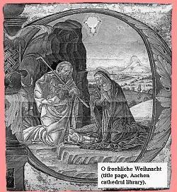
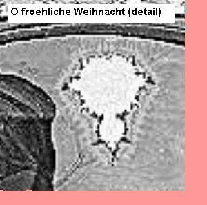

Sur ce blog il n'y a de place que pour la vérité vraie et vérifiable, agrémentée parfois d'un peu de sel subjectif pour en augmenter la saveur. Donc je le dis tout net : voici un vrai canular, mais un magnifique canular, si beau qu'on aimerait vraiment qu'il soit vrai.

Sur "[The Mandelbrot Monk](http://classes.yale.edu/Fractals/MandelSet/MandelMonk/MandelMonk.html)", Ray Girvan raconte l'histoire ([traduite en français ici](http://translate.google.ch/translate?u=http%3A%2F%2Fclasses.yale.edu%2FFractals%2FMandelSet%2FMandelMonk%2FMandelMonk.html&sl=en&tl=fr&hl=fr&ie=UTF-8)) d'[Udo d'Aachen](http://en.wikipedia.org/wiki/Udo_of_Aachen) (Aix-la-Chapelle), moine vivant entre 1200 et 1270 et passionné de mathématiques qui enlumina l'un de ses manuscrits avec l'image de la Nativié ci-contre.

Votre oeil aguerri aura repéré instantanément la forme étrange de l'Etoile du Berger, dont voici un agrandissement :

Mais, oui, c'est bien le fameux [ensemble de Mandelbrot](http://fr.wikipedia.org/wiki/Ensemble_de_Mandelbrot)! Udo l'aurait calculé à la main pendant des années, 700 ans avant que sa découverte par Benoit ne le propulse au rang d'objet mathématique le plus célèbre après le nombre pi, le plus calculé par les ordinateurs du monde entier, et le plus inutile aussi.

 (l'ensemble de Mandelbrot "moderne")

Il faut reconnaitre que Ray Girvan, s'il existe, a fait un excellent travail en liant un certain nombre de faits réels par une fiction qu'il amène progressivement au spectaculaire, citant au passage moultes références bibliographiques que personne n'ira vérifier.

On trouve des choses magnifiques sur internet, des choses auxquelles on veut croire, écrites par des inconnus célèbres à qui on fait confiance d'instinct. Mais parfois, il faut les vérifier quand même...

### Références:

- "[Un moine mathématicien en avance sur son temps](http://www.xgouchet.fr/blog/index.php/post/2008/06/08/Un-moine-mathematicien-tres-en-avance-sur-son-temps?pub=1#pr)", l'article qui m'a fait tomber de ma chaise ;-)
- Ray Girvan, "[The Mandelbrot Monk](http://classes.yale.edu/Fractals/MandelSet/MandelMonk/MandelMonk.html)", le canular initial
- John Allen Paulos, "[Monk's 'Startling' Math Discovery](http://abcnews.go.com/Technology/WhosCounting/Story?id=98615&page=1)", 1er avril 1999, ABC News
- "[Hoax!](http://unapologetic.wordpress.com/2008/03/28/hoax/)" sur Unapologetic Mathematician, analyse la très bonne fabrication de ce canular
- Wikipedia sur "[Ugo of Aachen](http://en.wikipedia.org/wiki/Udo_of_Aachen)" en anglais
