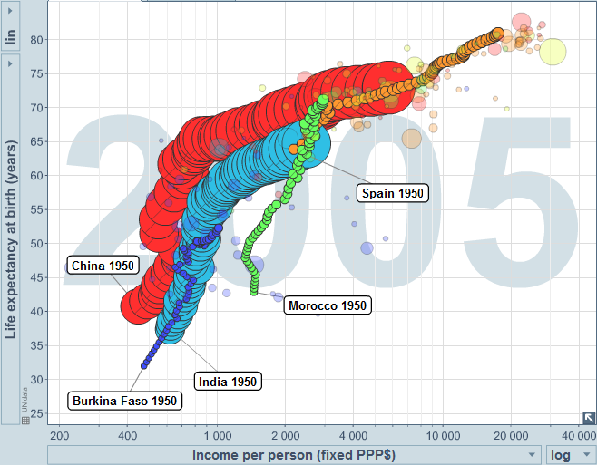

Dans la [Tribune de Genève d'hier, le conseiller national André Reymond (UDC) motive son attaque contre l'aide au développement suisse](http://www.tdg.ch/pages/home/tribune_de_geneve/l_actu/opinions__1/opinions_detail/\(contenu\)/235175) par "_la lente agonie du continent africain, qui témoigne de la faillite de l'aide aux pays en voie de développement_". Or si l'idée selon laquelle l'Afrique régresse est assez répandue, elle ne correspond pas aux faits.

A l'aide du fantastique outil [Gapminder.org](http://www.gapminder.org/) dont j'ai déjà parlé [ici](/2007/07/08/gapminderorg/) et [là](/2007/08/21/les-mythes-sur-le-tiers-monde/), on peut constater que le pouvoir d'achat par habitant de tous les pays africains (sauf la Rép. Dém. du Congo) a au moins doublé depuis 1950, mais aussi que l'espérance de vie a augmenté de 15 à 20 ans pendant cette période.

Certes, l'Afrique sub-saharienne reste globalement en retrait par rapport au reste du monde du point de vue économique et par l'espérance de vie. Mais en observant le développement rapide de la Chine ou l'Inde, on voit assez distinctement deux phases : d'abord un progrès au niveau de l'espérance de vie résultant d'un effort dans le domaine de la santé est des infrastructures (eau potable, égouts etc.), puis un développement économique.

Les pays d'Afrique du Nord comme le Maroc sont actuellement dans une situation comparable à l'Espagne ou l'Italie des années 1950, et disposent maintenant de l'infrastructure matérielle et humaine qui leur ouvre la possibilité d'un développement économique rapide.

La majeure partie de l'Afrique sub-saharienne en est encore à la première phase. Le Burkina-Faso, aidé par la Suisse, n'est effectivement parvenu qu'à doubler son revenu par habitant. Mais chaque habitant vit désormais 20 ans de plus que son arrière-grand père, et ce progrès est essentiel pour la suite du développement de ce pays et de tout le sous-continent.

L'aide de la Suisse et d'autres pays occidentaux a contribué au développement réel de l'Afrique. Il serait regrettable de la remettre en question, ou de freiner le développement économique qui s'amorce en Afrique par des mesures protectionnistes par exemple. Ceci reviendrait à pousser l'Afrique dans les bras de la Chine qui les leur ouvre tout grand, tout sourire à l'idée de récolter les fruits que nous avons aidé à semer.
