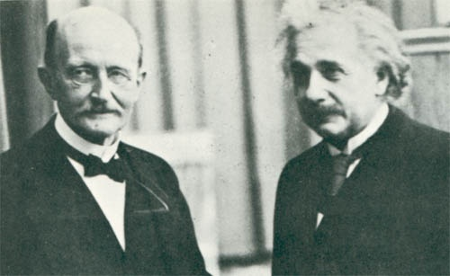

En répondant à un [commentaire](/2008/06/06/la-grande-question-du-temps/#comment-2524) sur [la Grande Question du Temps](/2008/06/06/la-grande-question-du-temps/), je me suis aperçu que le mètre et la seconde apparaissaient ensemble dans toutes les unités des [constantes universelles](http://fr.wikipedia.org/wiki/Constantes_physiques#Constantes_universelles):

| Nom | Symbole | Unité |
| --- | --- | --- |
| [Célérité de la lumière](http://fr.wikipedia.org/wiki/Vitesse_de_la_lumi%C3%A8re "Vitesse de la lumière") dans le vide | c | m/s |
| [Perméabilité magnétique du vide](http://fr.wikipedia.org/wiki/Perm%C3%A9abilit%C3%A9_magn%C3%A9tique_du_vide "Perméabilité magnétique du vide") | μ0 | kg·m / A2·s2 |
| [Permittivité diélectrique du vide](http://fr.wikipedia.org/wiki/Permittivit%C3%A9_di%C3%A9lectrique_du_vide "Permittivité diélectrique du vide") | ε0 | A2·s4 /kg·m3 |
| [Impédance caractéristique du vide](http://fr.wikipedia.org/wiki/Imp%C3%A9dance_caract%C3%A9ristique_du_vide "Impédance caractéristique du vide") | Z0 | kg·m2 / A2·s3 |
| [Constante de Planck](http://fr.wikipedia.org/wiki/Constante_de_Planck "Constante de Planck") | ℎ | kg·m2/s |

 _Albert et Max (Einstein et Planck)_

Or, comme expliqué dans "[Le temps, une 4ème dimension imaginaire](/2007/02/07/le-temps-une-4eme-dimension-imaginaire/)", la relativité d'Albert lie le temps et l'espace par la vitesse de la lumière : actuellement, [la définition du mètre](http://fr.wikipedia.org/wiki/M%C3%A8tre) est d'ailleurs basée sur [celle de la seconde](http://fr.wikipedia.org/wiki/Seconde_\(temps\)), mais dans cet "espace-temps" ([dit de Minkowski](http://fr.wikipedia.org/wiki/Espace_de_Minkowski)) , le temps est une dimension "imaginaire" au sens mathématique du terme :

1 \[s\] = i. 300'000'000 \[m\], où i est l'[unité imaginaire](http://fr.wikipedia.org/wiki/Unit%C3%A9_imaginaire) telle que i2\=-1

En introduisant la seconde comme équivalente, à un facteur près, à des mètres imaginaires dans les unités des constantes universelles on obtient :

| Nom | Symbole | Unité |
| --- | --- | --- |
| [Célérité de la lumière](http://fr.wikipedia.org/wiki/Vitesse_de_la_lumi%C3%A8re "Vitesse de la lumière") dans le vide | c | \-i |
| [Perméabilité magnétique du vide](http://fr.wikipedia.org/wiki/Perm%C3%A9abilit%C3%A9_magn%C3%A9tique_du_vide "Perméabilité magnétique du vide") | μ0 | \-kg / A2·m |
| [Permittivité diélectrique du vide](http://fr.wikipedia.org/wiki/Permittivit%C3%A9_di%C3%A9lectrique_du_vide "Permittivité diélectrique du vide") | ε0 | A2·m /kg |
| [Impédance caractéristique du vide](http://fr.wikipedia.org/wiki/Imp%C3%A9dance_caract%C3%A9ristique_du_vide "Impédance caractéristique du vide") | Z0 | i. kg / A2·m |
| [Constante de Planck](http://fr.wikipedia.org/wiki/Constante_de_Planck "Constante de Planck") | ℎ | \-i.kg·m |

N'est-ce pas merveilleux ? non seulement la vitesse de la lumière devient une constante purement géométrique, mais les "constantes du vide" retrouvent leur parenté oubliée...

Le plus amusant dans ce petit jeu, c'est de voir ce que devient l'unité d'énergie, le [Joule](http://fr.wikipedia.org/wiki/Joule) avec cette manipulation :

1 J = 1 kg·m2/s2 ≈ -1 kg

L'énergie, c'est une masse négative ! Ah, me direz vous, mais Albert  a dit que E=m.c2, donc que (beaucoup) d'énergie était équivalent à (un peu) de masse ! Oui, mais c est proportionnel au nombre imaginaire i, donc c2 ≈ i2 = -1, donc c'est bien ça : l'énergie correspond à de la masse négative.

Pour demain, démontrez que : E+m = 0, donc qu'avec un peu d'imagination, la somme de tout ce qui existe pourrait être rigoureusement nulle ;-)

Références:

1. "[analyse dimensionnelle](http://fr.wikipedia.org/wiki/Analyse_dimensionnelle)" sur Wikipedia
2. "[Unités de Planck](http://fr.wikipedia.org/wiki/Unit%C3%A9s_de_Planck)" sur Wikipedia
