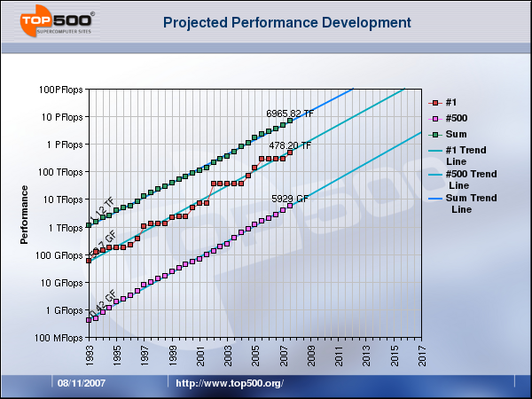
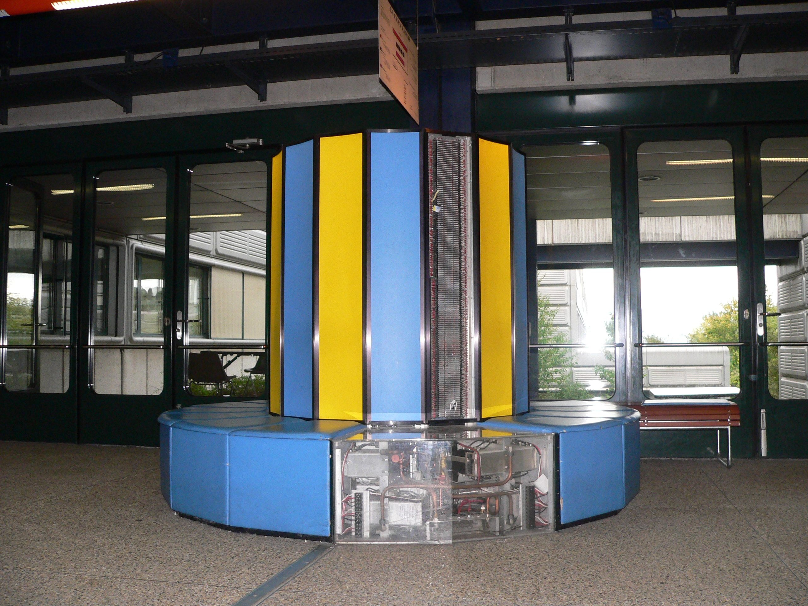
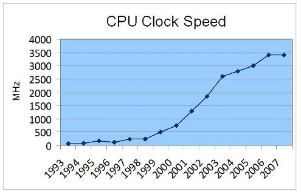
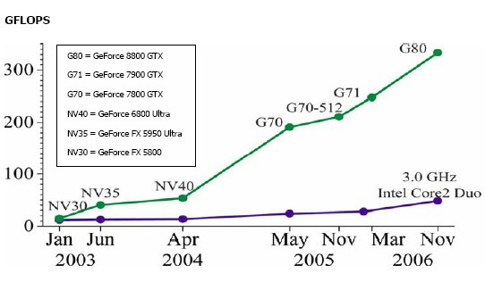
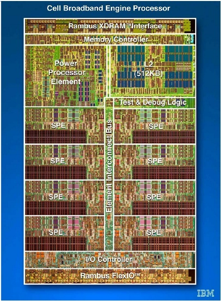

Le premier ordinateur capable d'effectuer un million de milliards d'opérations par seconde (un petaflop) fait "bip-bip" depuis quelques jours. Le ["Roadrunner" d'IBM](http://fr.wikipedia.org/wiki/Roadrunner_\(supercalculateur\)) supplante ainsi le "BlueGene/L d'IBM aussi, vieux d'une année seulement et qui plafonnait à 0.476 petaflop.

D'après les mesures de [top500.org](http://top500.org) qui répertorie les 500 plus puissants ordinateurs de la planète, leur puissance augmente avec une régularité de métronome depuis plus de 30 ans, décuplant en 4 ans, donc doublant en un peu moins de 18 mois.

En ce qui me concerne, c'est assez facile de me représenter cette fantastique croissance : mon PC de bureau actuel correspond assez bien au [Cray XMP installé à l'EPFL](http://dit-archives.epfl.ch/FI94/6-94-page15.html) alors que j'y étudiais en 1986. A l'époque c'était un honneur assez étroitement surveillé d'avoir le droit de faire tourner un programme dessus. Maintenant, il sert de siège dans un couloir.

Selon top500.org et d'autres sources, la progression devrait se poursuivre en tout cas encore une décennie : on devrait avoir un ordinateur de 10 pétaflops en 2012 et un de 100 en 2016, en attendant un "roadrunner de bureau" aux alentours de 2028.

La raison de cet optimisme tient au fait que la puissance des ordinateurs résulte de la combinaison favorable de plusieurs facteurs, et que lorsqu'on s'approche d'une limite sur l'un des facteurs, ça crée un potentiel d'amélioration sur un ou plusieurs autres

### La loi de Moore

L'un des facteurs essentiels est la miniaturisation de l'électronique. En 1965, [Gordon Moore](http://fr.wikipedia.org/wiki/Gordon_Earle_Moore), un des fondateurs d'intel, postula qu'on serait capable de doubler chaque 2 ans le nombre de transistors d'un circuit électronique à prix constant. Sa prédiction s'est extraordinairement bien vérifiée non seulement pour les microprocesseurs, mais aussi pour les mémoires RAM :

[



Il faut bien remarquer que l'on parle ici du nombre de transistors et pas de la puissance du processeur, qui d'ailleurs double en 18 mois, soit plus vite que le nombre de transistors ! Comment est-ce possible ?

### La fréquence

Autour de 1986, j'ai assisté à une conférence de Cray à l'EPFL qui expliquait en substance : "nos ordinateurs sont ronds parce que les ordinateurs du futur devront être ronds. Dans le Cray XMP, à 100 MHz, le courant parcourt moins de 3m dans les fils entre 2 coups d'horloge. A 1GHz, si on y arrive un jour, ça ne sera que 30 cm. Pensez-y : les processeurs ne pourront pas être à plus de 30cm de la mémoire !"

Aujourd'hui, si les processeurs travaillent autour de 3 GHz et la mémoire autour de 1 GHz, c'est beaucoup parce que la miniaturisation a réduit la longueur des "cables". gravés dans le silicium ou imprimés dans la résine, on connait leur longueur, leur section et la distance aux conducteurs voisins avec une précision extrême, ce qui permet de les optimiser en tenant compte de tous les effets électromagnétiques étranges survenant à ces fréquences.

Petite anecdote à ce propos : il y a 20 ans on apprenait qu'il était assez facile de déboguer un circuit digital en ralentissant son horloge, éventuellement jusqu'à la commander à la main avec un petit switch... On m'a dit que ce n'était plus possible actuellement : un Pentium ne fonctionne carrément pas du tout à 1 Hz, car ses circuits sont conçus pour la haute fréquence.

Malgré ceci, en 2003 la fréquence des processeurs qui croissait rapidement s'est retrouvée rapidement limitée en dessous de 4 GHz, entre autres pour des raisons thermiques.

En effet, un circuit consomme d'autant plus d'électricité qu'il fonctionne vite, ce qui fait [chauffer les ordinateurs](/2007/11/17/radiateurs-a-teraflops/), et ils n'aiment pas ça. Les Cray 1 et XMP étaient refroidis par une circulation de liquide entre les circuits imprimés, le Cray 2 était carrément immergé dans du réfrigérant liquide, et on se demandait bien quelle serait la prochaine étape. Mais là encore, la miniaturisation a permis de faire des machines tout aussi puissantes refroidies par de simples ventilateurs assistés éventuellement de [caloducs](http://fr.wikipedia.org/wiki/Caloduc).

### GaAs, optique, quantique ...

Pour contourner les difficultés rencontrées avec l'augmentation des fréquences, on a parfois proposé des ruptures technologiques assez radicales. La plus ancienne et la moins radicale concernait l'utilisation d'[arséniure de gallium](http://fr.wikipedia.org/wiki/Ars%C3%A9niure_de_gallium) à place du silicium. En principe, les transistors à GaAs sont beaucoup plus rapides que ceux au silicium et auraient permis de fonctionner à des dizaines de GHz, mais ils souffrent aussi de problèmes tels que la mise au point de circuits GaAs pour le [Cray 3](http://en.wikipedia.org/wiki/Cray-3) a contribué à la faillite de l'entreprise Cray research.

L'optique est aussi souvent citée comme une technologie de substitution possible à l'électronique. Certains circuits optiques spécialisés très rapides ont été réalisés, mais rien qui ne puisse prétendre concurrencer un ordinateur actuel.

Même dans le domaine du stockage, et malgré les CD et le DVD, l'optique n'a pas réussi à s'imposer en informatique. En 1988, j'ai assisté à une présentation de Pinnacle à l'EPFL qui disait en substance : "voici le premier disque capable de stocker 1Gb sur un seul plateau. Oui mesdames et messieurs, il est optique car il est évident que jamais un disque magnétique n'arrivera a stocker une densité pareille d'information" ...

De même, l'informatique "quantique" permet de rêver à des machines basées sur des principes totalement différents de ceux de Von Neumann, mais rien de concret ne laisse croire que cette technologie puisse jouer un rôle important en informatique dans les prochaines décennies.

### Parallélisme à tous les étages

Si la densité des transistors sur une puce augmente exponentiellement, le nombre de défauts sur une tranche de silicium limite toujours la taille maximale des puces pouvant être produites. A un certain point, il devient possible de mettre deux "coeurs" de processeur sur la même puce. Puis quatre (18 mois après...). intel et AMD nous proposeront peut-être des Hexiums et des Octérons dans 1 an ou 2, mais ce n'est pas sur, car vous avez peut-être déjà un processeur équipé de 100 ou 200 unités de calcul dans votre PC, sans le savoir.

#### L'apport des GPUs

Depuis quelques années on assiste à [la montée en puissance des GPUs](/2007/11/02/la-montee-en-puissance-des-gpus/ "La montée en puissance des GPUs") (Graphics Processing Unit) : le processeur équipant une bonne carte graphique (nVidia ou ATI) effectue nettement plus de calculs que le processeur central (CPU) de votre PC :

Jusqu'à récemment, l'architecture des GPU était uniquement destinée à la production d'images de scènes 3D en temps réel. Mais désormais ces processeurs peuvent être utilisés pour le calcul scientifique, la simulation de phénomènes physiques et d'autres applications exigeant une grosse puissance de calcul (voir mon blog [www.3dmon.com](http://3dmon.wordpress.com) à ce sujet)

nVidia vient de [présenter son processeur GTX 280](http://www.silicon.fr/fr/news/2008/06/16/nvidia_devoile_la_gamme_geforce_gtx_200_), doté de 1.4 milliards de transistors qui réalisent 240 coeurs fournissant 930 Gigaflops : l'ordinateur le plus puissant du monde de1992 est maintenant dans votre carte graphique !

Les GPU ne sont cependant pas (encore?) capable de faire fonctionner des programmes "normaux" : il faut toujours un CPU pour faire tourner un système d'exploitation, Word, Firefox 3 et quelques autres logiciels simultanément, ce qui justifie 2 voire 4 coeurs, mais probablement pas 6 ou 8.

#### Vers un mix

Un des processeurs les plus puissants actuellement est le "[Cell](http://fr.wikipedia.org/wiki/Cell_\(processeur\))" d'IBM qui équipe la console PlayStation 3 (voir [ici](/2007/11/27/le-top-500-des-supercalculateurs/)) Il contient 1 coeur de processeur "classique" et 8 petits coeurs "SPE" plus inspirés de ce que l'on trouve dans les GPU. Le coeur classique fournit 20 GFlops avec des nombres en double précision, les 8 "SPE"s montent à 200 GFlop en simple précision, suffisante pour beaucoup d'applications

Depuis qu'AMD a racheté ATI et qu'intel s'est mis à (essayer de) faire des processeurs graphiques, il n'y a plus guère de doute : les futurs processeurs combineront la flexibilité des CPU actuels et la puissance brute des GPU, et cette combinaison rendue possible par la Loi de Moore continuera à faire progresser la puissance de nos ordinateurs au rythme immuable du doublement chaque 18 mois encore de nombreuses années.

### Et après ?

Il y a bien un moment où les limites physiques seront atteintes : un conducteur métallique doit tout de même avoir quelques atomes de diamètre, comme [l'imaginait Richard Feynman il y a 50 ans](/2008/06/13/il-y-a-plein-de-place-en-bas/). Actuellement les processeurs les plus fins ont des "fils" de 45nm, soit environ 200 atomes de large. Admettons qu'on peut les réduire encore d'un facteur 10, ce qui donne une densité 100x plus élevée que l'on atteindra, selon la Loi de Moore dans 13 ans environ. Que faire après ?

La meilleure réponse à cette question que j'aie entendu est celle du prof. [Jean-Daniel Nicoud](http://fr.wikipedia.org/wiki/Jean-Daniel_Nicoud) lors de sa leçon terminale. En substance il disait "jusqu'à maintenant, on ne grave les puces que sur la surface du silicium, sur des fractions de micron d'épaisseur. On pourrait déjà simplement faire de la gravure sur les deux faces du wafer pour doubler le nombre de transistors. Et puis on pourrait faire des couches multiples. Sur une épaisseur de wafer de silicium, disons 1 mm, on a de la place pour 1000 couches de 1 micron, ça laisse encore 20 ans de plus de validité à la loi de Moore."

On estime que la puissance d'un cerveau humain équivaut à 10 Petaflops, soit la puissance cumulée des 500 plus puissants ordinateurs actuels, qui occument au moins 500 salles actuellement. En 2012, l'ordinateur le plus puissant fournira la même puissance dans une seule salle, et en 2020 environ vous devriez l'avoir sur votre bureau, ou dans la console de jeu familiale. Si les programmeurs travaillent aussi bien que les fabricants de processeurs, peut-être qu'enfin, [60 ans après la vision de Feynman](/2008/06/13/il-y-a-plein-de-place-en-bas/), votre PC saura vous reconnaitre et vous appeler par votre prénom...

### Références:

1. [Loi de Moore sur le site d'intel](http://www.intel.com/technology/mooreslaw/index.htm) avec
    1. "[Moore optimistic on Moore's Law](http://www.intel.com/technology/silicon/mooreslaw/eml02031.htm?iid=tech_mooreslaw+body_optimistic)"
    2. [ce beau poster](http://download.intel.com/pressroom/kits/events/moores_law_40th/MLTimeline.pdf)
2. "[nVidia CUDA : la fin des CPU ?](http://www.presence-pc.com/tests/CUDA-CPU-GPU-22788/)" sur Tom's Hardware
3. Jean-Michel Billaut "[Une intelligence non biologique ?](http://billaut.typepad.com/jm/2005/10/une_intelligenc.html)"
