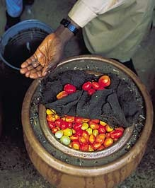
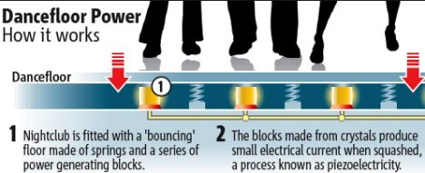
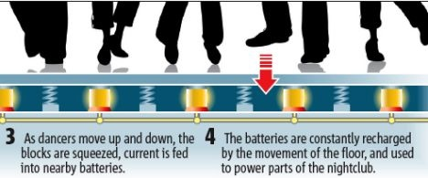

"_Tout ce qu’on peut inventer a été inventé._" Cette citation attribuée à un directeur de la Commission des brevets américains de la fin du XIXème siècle traduit un sentiment assez généralisé dans la population. Mais [la citation est fausse ou non avérée](http://www.empyree.org/latapie_david/drupal/post/plus_rien_a_inventer), et le sentiment aussi.

La preuve avec ces trois inventions trouvées sur "[How to Change the World](http://blog.guykawasaki.com/2008/06/cool-stuff-mond.html)" :

1. le [Q-Drum](http://www.qdrum.co.za/) est un bidon de 50l conçu pour être roulé facilement. Si vous avez visité une seule fois un pays où l'eau courant n'arrive pas dans chaque maison, vous comprenez son avantage. Encore faut-il un chemin relativement plat...
2. Le "[Pot dans le Pot](http://fr.ekopedia.org/Pot-dans-le-pot)" est également destiné aux pays en voie de développement, et peut être produit avec les matériaux et techniques locales. C'est un "frigo sans électricité" utilisant l'évaporation de l'eau mouillant du sable placé entre 2 pots de terre cuite. La nourriture se conserve ainsi beaucoup plus longtemps.Les deux inventions ci-dessus ont reçu le "[Rolex Award](http://www.rolexawards.com/en/index.jsp)" respectivement en 1996 et en 2000
3. Dans la rubrique "choc des cultures", voici un plancher [piezo-électrique](w:Piezzo-électrique) pour eco-nightclub, sensé produire jusqu'à 60% de l'électricité consommée dans un établissement (j'ai un léger doute...) Si vous allez à Londres, [allez le tester](http://www.dailymail.co.uk/sciencetech/article-1027362/Britains-eco-nightclub-powered-pounding-feet-opens-doors.html) à pied ou à vélo, l'entrée sera gratuite.

