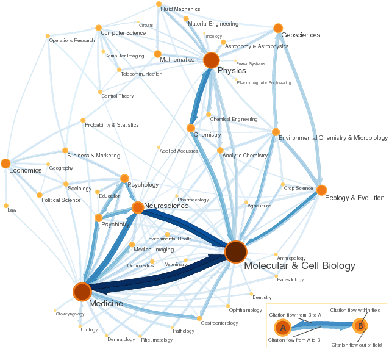
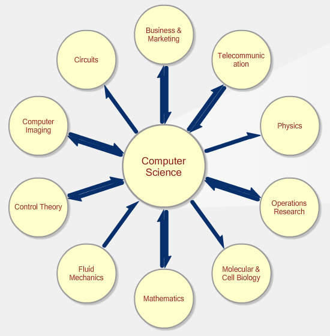
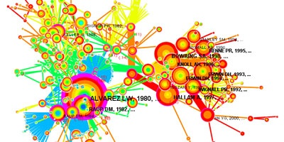
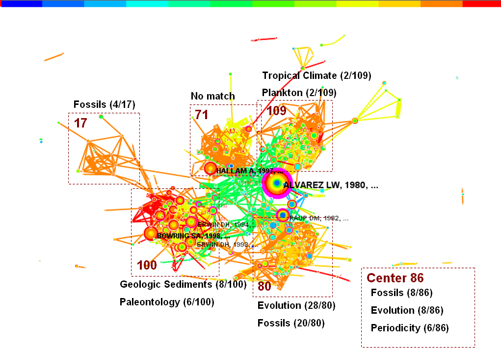
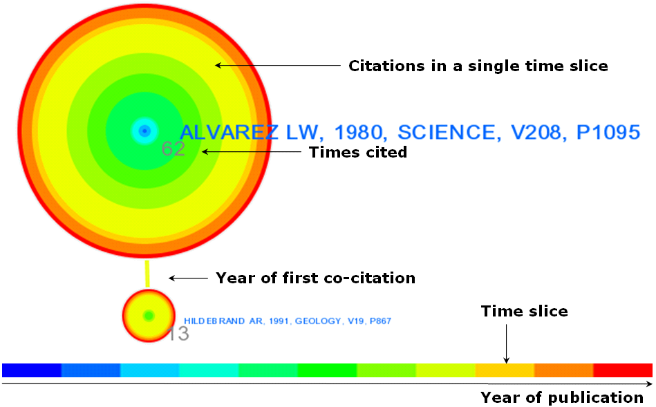

La [scientométrie](http://fr.wikipedia.org/wiki/Scientom%C3%A9trie) est de plus en plus utilisée pour évaluer les scientifiques et attribuer des crédits à leurs laboratoires, alors qu'il existe de nombreuses raisons montrant que ce n'est pas un bon système. Enro a publié [plusieurs excellents articles](http://www.enroweb.com/blogsciences/index.php?tag/evaluation-de-la-recherche) à ce sujet.

Fort heureusement, les imposantes données collectées pour la scientométrie permettent d'en faire un autre usage plus noble et beau : des graphes.

Je vous avais déjà présenté une [Carte des Sciences](/2007/06/07/carte-des-sciences/), mais le site [eigenfactor.org en propose une version modernisée](http://eigenfactor.org/map/maps.htm) utilisant 6'434'916 citations des 6128 journaux répertoriés par Thomson Scientific pour le fameux calcul du "[facteur d'impact](http://fr.wikipedia.org/wiki/Facteur_d%27impact)" des journaux :

eigenfactor.org offre aussi un [système de navigation en ligne](http://www.eigenfactor.org/map/index.php) permettant de visualiser les domaines connexes à un domaine donné, et surtout la liste des journaux traitant de ce sujet (très utile) avec leurs statistiques (moins). Voici par exemple un graphe qui m'a fait très plaisir :

1. Il y a toujours des gens qui savent que l'informatique est une science alors que l' "IT" est une technologie ...
2. elle est toujours bien centrale à mes sujets d'intérêt : ils sont tous là, bien en cercle, il y a même la [mécanique des fluides](http://foils.wordpress.com/) !

[CiteSpace](http://cluster.cis.drexel.edu/~cchen/citespace/) est un autre outil remarquable. C'est une [application Java](http://cluster.cis.drexel.edu/~cchen/citespace/download.html) qui permet d'analyser vos propres bibliographies pour visualiser le référencement entre chercheurs

ou les connexions entre domaines d'étude :

Les couleurs ne sont pas seulement "hippies" : comme elles correspondent aux années, elles permettent de saisir l'évolution temporelle du graphe. La convention utilisée est la suivante :

### Références:

1. Chen, C. (2006) ["CiteSpace II: Detecting and visualizing emerging trends and transient patterns in scientific literature](http://cluster.cis.drexel.edu/%7Ecchen/citespace/doc/jasist2006.pdf)". Journal of the American Society for Information Science and Technology, 57(3), 359-377.

Le blog à suivre si la visualisation des données vous intéresse, c'est [information aesthetics](http://infosthetics.com/), c'est [ici](http://infosthetics.com/archives/2008/06/citation_relation_network.html) et [là](http://infosthetics.com/archives/2006/08/scientific_literature_trends.html) que j'ai trouvé ce qui précède et aussi des représentations à vocation essentiellement esthétiques

- "[400 years of academic papers](http://infosthetics.com/archives/2007/02/400_years_academic_papers_royal_society.html)", une timeline de presque 400 ans de publications à la Royal Society
- "[Map of Science](http://infosthetics.com/archives/2007/03/map_of_science_visualization.html)", une belle carte des sciences illisible
