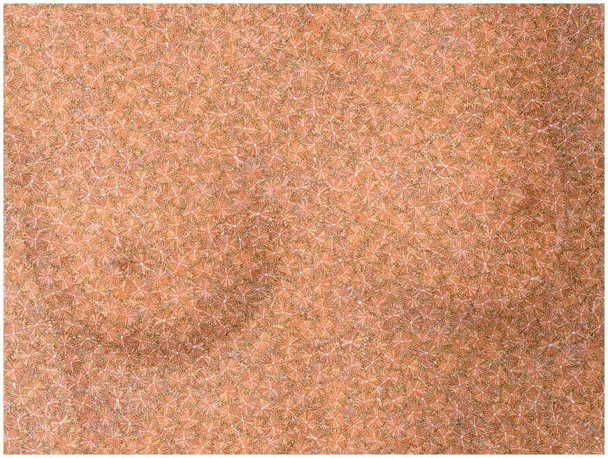
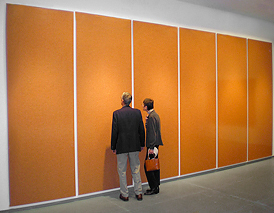

Découvert le photographe [Chris Jordan](w:) grâce à sa [conférence "Picturing Excess" au TED](http://www.ted.com/index.php/talks/chris_jordan_pictures_some_shocking_stats.html) ([disponible sur YouTube](http://www.youtube.com/watch?v=f09lQ8Q1iKE)).

[Sur son site](http://www.chrisjordan.com/) vous pourrez admirer son travail récent "[Running the Numbers - An American Self-Portrait](http://www.chrisjordan.com/gallery/rtn/) " qui illustre par d'immenses [photomosaïques](/2007/08/19/grandes-images/) la boulimie de consommation de ses compatriotes étatsuniens et autres travers relayés par les statistiques, comme:

- ma préférée (allez savoir pourquoi...) :

Vous voyez les petits cercles sur l'image ? en agrandissant, ça donne ceci :

au total il y a 32'000 Barbies, le nombre d'opérations d'augmentation mammaires réalisées chaque mois aux USA ...

- les premiers mots de la Constitution US réalisée en photomosaïque de 83'000 photos symbolisant autant de personnes détenues sans jugement au cours de la "Guerre contre le Terrorisme"...
- 29'569 pistolets, le nombre de victimes tuées par balles en 2004, en partie grâce au 2ème amendement de la Constitution ci-dessus.
- 2.3 millions d'uniformes de prisonniers orange, le nombre de personnes derrières les barreaux au pays de la Liberté en 2005. Dans une exposition, ça donne l'effet d'un orange homogène sur 6 grands panneaux, mais ils sont tous là, bien empilés...
- un million de gobelets en plastique empilés, le nombre utilisés chaque 6h par les compagnies américaines.
- 11'000 avions et leur traînée dans le ciel, le nombre de vols aux USA en 8h.
- 426'000 téléphones cellulaires mis au rebut chaque jour !
- 1.14 millions de sacs en papier bruns, ce que distribuent les supermarchés là bas chaque heure.
- un tableau pointilliste de [Seurat](w:Georges_Seurat) réalisé avec les 106'000 canettes de boisson en alu jetées chaque 30 secondes
- 65'000 cigarettes, le nombre de jeunes qui commencent à fumer chaque mois
- 9 millions de petits blocs en bois pour apprendre l'alphabet = le nombre d'enfants sans assurance maladie dans le pays le plus riche du monde.
- et bien d'autres images chocs sur des faits qui ne le sont pas moins.

Chris Jordan nous promet pour bientôt d'autres images "plus globales", sur les océans, l'Afrique etc. A suivre de près.
