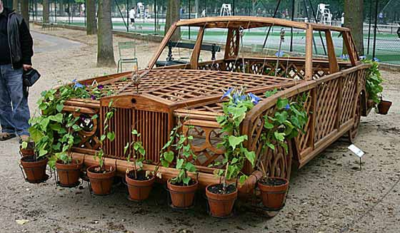
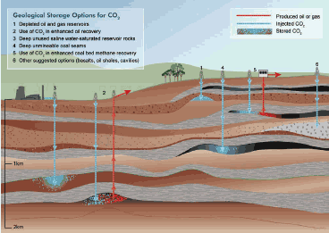
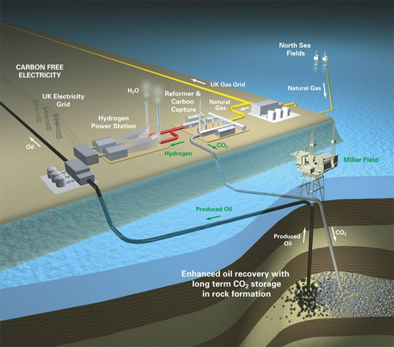
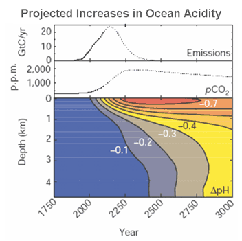

### Réduction du CO2 : rêve et illusion

Le [réchauffement climatique](/2007/05/23/faq-rechauffement-global/) est du en (très) grande partie au dégagement de CO2 du aux combustibles fossiles : pétrole (42%), gaz (18%) et, ne l'oublions pas, charbon(40%).

Espérer résoudre ce problème en limitant la consommation de ces combustibles est illusoire:

- d'une part il est trop tard : des réductions de quelques pourcent du CO2 dégagé n'auront [que des effets mineurs](/2004/06/29/on-brulera-tout/#comment-5) vu le taux de CO2 déjà présent dans l'atmosphère.
- d'autre part [l'augmentation de la demande](/2008/06/12/le-dessous-des-cartes-de-lenergie/) est non seulement inévitable, mais planifié.

Si on réalise que le "pic pétrolier" que nous sommes en train de traverser signifie que seule la moitié du pétrole facile à extraire a déjà été brulé, que le "pic du gaz" n'arrivera que dans quelques décennies et celui du charbon dans un siècle et que des raisons économiques font qu' [on brulera (vraiment) tout](/2007/05/25/on-brulera-vraiment-tout/), il faut se rendre à l'évidence : la réduction du CO2 par la réduction de la consommation est une illusion.

### Captage et stockage

Une autre voie est possible : le captage et le stockage du CO2 sous une forme moins néfaste. Les idées sont sorties des labos et les premières expérimentations à taille industrielle sont en cours, encouragées entre autres par le [Virgin Earth Challenge](https://www.virginearth.com/) lancé par Richard Branson en février 2007. Il offre " _un prix de $25m a quiconque peut démontrer à la satisfaction des juges un système commercialement viable qui résulte en la soustraction de gaz à effet de serre d'origine humaine de façon à contribuer matériellement à la stabilité du climat de la Terre_."

Le problème peut être décomposé en 2 sous-problèmes :

1. **capter** le CO2, soit à la sortie des chaudières et moteurs où il est produit, soit une fois dilué dans l'atmosphère
2. **stocker** le CO2, ou surtout le Carbone.

### Le cycle du carbone

Commençons par analyser le [cycle du carbone](http://fr.wikipedia.org/wiki/Cycle_du_carbone) et les phénomènes naturels qui absorbent directement le CO2 de l'atmosphère, les "[puits de carbone](http://fr.wikipedia.org/wiki/Puits_de_carbone)":

- la photosynthèse : la végétation capte chaque année 62 Milliards de tonnes de Carbone (GtC), 10 fois plus que les 6 GtC correspondant aux 22 Gt de CO2 dégagés par l'activité humaine ! Ou est le problème alors ? Et bien la biosphère rejette 60 GtC/an  pour la respiration. Il reste quand même 2 GtC/an, l'équi transformés en bois, en feuilles mortes, en aliments ou en biocarburant. Mais la déforestation actuelle dégage 1.9 GtC/an et annule donc presque totalement l'effet de la photosynthèse.
- De même 2GtC/an se dissolvent dans l'océan, qui contient 52 fois plus de CO2 que l'atmosphère, mais seuls 0.4 GtC/an sont transormés en calcaire (et en fossiles) par le corail et autres bestioles. Petit rappel : les montagnes calcaires comme le Jura ont été formées ainsi et contiennent l'équivalent de 37'000'000 de GtC (37 millions de gigatonnes = 37 pétatonnes, ou exakilos ou encore zettagrammes de Carbone), l'équivalent de 50 millions d'années de pollution humaine ...

Dans cet article [[1]](#ref-1), l'auteur estime qu'il faut extraire le CO2 directement de l'air et cite différents procédés pour le faire. Mais les puits de carbone naturels fonctionnent grâce à leur énorme surface permettant de capter le CO2 qui ne représente que 0,0375% de la composition de l'air. De ce fait, je suis assez sceptique sur les approches du type "[arbres artificiels](http://news.bbc.co.uk/2/hi/science/nature/2784227.stm)"...

Par contre, faciliter le travail de la nature me parait une approche intéressante. Des expériences de [fertilisation du phytoplancton](http://www.techno-science.net/?onglet=news&news=4336) ont montré que la chose est possible, à défaut d'être réellement efficace pour l'instant.

### Le Captage

Une partie importante du CO2 est dégagé par de grandes installations : les centrales thermiques (34%), l'industrie lourde (25%). Et si nos véhicules fonctionnaient à l'hydrogène, le CO2 qu'elles dégagent actuellement (23%) proviendrait des [usines de production d'hydrogène à partir du gaz naturel.](/2007/09/06/lhydrogene-energie-du-futur/)

C'est pourquoi des entreprises comme [Alstom](http://www.enerzine.com/14/3295+Alstom-progresse-sur-le-captage-de-CO2+.html) ont développé des technologies de captage qui sont aujourd'hui en phase d'expérimentation avant d'être disponibles industriellement autour de 2014. Il y a :

1. le "captage en postcombustion" qui permet d'extraire ~90% du CO2 des gaz d'échappement de centrales à charbon à l'aide d'amoniaque réfrigéré
2. l'"oxycombusion" consiste à bruler les combustibles dans de l'oxygène pur au lieu d'air. On obtient ainsi des gaz composés uniquement de CO2 et d'eau, et après refroidissement, du CO2 pur. Le problème est alors d'obtenir de l'oxygène aussi bon marché que pur, et il existe deux voies :
    1. avec la séparation cryogénique, on distile l'air : à -185°, l'oxygène se liquéfie et l'azote reste gazeux. Refroidir pour mieux brûler ... le procédé est gourmand en énergie...
    2. la "combustion chimique en boucle" (CLC : [Chemical Looping Combustion](https://fr.wikipedia.org/wiki/Chemical_Looping_Combustion)) est un nouveau procédé utilisant un oxyde de métal alternativement oxydé par l'air et réduit par le combustible. Etonnant est prometteur.
3. la "précombustion" consiste à ôter le carbone des combustibles fossiles avant de bruler ce qui reste, à savoir de l'hydrogène. C'est ainsi [qu'on produit l'hydrogène à partir du gaz naturel](/2007/09/06/lhydrogene-energie-du-futur/) actuellement, mais Alstom n'a pas l'air d'y croire comme moyen industriel de produire de l'énergie car cette approche ne s'adapte pas aux centrales existantes.

### Le stockage

Une fois capté, que faire de tout ce CO2 ? Il existe déjà plusieurs [sites de stockage dans le monde](http://www.geos.ed.ac.uk/sccs/storage/storageSites.html) et de nombreux autres sont sur le point de démarrer. Fondamentalement, il existe [4 types de stockage de CO2](http://www.geos.ed.ac.uk/sccs/storage/howstored.html)

- le "stockage structurel" consiste à emprisonner le CO2 gazeux dans des poches géologiques. En gros, on "gonfle des trous" avec du CO2. [Depuis peu [[2]](#ref-2)](http://tempsreel.nouvelobs.com/) par exemple, 100 tonnes de CO2 provenant d'une [usine de production d'hydrogène](/2007/09/06/lhydrogene-energie-du-futur/) sont injectées quotidiennement à 700m de profondeur dans une couche d'argile en Allemagne. Mais il subsiste le risque qu'un défaut d'étanchéité libère le gaz dans quelques années ou quelques siècles.
- le "stockage résiduel" consiste à faire absorber le CO2 à des sols "spongieux" dans lesquels des bulles de CO2 se retrouvent emprisonnées dans des cavités minuscules. On envisage injecter ainsi du CO2 gazeux dans des gisements de pétrole épuisés, mais ça pourrait marcher aussi avec du CO2 liquide dans du sable. Ce type de stockage serait plus durable et plus sur : par analogie, il faut écraser une éponge sous l'eau plusieurs fois pour qu'elle relâche l'air qu'elle contient. Dans un monde parfait, on pourrait même optimiser l'extraction de pétrole d'un puits en y injectant le CO2 produit par le reformage sur place du pétrole en hydrogène, le tout produisant un mix d'électricité, d'hydrogène, de pétrole voire d'eau ...
    
    
    
- le stockage par solution dans l'eau. Comme on le voit avec une bouteille d'eau minérale, le CO2 se dissout très bien dans l'eau. on pourrait donc l'injecter "facilement" dans l'océan. Cependant, ceci accélèrerait [l'acidification des océans](http://www.geos.ed.ac.uk/ccs/Technical/Ocean/) qui pourrait avoir des effets très néfastes à long terme. Comme on le voit sur le graphique, la diminution du pH déjà notée en surface mettra 400 ans à se répercuter au fond des océans ... D'un autre côté, si on considère qu'il y a déjà 37'000 Gt de CO2 dissous dans les mers, ce n'est pas quelques dizaines de plus qui devrait causer un  gros changement... [[1]](#ref-1) cite plusieurs méthodes possibles d'injection de CO2 dans l'océan et mentionne le fait, qu'injecté à grande profondeur, le CO2 pourrait y rester de manière stable sous forme d'hydrates liquides qui ne contribueraient pas à l'acidification.
- le stockage sur et à long terme, c'est le stockage minéral. Dans plus de 10'000 ans, le corail aura transformé une bonne part de notre pollution en montagnes de calcaire. Si on n'a pas la patience d'attendre, on peut accélérer le mouvement en injectant le CO2 par exemple dans le basalte des fonds marins, qui est basique (le contraire d'acide...) ce qui produit de la calcite, de la magnésite et de la sidérite (voir [l'excellent article de Benjamin [[3]](#ref-3)](http://bacterioblog.over-blog.com/article-21469412.html)).

### Economiquement viable ?

Les scientifiques ne manquent donc pas d'idées pour capter et stocker de grandes quantités de CO2. Sur le plan technique, on sait le faire et on est en train de tester ces procédés à grande échelle. Mais pourra-t-on les financer ? Ce n'est pas seulement Richard Branson qui demande une solution commercialement viable, mais toute l'économie : si c'est trop cher, on continuera à polluer.

Le système de stockage allemand a coûté €35 Millions et permet de stocker la production de CO2 de 22000 voitures. Si on admet qu'il durera aussi longtemps que les véhicules (disons 10 ans), ça représente  €1590 par véhicule auxquels il faut ajouter les coûts de fonctionnement de l'installation. Pas bon marché, mais jouable, surtout si on considère que ce n'est qu'une installation pilote de faible capacité.

Oui, le stockage du CO2 sera probablement économiquement viable. Peut-être même plus que les "énergies renouvelables". Après les fonds d'investissements verts, les noirs ne vont pas tarder.

### Idées à $25m

Voici quelques idées pour gagner les $25 millions du [Virgin Earth Challenge](https://www.virginearth.com/). Si vous gagnez grâce à l'une d'elles, pensez à moi, je me paierais bien une Lamborghini à hydrogène un de ces jours...

1. Arrêter la déforestation. Ca représenterait à la fois une réduction de 25% des dégagements de CO2 et un système de captage de 1/3 du CO2 produit. Qui dit mieux ?
2. Favoriser la pousse du corail. Actuellement le réchauffement de l'eau cause plutôt des ravages sur les récifs, mais si des espèces plus adaptées apparaissent ou sont favorisées (du corail OGM, M. Monsanto ?), le corail n'aura aucun problème à pousser aussi vite que la hausse du niveau des mers, et protéger les iles menacées de disparition par la même occasion.

### Références

1. [Les enjeux de la capture et la séquestration du CO2](http://www.cite-sciences.fr/blog-acces/chercheur/les-enjeux-de-la-capture-et-la-sequestration-du-co2/ "Permalien vers  Les enjeux de la capture et la séquestration du CO2"), Cité des Sciences
2. [Inauguration en Allemagne d'un site de stockage souterrain du CO2](http://tempsreel.nouvelobs.com/), Nouvel Obs, 1.7.2008
3. [Séquestrer du CO2 pour enrayer le changement climatique](http://bacterioblog.over-blog.com/article-21469412.html "Séquestrer du CO2 pour enrayer le changement climatique") sur le Bacterioblog de Benjamin
4. [Turning Carbon Dioxide into Stone](http://www.sciencefriday.com/videos/watch/10133), vidéo de Science Friday sur la séquestration de CO2 dans les océans
