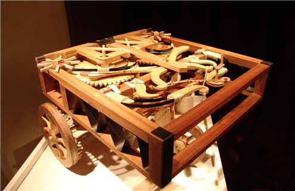
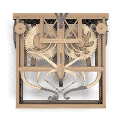



Autour de 1493, Léonard de Vinci esquisse un chariot ingénieux, apparemment conçu pour parcourir un chemin "programmé" à l'aide de cames.

[SolidWorks](http://www.solidworks.com/) vous explique son fonctionnement en détail sur le site [real geniuses](http://realgeniuses.sw-campaign.com/), en le mêlant à une démonstration de leur logiciel de CAO 3D sur un ton parfois un peu trop commercial, mais c'est intéressant malgré tout. La première partie est disponible sur youtube:



Si vous préférez le vrai bois au virtuel, l'entrprise [Leonardo3](http://www.leonardo3.net/) fournit des [modèles réduits de l' "automovile" de Léonard](http://www.leonardo3.net/leonardo/game1/GAME1_06.htm) à monter soi-même ([parmi beaucoup d'autres](http://www.leonardo3.net/leonardo/machines.php)). Le résultat est ce bel objet qui intriguera sans doute vos amis :

(photos copyright [Leonardo3 www.leonardo3.net](http://leonardo3.net))

Et en plus il fonctionne, et grâce au système de cames, le chariot peut parcourir un carré, faire des zig-zags etc. Et si vous voulez en voir un de près, un tuyau : visitez l'exposition ["Léonard de Vinci, l'inventeur" à la Fondation Gianadda](http://www.gianadda.ch/wq_pages/fr/expositions/davinci.php) de Martigny, jusqu'en octobre.
