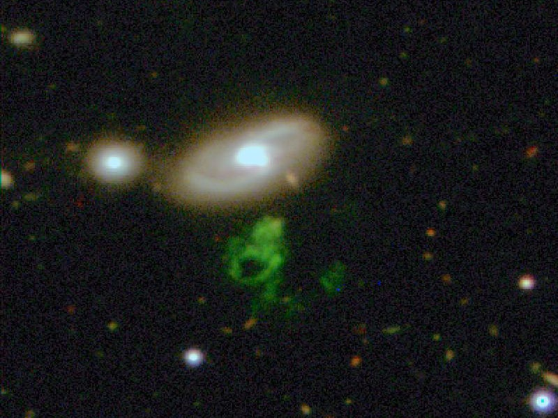

Il y a quelques temps, [je vous parlais de GalaxyZoo](http://drgoulu.local/2008/04/25/galaxy-zoo-lastronomie-collaborative/), un projet permettant aux internautes de participer à l'analyse des milliards de galaxies photographiées par Hubble.

Le 13 août 2007, Hanny van Arkel, une institutrice hollandaise de 25 ans à [posté sur le forum de GalaxyZoo une question simple](http://www.galaxyzooforum.org/index.php?topic=3802.0) : "c'est quoi le truc bleu en dessous ?" à propos de cette image qui lui avait été soumise :

Le grenouille bleue en dessous de la galaxie centrale a été baptisée "voorwerp" par Hanny, le mot hollandais pour "objet". Mais personne n'a pu lui répondre sur sa nature.

[Les analyses suivantes](http://blogs.zooniverse.org/galaxyzoo/2008/01/11/whats-the-blue-stuff-below/) ont montré que la grenouille n'était pas bleue mais verte, et qu'elle était approximativement à la même distance de la galaxie au centre du cliché, baptisée IC 2497, et qu'elle est constituée de gaz ionisé à 10'000° environ et non pas d'étoiles.

Le "Hanny's Voorwerp" a reçu les honneurs de la NASA lorsque le grand téléscope des Canaries a pris cette photo, devenue "[astronomic picture of the day](http://apod.nasa.gov/apod/ap080625.html)" le 25 juin 2008 :

L'hypothèse actuelle est que le Hanny's Voorwerp est une gigantesque "[nébuleuse par réflexion](http://fr.wikipedia.org/wiki/N%C3%A9buleuse_par_r%C3%A9flexion)", un nuage de gaz éclairé par le [noyau actif de la galaxie](http://drgoulu.local/2008/04/18/ca-cest-du-trou-noir-du-vrai/) (qu'on appelle alors un quasar), mais qui serait désormais "éteint" depuis 100'000 ans. Si c'est le cas, il pourrait y avoir beaucoup de ces nuages de gaz extragalactique, mais ils ne deviendraient visibles que dans des conditions très particulières.

Mais quel phénomène a pu créer un nuage si énorme, et qu'est-ce qui lui donne cette forme étrange et notamment ce trou entre les "bras de la grenouille" ? Les supporters de la matière noire et de l'énergie sombre sont sur le coup, et peut-être que Hanny Van Arkel restera dans la postérité comme la découvreuse d'une nouvelle classe d'objets célestes.

Ca aurait pu être vous, si vous partiticpiez à [Galaxy Zoo](http://drgoulu.local/2008/04/25/galaxy-zoo-lastronomie-collaborative/) ...
