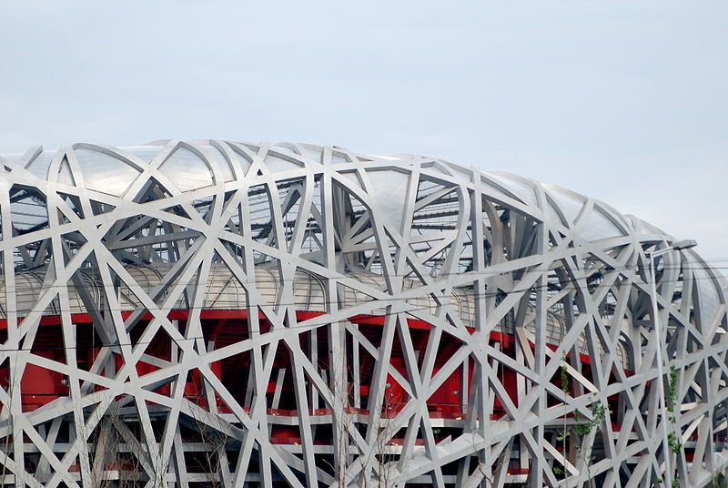
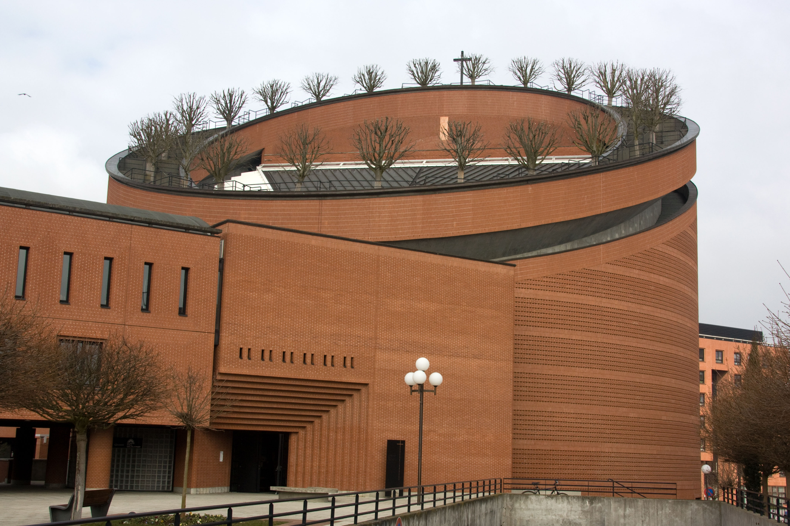
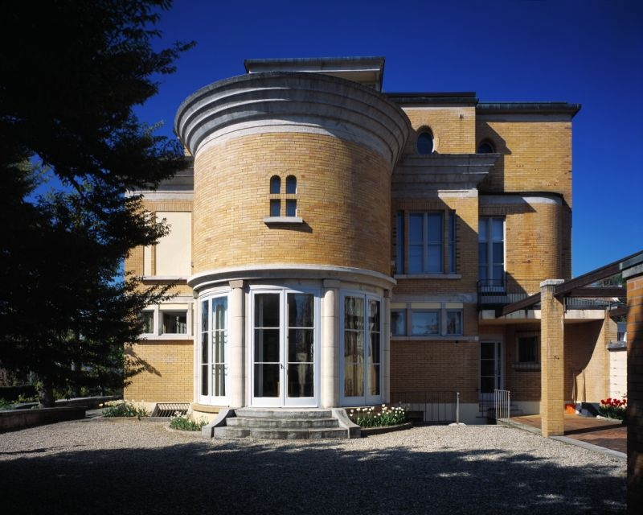

On peut discuter la pertinence de l'attribution des JO à un pays où on facture aux familles les balles utilisées pour les exécutions capitales (entre autres), mais une chose est sure :  le [Stade Olympique National de Pekin](http://fr.wikipedia.org/wiki/Stade_national_de_P%C3%A9kin) dit "le Nid d'Oiseau" est génial :

C'est l'oeuvre de [Herzog et De Meuron](http://fr.wikipedia.org/wiki/Herzog_&_de_Meuron), un duo d'architectes suisses qui ont conçu et réalisé des bâtiments spectaculaires dans le monde entier ces dernières années.

Vu l' excellent film "[Le Nid d'Oiseau. Herzog et de Meuron en Chine](http://www.tsr.ch/docs/)" de C: Schaub et M. Schindhelm sur ce travail, dont voici le lancement :



On y voit notamment comment les architectes ont pris en compte la culture chinoise et ses nombreux symboles avec l'aide d'[Ai Weiwei](http://fr.wikipedia.org/wiki/Ai_Weiwei), démarche que d'autres concurrents internationaux ont eu le tort d'ignorer...

Petite séquence "y'en a point comme nous" à l'intention des chers voisins qui réduisent volontiers la Suisse à banques+montres+chocolat : on a aussi des architectes célèbres.

Comme [Mario Botta](http://www.botta.ch/), qui parsème l'europe de cylindres découpés de diverses manières comme [la cathédrale d'Evry](http://fr.wikipedia.org/wiki/Cath%C3%A9drale_de_la_R%C3%A9surrection_d%27%C3%89vry) :

Et aussi comme "[Le Corbusier](http://fr.wikipedia.org/wiki/Le_Corbusier)". Si si, c'est un suisse qui conçut entre autres de nombreuses "cités radieuses" construites après guerre en France, voire une ville entière en Inde, [Chandigarh](http://fr.wikipedia.org/wiki/Chandigarh).

Je n'apprécie pas énormément le côté parallélépipédique de beaucoup des oeuvres de le Corbusier, mais mon [archisoeur](http://aguglielmetti.ch/) m'a indiqué dans un commentaire la "Villa Turque" à La Chaux de Fond, toute en rondeurs, et en brique. Ca mérite en effet une mise à jour de l'article et une photo :

