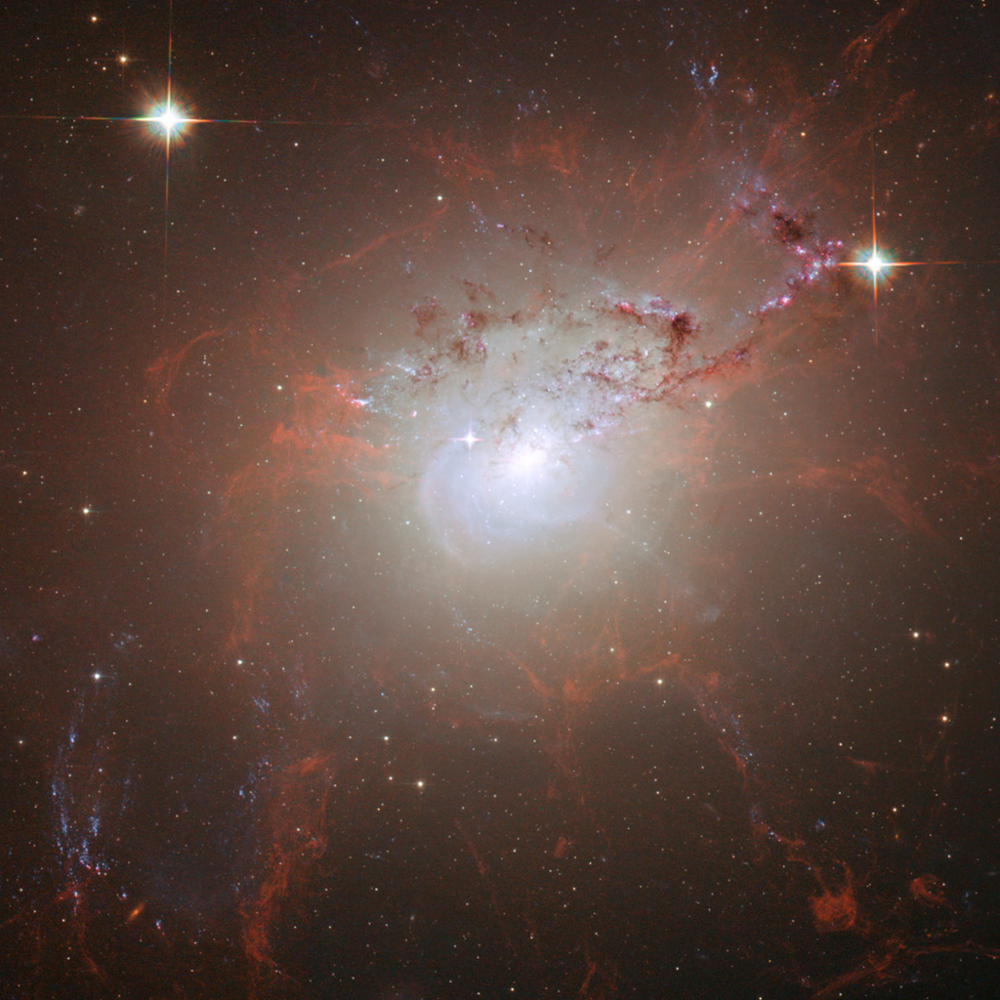

NGC 1275 est la galaxie spirale bleue que vous distinguez au centre de cette photo prise par le télescope spatial Hubble. Les filaments rouges mesurent chacun dans les 20'000 années-lumières de long et 200 de diamètre, et contiennent chacun environ 1 million de masses solaires de gaz tellement chaud (des millions de degrés) qu'il émet des rayons X.

")

La grande question était de savoir ce qui émet ces jets, les chauffe et maintient dans ces formes tentaculaires qui les empêche de retomber sur la galaxie.

Une équipe de l'Université de Cambridge a montré que c'est le trou noir supermassif au centre de NGC 1275 qui la matière qui s'approche trop non pas sous forme de [jets bien droits](/2008/05/03/le-jets-des-trous-noirs/), mais sous forme de "bulles" qui sont ensuite déformées et maintenues sous forme de filaments par les champs magnétiques du trou noir.

Mais tant de puissance et de beauté font que certains entrevoient une [autre explication.](http://pastafari.wordpress.com/2008/08/23/34/)..

sources : [NewScientist](http://www.newscientist.com/article/dn14573?DCMP=ILC-hmts&nsref=news1_head_dn14573) et [Techno-Sciences](http://www.techno-science.net/?onglet=news&news=5721)
