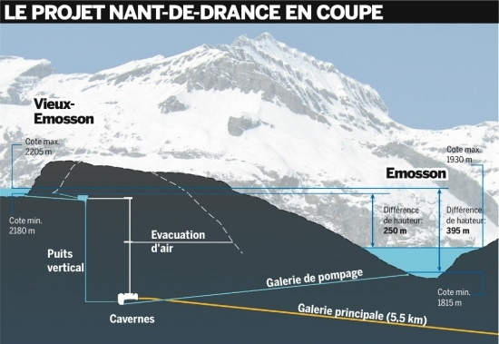



[Le Courrier](http://www.lecourrier.ch/) de ce week-end consacre [un article](http://www.lecourrier.ch/index.php?name=NewsPaper&file=article&sid=440320) à l'énergie éolienne, décrite dès les premiers mots comme "particulièrement rentable". Voyons s'il faut vraiment investir dans le vent.

Selon l'article, la [plus grande éolienne de Suisse](http://www.rhoneole.ch/index.php?option=com_content&task=view&id=15&Itemid=28), mise en service récemment à Collonges a couté 5 Millions de francs suisses et en rapportera 850'000 par an, ce qui permettra de l'amortir en 5 ans. D'abord, 5'000'000/850'000 ça fait 5.8 , donc plutôt 6 ans que 5, et seulement si on ne doit pas payer d'intérêts sur les 5 millions. Avec un taux raisonnable de 5%, c'est près de 9 ans qu'il faut pour amortir l'installation. Passe encore.

Mais surtout, l'éolienne produira 4.4 millions de kWh par an, et en divisant 850'000 Frs par ce nombre on obtient le prix de revient du kWh produit par cette merveille technologique : **19.8 centimes\*, soit le double du prix du kWh produit par les installations hydroélectriques** et le quadruple de celui des centrales thermiques, nucléaires ou à gaz !

Selon les lois du marché, cette éolienne est une aberration économique car personne de sensé n'achèterait de l'électricité à ce prix là. Mais voilà, des décisions politiques ont faussé le jeu : à coups de subventions mais surtout en obligeant les distributeurs d'électricité à [acheter l'électricité éolienne (et solaire) à prix coutant](/2007/08/26/energie-eolienne-et-solaire-a-prix-coutant/), il devient intéressant de construire des moulins à vent parce que les clients sont obligés d'acheter !

Il ne faut donc pas s'y tromper : ce qui est "particulièrement rentable", ce n'est pas l'énergie éolienne, mais bien de puiser dans le porte-monnaie du contribuable-consommateur.

A quelques kilomètres de Collonges, l'installation du [Nant de Drance](http://www.nant-de-drance.ch/) va produire 1500GWh par an, soit l'équivalent de 341 énormes éoliennes. L'installation coutera 700 millions de francs suisses, soit le prix de 140 éoliennes "seulement". Elle produira donc du courant **tout aussi propre**, sans bruit et avec un impact minime sur le paysage, mais surtout **à moins de la moitié du prix** de l'éolienne... Et en plus, le Nant de Drance produira l'électricité quand on en aura besoin, pas seulement quand il y aura du vent.

Le plus incroyable, c'est que les installations comme le Nant de Drance seront obligées par la loi à acheter le courant éolien produit la nuit quand personne n'en veut, l'utiliser pour pomper de l'eau vers les hauteurs, puis à la turbiner en journée pour revendre cette énergie, avec une perte à la fois énergétique et financière.

Voilà comment une énergie renouvelable chère devient "rentable" en renchérissant une autre énergie renouvelable bon marché...

Note\* ajoutée en 2011 : centimes de francs suisses, environ 15 centimes d'Euro

## Références:

- "[Coup de vent sur les éoliennes](http://www.ifrap.org/agriculture-et-energie/coup-de-vent-sur-les-eoliennes)" sur ifrap.org. _(ajouté le 6.9 : un très bon article sur la situation en France)_
- "[L’ÉNERGIE ÉOLIENNE](http://www.sfen.org/IMG/pdf/eoliennepdf-1254.pdf)", Groupe de Réflexion sur l’énergie et l’environnement au XXIème siècle de la Société Française d'Energie Nucléaire ([sfen.org](http://www.sfen.org/))
