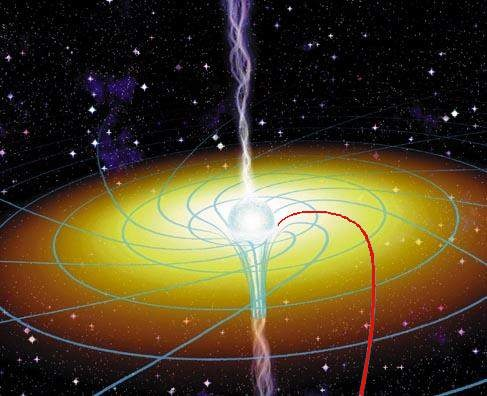
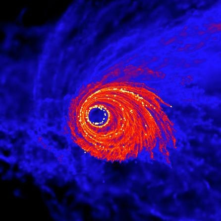

Dans l'imaginaire collectif alimenté par les mauvais films de SF, les trous noirs sont des monstres qui avalent tout ce qui les entoure. En fait, ils recyclent, transforment et éjectent probablement beaucoup plus de matière qu'ils n'en absorbent.

Rappelons tout d'abord que les trous noirs sont des "astres" tellement massifs que même la lumière ne peut s'en échapper. Il en a trois familles:

- les trous noirs stellaires, formés à la fin de la vie d'une étoile massive. Ils pèsent comme plusieurs soleils
- les trous noirs "supermassifs" qui siègent au centre de la plupart des galaxies, voire toutes  [y compris la notre](/2007/06/26/le-trou-noir-central-de-la-voie-lactee-revele/ "le trou noir central de la Voie Lactée révélé").
- c'est tout. Les minis trous noirs qui [font peur](/2008/06/08/nostradamus-et-les-catastrophysiciens/) n'existent pas ;-)

Concentrons-nous sur les premiers en supposant que d'un coup de baguette magique, le Soleil se transforme en trou noir là, maintenant, sous nos yeux ébahis. Ca ne peut pas arriver, mais imaginons. Que se passerait-il ?

Evidemment, il ne brillerait plus, et ce serait bien ennuyeux. Mais la bonne nouvelle c'est qu'il n'avalerait pas la Terre, car sa masse serait toujours la même, simplement il ne serait plus qu'un point au centre du Soleil actuel. Sa force d'attraction resterait pratiquement la même, donc la Terre, Mars, Vénus et toutes les autres planètes continueraient gentiment de lui tourner autour sur leurs orbites respectives.

## Pas un désintégrateur

Qu'est-ce qui pourrait tomber dans le trou noir alors ? Pas grand chose. Actuellement le Soleil a un diamètre de 1.4 millions de kilomètres et il arrive assez fréquemment qu'une comète, un astéroïde ou des petits cailloux se vaporisent en l'approchant de trop près. Mais une fois "trounoirisé", il faudrait que ces projectiles arrivent tout droit dans une cible de moins de 10 km de diamètre pour être agglomérés au trou noir : aucune chance.

En réalité c'est plus compliqué. Plus haut, j'ai dit que la force d'attraction resterait "pratiquement" la même, parce qu'en passant d'un diamètre de 1.4 millions de kilomètres à moins de 10 km, la rotation du Soleil accélèrerait monstreusement, et c'est un euphémisme. Au lieu d'une rotation en 26 jours, le Soleil trounoirisé pirouetterait plusieurs centaines de fois par seconde, devenant une sorte de fraise de dentiste stellaire, enroulant littéralement l'espace alentour :

Donc pour tomber dans le trou noir, la matière doit arriver "tout droit à côté", selon des géodésiques comme celle tracée en rouge sur la figure. Un petit écart et la matière, sera éjectée à une vitesse prodigieuse sur une orbite totalement aberrante selon les lois de la mécanique classique. Mais au passage, elle sera broyée menu par les "forces de marée".

## Générateurs de gaz

A 100 km de notre trou noir, la force d'attraction est titanesque : 13 milliards de Newtons sur une masse de 1kg ! de quoi l'accélérer 0 à 100 km/h en 2 milliardièmes de secondes, et à près de la vitesse de la lumière en 23 millièmes de seconde chrono. Mais 1 mètre plus loin, à 100.001 km, l'attraction est inférieure de 265 KN. Donc une barre d'acier trempé qui passerait par inadvertance à une distance relativement confortable du trou noir serait étirée et transformée en kilomètres de fil à couper le beurre en une milliseconde, et en atomes de fers relativistes une fraction de seconde plus tard.

Les choses deviennent plus intéressantes si un trou noir traverse un nuage de gaz : là, en tombant en spirale vers le trou noir, les atomes accélérés à des vitesses fantastiques vont s'entrechoquer, se freiner mutuellement dans un plasma visqueux qui tourne autour du trou en formant un "disque d'accrétion". Ce sont ces disques d'accrétion, très lumineux particulièrement dans les rayons X, qui permettent de détecter directement les trous noirs.

Petit à petit, comme l'eau de la baignoire qui se vide, la matière du disque d'accrétion devrait tomber peu à peu dans le trou. Mais une fois encore, ce n'est pas si simple.

D'abord, les étoiles ont des champs magnétiques, et lorsqu'une étoile s'effondre, son champ devient incroyablement puissant et forme une sorte dynamo qui éjecte dans l'espace des [jets](/2008/05/03/le-jets-des-trous-noirs/) de gaz par ses pôles nord et sud. Les trous noirs supermassifs émettent ainsi de la matière à des distances prodigieuses, recyclant de la matière depuis le centre des galaxies vers leur périphérie, comme on le voit bien sur les clichés récents de [NGC 1275.](/2008/08/23/monstre-de-spaghetti-galactique/)

## Générateurs d'étoiles

D'autre part, selon des simulations récentes, des grumeaux peuvent se former en bordure des disques d'accrétion et se retrouver éjectés, formant des étoiles massives, qui ne vivent pas très longtemps

Bien sur, une simulation peut être tès jolie mais simuler des phénomènes inexistants, mais là ça tombe plutôt bien : autour du centre de la galaxie d'Andromède toute proche, on a détecté un anneau d'étoiles massives jeunes, et autour du centre de notre propre Galaxie aussi, il y a beaucoup plus d'étoiles jeunes que la normale....

### Conclusion

En quelques années, on est passés de l'idée étonnante qu'il pouvait peut-être y avoir des trous noirs au centre de quelques galaxies à celle que les galaxies se sont probablement formées autour des trous noirs supermassifs. Désormais, ces objets fascinants apparaissent comme des moteurs de l'univers d'une puissance fantastique, bien plus recycleurs qu'aspirateurs.

### Références

 

1. Rachel Courtland "[Simulation shows stars form around black holes after all](http://www.newscientist.com/article/dn14582)", NewScientist.com, 21 August 2008
2.  I. A. Bonnell, W. K. M. Rice "Star Formation Around Supermassive Black Holes", Science  22 Aug 2008: Vol. 321, Issue 5892, pp. 1060-1062 
    
3. David L Chandler "[Mysterious ring of stars guards Andromeda’s heart](http://www.newscientist.com/article/dn8025)", NewScientist.com 20 September 2005
4. Didier Jamet "[Les trous noirs en jettent](http://www.cidehom.com/astronomie.php?_a_id=78)", Ciel des hommes, 29-01-2002
5. Jonathan Ferreira "[ASTROPHYSIQUE : Les Etoiles: la Vie, la Mort et tout le Bazar](http://ipag.osug.fr/~ferreira/enseignement/cours_astro2000.pdf)", cours de Magistère et Maîtrise de Physique, OBSERVATOIRE DE GRENOBLE, LABORATOIRE D’ASTROPHYSIQUE, UNIVERSITE JOSEPH FOURIER, Novembre 2000
