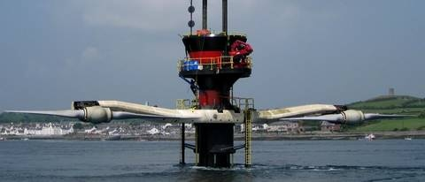
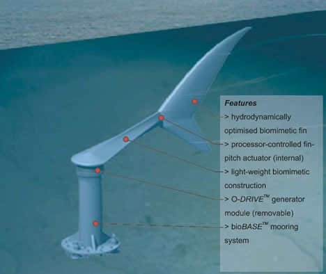

Dans un [article précédent](/2008/09/06/potentiel-hydroelectrique/), j'ai mentionné que les turbines Pelton et Francis utilisées en hydroélectricité ont un rendement très supérieur (~90%) aux hélices des éoliennes, qui ne peuvent dépasser la [limite de Betz](https://fr.wikipedia.org/wiki/limite_de_Betz), égale à 16/27 = 59%. Cette limite n'est pas due au fluide, air plutôt qu'eau, mais aux caractéristiques d'un écoulement ouvert : si une hélice a une surface trop grande et freine trop l'air, le vent va contourner l'hélice plutôt que de passer à travers. L'air étant peu dense, il ne fournit beaucoup d'énergie que dans des vents assez violents [que l'on ne trouve pas partout](/2007/08/26/energie-eolienne-et-solaire-a-prix-coutant/), et qui sont de plus peu prévisibles.

Par contre, l'eau ayant une densité 800 fois supérieure à l'air, il pourrait être intéressant d'installer des [hydroliennes](https://fr.wikipedia.org/wiki/hydrolienne) \[1\] sous l'eau, dans les courants marins et en particulier dans les courants de marée, plus rapides et parfaitement prévisibles. Les sites idoines ne sont pas nombreux mais le potentiel européen est tout de même estimé à 10 TWh, essentiellement dans la Manche. Ce potentiel équivalent à celui de l'éolien en France a convaincu EDF d'installer quelques hydroliennes pilotes au large de Painpol d'ici 2011 \[2\].

Quelques entreprises proposent déjà différents types d'hydroliennes:

- l'entreprise française [Hydrohelix](http://www.sabella.fr/) propose des modules de 5 hélices de 10m produisant 1MW
- [Tidal Stream](http://www.tidalstream.co.uk/) a axé ses développements sur un inconvénient des hydroliennes : la difficulté d'entretien. Leurs solutions permettent de remonter facilement les hélices en surface

- [Marine Turbines](http://www.marineturbines.com/) est la plus avancée : elle a déjà réalisé deux installations pilotes en Angleterre:
    - SeaFlow fournit 300 KW à [Lynmouth dans le Devon](http://maps.google.ch/maps?f=q&hl=fr&geocode=&q=Lynmouth+&ie=UTF8&ll=51.089723,-3.619995&spn=2.25302,2.702637&z=8) depuis 2003
    - [SeaGen](http://www.seageneration.co.uk/), d'une puissance de 1.2 MW, installé cette année à [Strangford Lough](http://maps.google.ch/maps?f=q&hl=fr&geocode=&q=Strangford+Lough&sll=46.223062,6.038066&sspn=0.009694,0.010557&ie=UTF8&ll=54.335744,-5.63324&spn=1.045676,1.351318&z=9&iwloc=addr) en Irlande

D'autres idées émergent pour exploiter les courants marins, comme cet aileron de requin géant projeté par [BioPower systems](http://www.biopowersystems.com/) \[3\]

Un aileron de 15m de haut pourrait produire 2 MW avec un rendement de 90%. Le chiffre parait haut, mais il est vrai que peu de poissons préfèrent les hélices...

### sources :

1. [Hydrolienne](http://fr.wikipedia.org/wiki/Hydrolienne) sur Wikipedia
2. [EDF s'engage dans le développement de l'énergie des courants de marées](http://medias.edf.com/medias-21.html)
3. [L’hydrolienne, éolienne sous-marine](http://www.ecosources.info/dossiers/Hydrolienne_eolienne_sous-marine)
4. [Giant Shark Fin to Generate 2 Megawatts](http://www.biopowersystems.com/) sur [ecogeek.org](http://www.ecogeek.org/)
5. [Energies de la Mer](http://energiesdelamer.blogspot.com/), un blog entièrement consacré à ce sujet
