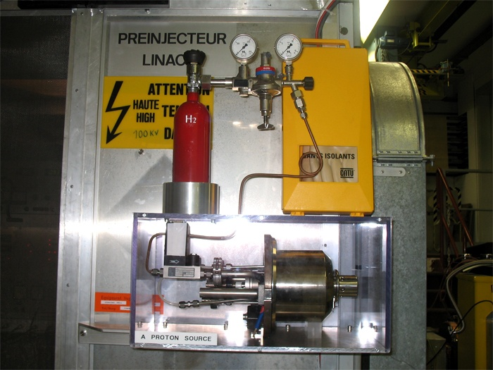
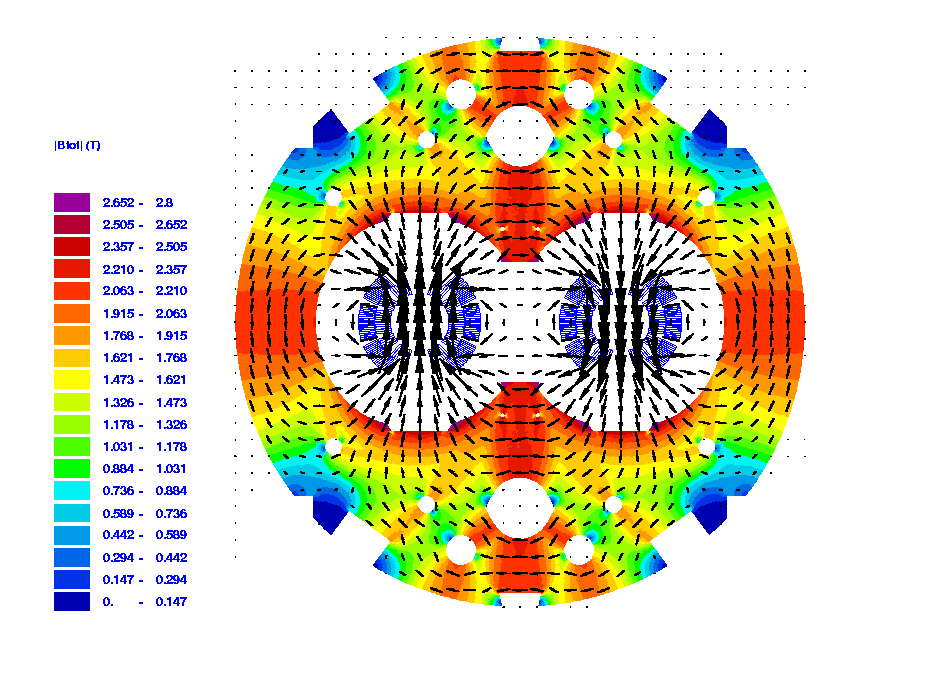

Quelques questions fréquemment posées à propos du LHC du CERN :

- C'est quoi, un hadron ?
- D'où viennent les protons ?
- Combien y'a-t-il de protons qui tournent ?
- Combien de temps les protons passent-ils dans l'expérience ?
- MeV, GeV, TeV ???
- Violent comme une collision de moustiques ... ou de trains ?
- Comment font les protons pour tourner dans des sens différents ?
- ALICE

### C'est quoi, un hadron ?

Logiquement, le LHC aurait pu s'appeler LPC, pour "large proton collider" parce qu'on y fracassera prochainement des protons les uns contre les autres. Mais plus tard, on va également y accélérer des noyaux de plomb, formés de protons et de neutrons. Les protons et les neutrons appartenant à la famille des [hadrons](https://fr.wikipedia.org/wiki/hadrons) (ce sont plus précisément des [baryons](https://fr.wikipedia.org/wiki/baryons)), on a trouvé que LHC, ça sonnait bien. Moi j'aurais préféré un nom plus poétique comme "tournicoton" ou "femto-banger", mais on ne m'a pas demandé mon avis.

### D'où viennent les protons ?

Le proton forme le noyau de l'atome le plus simple : l'hydrogène, qui est aussi de loin l'élément le plus abondant dans l'Univers. On en injecte un tout petit peu dans le "[Duoplasmatron Proton Ion Source](http://linac2.home.cern.ch/linac2/sources/source.htm)" dessiné ci-dessous par le "Gas feed". Dans la "plasma chamber", l'hydrogène est tellement chauffé par un arc électrique que les protons et les électrons qui leur tournent autour se séparent.



Au milieu de ce plasma se trouve la cathode et au bout du canal étroit, l'anode. Entre les deux on applique par impulsions une tension de 92'000 volts, ce qui accélère les protons en direction de la droite, et les électrons vers la gauche, où ils se font manger. Les électroaimants en vert servent à regrouper les protons le plus possible en un faisceau, mais ils arrivent par gros paquets à l'anode. L' "expansion cup" les dilue un petit peu, de sorte qu'à la sortie on a de beaux trains de protons.

Tout ça n'est pas gros du tout, voici une photo du dispositif avec une bouteille d'hydrogène qui devrait suffire pour quelques années de fonctionnement :

### Combien y'a-t-il de protons qui tournent ?

Il y a 2808 paquets de protons qui tournent en même temps dans le LHC dans chaque sens, et chaque paquet contient 100 milliards de protons. Au total, il y a un dix-milliardième de gramme de protons répartis sur les 27km de tube.

### Combien de temps les protons passent-ils dans l'expérience ?



Quand un proton quitte sa source, il traverse un premier petit accélérateur linéaire, le "linac" qui l'accélère à 50 MeV en quelques microsecondes, et entre dans le "Proton Synchroton Booster" (PSB) qui l'accélère à 1.4 GeV en 530 millièmes de seconde. Puis il est injecté dans le "[Proton Synchroton](http://public.web.cern.ch/Public/en/Research/PS-en.html)" (PS), un accélérateur de 628m de circonférence datant de 1959. Là il est accéléré pendant environ 1 seconde. Il est déjà presque à la vitesse de la lumière, donc il parcourt 300'000 km pendant ce temps, soit près de 500'000 tours. Dans certains cas, le proton reste encore 1 seconde de plus avant d'être passé au SPS. Le "supersynchroton à protons" (SPS) est un accélérateur de 7 km de périmètre datant de 1976 ou les paquets de protons attendent entre 10.8 secondes et 0 secondes, ce qui permet de regrouper 4 paquets venant du PSB en un seul, prêt à passer dans le LHC. Jusqu'ici les protons ont passé entre 6 et 18 secondes environ dans l'antichambre de la bête.

Puis, les 2808 paquets de protons sont injectés un à un dans chaque sens du LHC pendant 20 minutes à une énergie de 450 GeV et quand ils se suivent bien gentiment à une distance de 7.5 mètres les uns des autres et que tout est stable, on met la gomme pendant 25 minutes pour atteindre les 7 TeV

### MeV, GeV, TeV ???

L' [électron-volt](https://fr.wikipedia.org/wiki/électron-volt) (eV) est une unité à tout faire. A la base, c'est la minuscule énergie d'un électron accéléré par une tension de 1 Volt. Mais selon la célèbre équation d'Albert E=mc2 lue à l'envers, m=E/c2, la masse d'une particule peut aussi être mesurée en électron-volt (divisés par la vitesse de la lumière au carré, mais on laisse souvent tomber ce détail). Ainsi, un proton au repos à une masse de .938 GeV (Giga-électron-volt) et dans le LHC on l'accélère à 7 TeV (Tera-électron-volt) soit 7000 GeV.

Comme Albert s'obstine à dire que l'énergie et la masse c'est la même chose à un facteur près, ça signifie qu'à la vitesse correspondant à cette énergie (99.999999% de la vitesse de la lumière, "huit neufs" comme j'appelle ça dans "[accélération](http://drgoulu.local/2004/08/09/acceleration/)"), tout se passe comme si le proton pesait plus de 7000x son poids au repos. Le choc n'en sera que plus violent.

### Violent comme une collision de moustiques ... ou de trains ?

Même multipliée par 7000, la masse d'un tout petit proton n'est que de 1.2477\-23 Kg, mais il va très vite. En se fracassant contre un autre l'énergie libérée est de 226'961 Joules, soit 0.063 KWh pour parler en unités d'énergie plus habituelles. C'est vraiment pas beaucoup, mais c'est extraordinairement concentré dans un minuscule pouillème d'espace.

D'un autre côté, le LHC devrait produire environ 2 milliards de telles collisions par seconde, et ça, ça correspond à une puissance telle que j'ai du me planter quelque part dans les calculs...

(_La suite date du 16/9/2008_)

Heureusement [Benjamin](http://science-for-everyone.over-blog.com/) est venu à la rescousse : On parle de 600 millions de collisions par seconde. Au maxium, une collision est de 14 TeV (2 fois 7 TeV). 1 eV est égale à 1,602e-19 Joule. On obtient alors par seconde :

14e12\*1,602e-19\*600e6 = 1 345 Joules / sec = 1 345 Watt

Donc le LHC fournit une puissance (de collision) égale à environ 1,3 kW… Pas de quoi fouetter un chat mais c’est fabuleux quand on regarde la masse d’un proton.

Concernant l’énergie d’un faisceau LHC à 7 TeV, on obtient pour les 2808 bunches contenant 100 milliards de protons: 2808\*100e9\*7e12\*1.602e-19 = 314 889 120 Joules

Donc l’énergie contenu dans le faisceau est de 350MJ (ca fait un TGV de 400 tonnes à 150 km/h).

L’énergie emmagasinée dans les aimants supraconducteurs pour faire tourner et focaliser les faisceaux est quant à elle gigantesque : on obtient un total de 11 GJ dans les aimants du LHC (de quoi faire fondre une demi tonne de cuivre).

### Comment font les protons pour tourner dans des sens différents ?

D'abord, comme on le voit sur une figure précédente, les protons accélérés dans un seul sens dans le SPS sont transférés au LHC par deux chemins différents illustrés en rouge.

Pour tourner en rond dans les deux sens, les faisceaux de protons doivent être courbés par 1232 [aimants "dipolaires"à supraconducteurs extrêmement puissants](http://lhc-machine-outreach.web.cern.ch/lhc-machine-outreach/components/magnets.htm) (8.3 Teslas, 11'850 Ampères, 35 tonnes / pièce ...), mais qui doivent générer des champs inverses pour les deux directions .

Comme on le voit sur la coupe ci-contre, il y a en réalité 2 bobines supraconductrices pour chaque sens de circulation, avec des pôles N et S inversés, ce qui crée des lignes de champ illustrées sur l'image suivante :

Ce qui peut paraitre surprenant aussi c'est que le champ est orienté haut/bas et pas horizontal. Il faut se souvenir que ce n'est pas le proton qui est attiré par l'aimant, mais que c'est le courant électrique créé par son déplacement linéaire qui interagit avec le champ magnétique de l'aimant, ce qui crée sur les protons une force perpendiculaire au déplacement par la règle du tire-bouchon.

A noter que ce ne sont pas des aimants qui accélèrent les protons, mais des "cavités accélératrices" dans lesquelles règne un champ électrique de 6000V/m. Chaque cavité ne fonctionne que sur un seul sens.

(_La suite date du20/9/2008_)

### ALICE

ALICE est l'un des 4 détecteurs installés aux 4 points ou les faisceaux se croisent. "Alice", c'est l'acronyme de "A Large Ion Collider Experiment" : une expérience de collision de grozions gros ions. Les ions en question sont des noyaux de plomb contenant 82 protons que le LHC accélèrera une fois par mois environ au lieu de protons.

L'énergie des noyaux sera de 82 x 7=574 Tev, mais ça ne fait "que" 574/208 = 2.76 TeV par nucléon, à cause des neutrons. On aura donc des collisions plus énergétiques, mais des densités d'énergie moins élevées. Le but d'ALICE est d'étudier la purée quarks+gluons, en particulier des questions comme :

- A quoi ressemble la matière chauffée à 100'000 x la température au centre du soleil ?
- Pourquoi les protons et les neutrons pèsent 100x plus lourd que les 3 quarks dont ils sont constitués ? (et ça c'est une vachement bonne question...)
- Peut-on libérér les quarks collés (par les gluons) dans les protons et les neutrons ?

### D'autres questions ?

Posez-les dans les commentaires et on tentera d'y répondre.

### Références:

1. C.E. Hill "[ION AND ELECTRON SOURCES](http://linac2.home.cern.ch/linac2/seminar/seminar.htm)" CERN, Geneva, Switzerland
2. [LHC facts and figures](http://public.web.cern.ch/Public/en/LHC/Facts-en.html)
3. [LHC machine outreach](http://lhc-machine-outreach.web.cern.ch/lhc-machine-outreach/lhc-machine-outreach-faq.htm)
4. l'inévitable [Wikipedia](http://fr.wikipedia.org/wiki/Large_Hadron_Collider)
5. [aimants et accélérateurs](http://irfu.cea.fr/Phocea/Vie_des_labos/Ast/astimg.php?voir=1280&type=theme) au cea : plein d'illustrations intéressantes
6. [Alice et le plomb](http://www.lhc-france.fr/?article7)
7. [Alice au CERN](http://public.web.cern.ch/Public/fr/LHC/ALICE-fr.html) et aussi [ici en anglais](http://aliceinfo.cern.ch/Public/Welcome.html)
