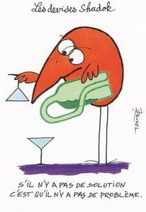

C'est assez facile de faire rire des scientifiques ou des ingénieurs, car ils sont sensibles à de nombreuses formes d'humour.

### Blagues

Il y a bien sur les histoire classiques comme "Dans un jeu télévisé,  un ingénieur, un physicien et un mathématicien doivent construire une clôture tout autour d'un troupeau de moutons en utilisant aussi peu de matériel que possible.

- L'ingénieur fait regrouper le troupeau dans un cercle, puis construit une barrière tout autour.
- Le physicien construit une clôture d'un diamètre infini et tente de relier les bouts de la clôture entre eux jusqu'au moment où tout le troupeau peut tenir dans le cercle.
- Le mathématicien, voyant ceci, construit une clôture autour de lui-même et se définit comme y étant à l'extérieur."

Vous en trouverez de nombreuses autres de ce genre [ici.](http://www.sciences.ch/htmlfr/humour.php)

### (Auto)-Dérision

Les désormais fameux [prix igNobel](http://ignobel.com/) récompensent les recherches les plus étranges, republiées dans le "[Journal of Improbable Research](http://improbable.com/)". Je vous avais [parlé ici des prix 2007](/2007/10/19/prix-ignobel/), les 2008 ne vont pas tarder à être décernés, préparez vos zygomatiques. Ce qui me surprend le plus, c'est de voir la plupart des lauréats accepter leur prix avec le sourire et gratifier l'assistance d'une présentation en bonne et due forme de leur sujet de recherche farfelu, diffusée largement en [video](http://www.youtube.com/results?search_query=improbable+research&search_type=&aq=0&oq=improbable+re).

L'autodérision est également très appréciée dans la communauté scientifique. En particulier, le "[Journal of Irreproductive Results](http://www.jir.com/)" publie des articles parodiques voire délirants, mais respectant scrupuleusement le formalisme formellement formel des publications scientifiques de plus haut niveau.

Dans le même ordre d'idées, quelques aménagements du [système international d'unités](http://fr.wikipedia.org/wiki/Syst%C3%A8me_international_d%27unit%C3%A9s) ont été proposés pour étendre le domaine d'application de la science tout en intégrant de quelques expressions du langage populaire dans le formalisme scientifique. Voir en particulier la norme NF UNM 00-000 dite des "unités pifométriques" [dont je vous ai déjà parlé ici](/2007/01/20/nouvelles-unites-de-mesure/)

### Lois Universelles

Un moyen assez simple de faire coller la dure réalité expérimentale aux belles théories scientifiques consiste à tenir compte de quelques lois universelles additionnelles, complétant voire supplantant occasionnellement [la logique pure](/2004/06/21/temple-de-la-logique-pure/).

Les [lois de Murphy](http://www.courtois.cc/murphy/murphy.html) sont les plus connues puisqu'elles sont absolument fondamentales en ingénierie et dans la plupart des sciences expérimentales

#### les devises Shadok

Depuis 1968, les extraterrestres surréalistes de Jacques Rouxel continuent d'émailler les conversations de scientifiques et d'ingénieurs avec leurs devises célèbres, comme:

- pourquoi faire simple quand on peut faire compliqué ? (oui, c'est bien des Shadoks, à l'origine ...)
- s'il n'y a pas de solution, c'est qu'il n'y a pas de problème.
- il vaut mieux pomper même s'il ne se passe rien que risquer qu'il se passe quelque chose de pire en ne pompant pas.
- pour qu'il y ait le moins de mécontents possible, il faut toujours taper sur les mêmes.

Pour notre plus grand bonheur, certains épisodes aussi épiques que surréalistes des Shadoks sont disponibles sur le web, et d'autres en DVD. Voici par exemple une merveille de mixture cours de maths + délire :



### Les informaticiens

L'humour des informaticiens est particulièrement caustique car leur discipline repose sur essentiellement sur un sur-ensemble des lois de Murphy faisant qu'un ordinateur exécutant sans erreur un programme réalisant la fonction pour laquelle il a été conçu tient du pur miracle.

De ce fait, les informaticiens sont des mystiques assez prompts aux blagues métaphysiques, mais aussi aux blagues à connotation religieuse voire racistes visant les minorités comme les adeptes de Fortran ou les Cobolistes.

L'humour informaticien est notamment très présent dans les [Perlisismes](/2008/01/21/perlisismes-les-dictons-informatiques-dalan-perlis/), tels que "Il y a deux manières d’écrire des programmes sans erreurs. Seule la troisième marche."

N'hésitez pas à mettre en commentaire d'autres références que vous pourriez connaitre!
