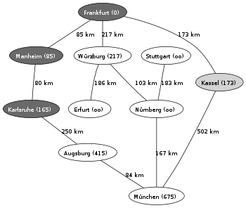

Dans l'[article précédent](/2008/09/27/le-gps-pour-les-nuls-satellites-et-signaux/), j'explique comment votre GPS peut déterminer la latitude et la longitude où vous vous trouvez à partir de satellites. C'est génial, mais c'est peu utile si vous n'êtes pas un marin.

Ce qui fait l'intérêt du GPS de nos jours c'est qu'il vous dit que vous êtes sur la Route du Mandement en direction de Satigny, et qu'il faut tourner à droite 300m après le giratoire pour aller en direction de Bourdigny. Comment est-ce possible ?

En plus du récepteur sophistiqué décrit dans [l'article précédent](/2008/09/27/le-gps-pour-les-nuls-satellites-et-signaux/), un GPS contient une grosse mémoire pour stocker une carte géographique et un microprocesseur relativement puissant pour calculer votre itinéraire par une méthode qui fait l'objet de cet article.

La carte routière stockée dans votre GPS est bien plus qu'une digitalisation d'une carte routière en papier : elle contient le "[graphe](http://fr.wikipedia.org/wiki/Th%C3%A9orie_des_graphes)" formé par le réseau routier, à savoir tous les carrefours (ou points, ou noeuds) reliés par un réseau de chemins (ou arcs, ou arêtes).

Pour aller d'un point à un autre, le microprocesseur de votre GPS va déterminer le trajet le plus court entre deux lieux en parcourant ce graphe. Si vous utilisez un logiciel de cartographie comme [Google Maps](http://maps.google.ch/), vous vous êtes peut-être dit que Google a assez de gros ordinateurs pour le faire rapidement, et garde peut-être même en mémoire les requêtes les plus fréquentes (Paris - le Grau du Roi...) pour les resservir plus vite. Mais si vous avez un petit GPS dans votre voiture ou dans la main, vous avez certainement remarqué qu'il lui fait plusieurs secondes avant de pouvoir commencer à vous indiquer la direction à prendre. En réalité, c'est plutôt le fait qu'il n'ait pas besoin de minutes, voire d'heures de calcul qui tient de l'exploit, tant il existe de routes possibles.

Tout d'abord, remarquons que la position géographique des noeuds n'est pas indispensable pour résoudre le problème; seules les informations sur la "longueur" des routes importe réellement si on cherche à minimiser le trajet. Ceci permet d'ailleurs de choisir ce que l'on veut minimiser :

1. la distance parcourue. Dans ce cas seule la longueur de chaque route est utile
2. le temps nécessaire. Si chaque route est caractérisée par une vitesse moyenne ou un temps de parcours habituel, le chemin optimal favorisera une autoroute de contournement qu'une traversée urbaine
3. la consommation, le cout financier ... En fait, on peut attribuer à chaque route un "cout" selon un critère quelconque, voir même deux couts correspondant aux deux sens de parcours, ce qui permet de tenir compte des sens interdits par exemple.
4. si une route n'existe pas, on peut même en inventer une de coût élevé pour faire de [l'humour](/2007/05/03/humour-sur-google-maps/).

Ensuite, les trajets en voiture satisfont une hypothèse importante appellée "principe d'optimalité de Bellman" qui simplifie beaucoup la résolution du problème : si le trajet optimal de A à C passe par B, alors les trajets AB et BC sont aussi optimaux, et le cout pour aller de A à C est égal à la somme des couts AB+BC.

Cette hypothèse appelée semble évidente, mais elle peut être invalide avec d'autres moyens de transport:

- Marc, un ami (ingénieur) qui prit un vol Copenhague-Reykjavik pour visiter l'Islande eut la surprise de s'apercevoir qu'il payait son billet plus cher que les nombreux autres passagers de l'avion qui volaient de Copenhague à New-York. Ce viol du principe d'optimalité rend plus compliqué la recherche du vol le moins cher.
- Les transports publics partant à des heures déterminées par un horaire violent également le principe d'optimalité : il vaut parfois mieux choisir des trains avec de bonnes correspondances plutôt qu'un TGV qui nous obligera à perdre 1h dans une gare en attendant le train suivant.

Dans ces cas là, il faut tenter de modifier le problème pour le faire obéir au principe d'optimalité, soit se résigner à de très, très, très longs calculs.

Mais si le "principe d'optimalité de Bellman" est satisfait, et c'est le cas en voiture, alors on peut utiliser des algorithmes très efficaces :

1. Le célèbre [algorithme de Dijkstra](http://fr.wikipedia.org/wiki/Algorithme_de_Dijkstra) publié en 1959 permet de trouver le chemin joignant deux noeuds d'un graphe en minimisant la somme des "couts" et donc de trouver le "[plus court chemin](http://fr.wikipedia.org/wiki/Probl%C3%A8mes_de_cheminement)". Son temps de calcul est proportionnel à (m+n).log(n), où n est le nombre de nœuds et m le nombre de routes, ce qui rend possible son application sur des graphes comportant des millions de noeuds et routes.
2. En prenant en compte la position des villes, on peut utiliser des algorithmes heuristiques comme ["A\*" (A-star)](http://fr.wikipedia.org/wiki/Algorithme_A*) qui fournissent plus rapidement un chemin très proche de l'optimum dans le cas d'une carte "normale", mais peuvent être plus lents que Dijkstra dans des cas vicieux.

Une fois le trajet optimal déterminé, il suffit à votre GPS de vérifier que vous le suivez scrupuleusement à partir des mesures satellite, de vous diriger à gauche ou à droite, et si vous vous plantez ou si vous rencontrez un bouchon, de recalculer en vitesse un nouveau trajet optimal.

L'étape suivante sera de remettre à jour les cartes embarquées dans les GPS par des signaux radio, genre Wifi ou téléphone 3G. En cas de bouchon ou de travaux, il suffit de modifier automatiquement le cout du trajet correspondant et hop, les voitures équipées conseilleront un nouveau trajet optimal à leur conducteur. Ca s'appelle le progrès et c'est pour bientôt.

### Références:

1. Moshe Sniedovich , "[Dijkstra's Algorithm revisited : the OR/MS Connexion](http://www.ifors.ms.unimelb.edu.au/tutorial/dijkstra_new/index.html)", Department of Mathematics and Statistics, The University of Melbourne, Parkville, VIC 3052, Australia
